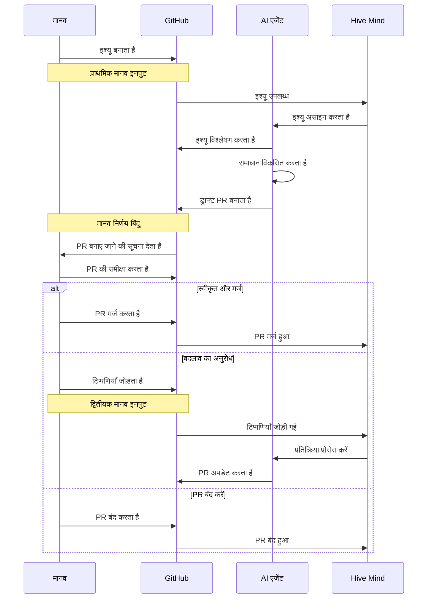
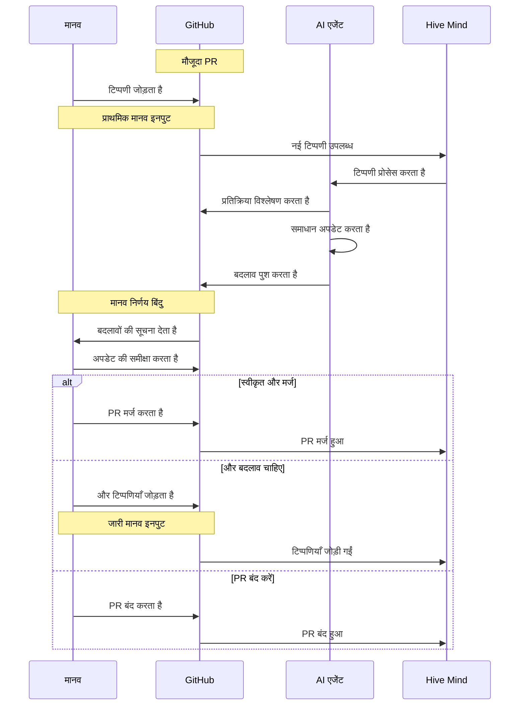

[](https://npmjs.com/@link-assistant/hive-mind)
[](https://github.com/link-assistant/hive-mind/blob/main/LICENSE)
[](https://github.com/link-assistant/hive-mind/stargazers)

[](https://gitpod.io/#https://github.com/link-assistant/hive-mind)
[](https://github.com/codespaces/new?hide_repo_select=true&ref=main&repo=link-assistant/hive-mind)

# Hive Mind 🧠 (languages: [en](README.md) • [zh](README.zh.md) • hi • [ru](README.ru.md))

**वह मास्टर AI जो AI के झुंड को नियंत्रित करता है।** यह एक ऑर्केस्ट्रेटर AI है जो अन्य AI को नियंत्रित करता है। HIVE MIND। SWARM MIND।

इस AI को सामूहिक मानव बुद्धिमत्ता से जोड़ना भी संभव है, अर्थात यह प्रणाली आवश्यकताओं, विशेषज्ञता और प्रतिक्रिया के लिए मनुष्यों के साथ संवाद कर सकती है।

[](https://github.com/konard/problem-solving)

[konard/problem-solving](https://github.com/konard/problem-solving) से प्रेरित

## Hive Mind क्यों?

**Hive Mind सबसे स्वायत्त, क्लाउड-तैयार AI इश्यू सॉल्वर है जो महत्वपूर्ण निर्णयों पर मानव निगरानी बनाए रखते हुए डेवलपर की निरंतर देखरेख की आवश्यकता को समाप्त करता है।**

Hive Mind एक **सामान्यवादी AI** (मिनी-AGI) है जो कार्यों की एक विस्तृत श्रृंखला पर काम करने में सक्षम है - केवल प्रोग्रामिंग तक सीमित नहीं। किसी रिपॉजिटरी में फ़ाइलों के साथ किया जाने वाला लगभग कोई भी कार्य स्वचालित किया जा सकता है।

| विशेषता                            | आपके लिए इसका अर्थ                                                                                                                                                                  |
| ---------------------------------- | ----------------------------------------------------------------------------------------------------------------------------------------------------------------------------------- |
| **बिना निगरानी के**                | sudo एक्सेस के साथ पूर्ण स्वायत्त मोड। AI को एक वास्तविक प्रोग्रामर की तरह रचनात्मक स्वतंत्रता है।                                                                                  |
| **क्लाउड आइसोलेशन**                | समर्पित VMs या Docker पर चलता है। टूट जाने पर पुनर्स्थापित करना आसान।                                                                                                               |
| **पूर्ण इंटरनेट + Sudo**           | AI पैकेज इंस्टॉल कर सकता है, दस्तावेज़ प्राप्त कर सकता है, और आवश्यकतानुसार सिस्टम को कॉन्फ़िगर कर सकता है।                                                                         |
| **पूर्व-स्थापित टूलचेन**           | 25GB+ तैयार: 10 भाषा रनटाइम, 2 थ्योरम प्रूवर, बिल्ड टूल्स। और इंस्टॉल कर सकते हैं।                                                                                                  |
| **टोकन दक्षता**                    | नियमित कार्य कोड में स्वचालित, ताकि AI टोकन रचनात्मक समस्या-समाधान पर केंद्रित रहें।                                                                                                |
| **समय की स्वतंत्रता**              | जो काम मनुष्यों को 2-8 घंटे लगता है, AI प्रत्येक कार्य सत्र में 10-25 मिनट में पूरा करता है। रिपॉजिटरी में कार्यों का बड़े पैमाने पर निष्पादन संभव है। "सोते समय कोड लिखा जाता है।" |
| **ऑर्केस्ट्रेशन के साथ स्केल**     | समानांतर वर्कर डेवलपर्स की एक टीम की तरह महसूस होते हैं, सभी ~$200/माह में।                                                                                                         |
| **मानव नियंत्रण**                  | AI ड्राफ्ट PR बनाता है - आप तय करते हैं क्या मर्ज होगा। जहाँ मायने रखता है वहाँ गुणवत्ता द्वार।                                                                                     |
| **किसी भी डिवाइस से प्रोग्रामिंग** | Telegram बॉट के माध्यम से `/solve` और `/hive` से किसी भी डिवाइस से AI प्रबंधित करें। कोई PC, IDE या लैपटॉप की आवश्यकता नहीं।                                                        |
| **100% ओपन सोर्स**                 | Unlicense (पब्लिक डोमेन)। पूर्ण पारदर्शिता, कोई वेंडर लॉक-इन नहीं।                                                                                                                  |

> _"$200 के Codex की तुलना में, यह समाधान शानदार है।"_ - उपयोगकर्ता प्रतिक्रिया

**लागत**: Claude MAX सदस्यता (~$200/माह, वर्तमान में 50% छूट = $400 मूल्य) Hive Mind के लिए लगभग असीमित उपयोग प्रदान करती है - बाजार में सबसे अच्छा मूल्य/गुणवत्ता संतुलन।

Hive Mind में औसत प्रोग्रामर से अलग न पहचानी जा सकने वाली उच्च रचनात्मकता है। यदि आवश्यकताएँ अस्पष्ट हों तो यह प्रश्न पूछता है, और आप PR टिप्पणियों के माध्यम से चलते-चलते स्पष्ट कर सकते हैं।

विस्तृत विशेषताओं और तुलनाओं के लिए, [docs/FEATURES.hi.md](./docs/FEATURES.hi.md) और [docs/COMPARISON.hi.md](./docs/COMPARISON.hi.md) देखें।

## ⚠️ चेतावनी

इस सॉफ़्टवेयर को अपने डेवलपर मशीन पर चलाना असुरक्षित है।

इंस्टॉलेशन के लिए Docker का उपयोग करना अनुशंसित है (स्थानीय और सर्वर दोनों पर)। नीचे [Docker इंस्टॉलेशन](#using-docker) अनुभाग देखें।

यह सॉफ़्टवेयर Claude Code के पूर्ण स्वायत्त मोड का उपयोग करता है, जिसका अर्थ है कि यह जो भी उचित समझे वह कमांड निष्पादित करने के लिए स्वतंत्र है।

इसका मतलब है कि इससे अप्रत्याशित दुष्प्रभाव हो सकते हैं।

स्पेस रिसाव की एक ज्ञात समस्या भी है। इसलिए आपको यह सुनिश्चित करना होगा कि आप स्पेस साफ करने और/या वर्चुअल मशीन को कोई नुकसान होने पर उसे पुनः इंस्टॉल कर सकते हैं।

### ⚠️ अत्यंत महत्वपूर्ण: टोकन और संवेदनशील डेटा सुरक्षा

**यह सॉफ़्टवेयर वर्चुअल मशीन पर आपके टोकन या अन्य संवेदनशील डेटा की कोई सुरक्षा गारंटी नहीं दे सकता।**

इंटरनेट से जुड़ी वर्चुअल मशीन से टोकन निकालने के असंख्य तरीके हैं। इसमें शामिल हैं लेकिन इन तक सीमित नहीं:

- **Claude MAX टोकन** - AI संचालन के लिए आवश्यक
- **GitHub टोकन** - रिपॉजिटरी एक्सेस के लिए आवश्यक
- **API keys और क्रेडेंशियल** - सिस्टम पर कोई भी संवेदनशील डेटा

**महत्वपूर्ण सुरक्षा विचार:**

- डेवलपर मशीन पर चलाना **बिल्कुल असुरक्षित** है
- वर्चुअल मशीन पर चलाना **कम असुरक्षित** है लेकिन फिर भी जोखिम हैं
- भले ही आपकी डेवलपर मशीन का डेटा सीधे उजागर न हो, VM में फिर भी संवेदनशील टोकन होते हैं
- इंटरनेट से जुड़े सिस्टम पर संग्रहीत कोई भी टोकन संभावित रूप से समझौता हो सकता है

**इस सॉफ़्टवेयर का उपयोग पूरी तरह से अपने जोखिम और जिम्मेदारी पर करें।**

हम दृढ़ता से अनुशंसा करते हैं:

- समर्पित, अलग वर्चुअल मशीनों का उपयोग करना
- टोकन नियमित रूप से बदलते रहना
- संदिग्ध गतिविधि के लिए टोकन उपयोग की निगरानी करना
- कभी भी उत्पादन टोकन या क्रेडेंशियल का उपयोग न करना
- इस सिस्टम के साथ उपयोग किए गए सभी टोकन को रद्द और प्रतिस्थापित करने के लिए तैयार रहना

`hive.mjs` चलाने के लिए न्यूनतम सिस्टम आवश्यकताएँ:

```
1 CPU Core
1 GB RAM
> 4 GB SWAP
50 GB disk space
```

## 🚀 त्वरित शुरुआत

### वैश्विक इंस्टॉलेशन

#### Bun का उपयोग करके (अनुशंसित)

```bash
bun install -g @link-assistant/hive-mind
```

#### Node.js का उपयोग करके

```bash
npm install -g @link-assistant/hive-mind
```

### Docker इंस्टॉल करना

यदि आपने अभी तक Docker इंस्टॉल नहीं किया है, तो Ubuntu पर Docker Engine इंस्टॉल करने के लिए इन चरणों का पालन करें:

```bash
# Install prerequisites
sudo apt update
sudo apt install ca-certificates curl

# Add Docker's official GPG key
sudo install -m 0755 -d /etc/apt/keyrings
sudo curl -fsSL https://download.docker.com/linux/ubuntu/gpg -o /etc/apt/keyrings/docker.asc
sudo chmod a+r /etc/apt/keyrings/docker.asc

# Add Docker repository
sudo tee /etc/apt/sources.list.d/docker.sources <<EOF
Types: deb
URIs: https://download.docker.com/linux/ubuntu
Suites: $(. /etc/os-release && echo "${UBUNTU_CODENAME:-$VERSION_CODENAME}")
Components: stable
Signed-By: /etc/apt/keyrings/docker.asc
EOF

# Install Docker
sudo apt update
sudo apt install docker-ce docker-ce-cli containerd.io docker-buildx-plugin docker-compose-plugin

# Verify installation
sudo docker run hello-world
```

**अन्य ऑपरेटिंग सिस्टम** या विस्तृत निर्देशों के लिए, [आधिकारिक Docker दस्तावेज़ीकरण](https://docs.docker.com/engine/install/) देखें।

### Docker का उपयोग करके

सुरक्षित स्थानीय इंस्टॉलेशन के लिए Docker का उपयोग करके Hive Mind चलाएँ - कोई मैन्युअल सेटअप की आवश्यकता नहीं:

**नोट:** Docker स्थानीय इंस्टॉलेशन के लिए अधिक सुरक्षित है और इसका उपयोग सर्वर या Kubernetes क्लस्टर पर कई अलग-थलग इंस्टेंस इंस्टॉल करने के लिए किया जा सकता है। Kubernetes डिप्लॉयमेंट के लिए, नीचे [Helm चार्ट इंस्टॉलेशन](#helm-installation-kubernetes-experimental) अनुभाग देखें।

```bash
# Pull the latest image from Docker Hub
docker pull konard/hive-mind:latest

# Start hive-mind container
docker run -dit --name hive-mind konard/hive-mind:latest

# Verify container started
docker ps -a

# Enter additional terminal process to do installation
docker exec -it hive-mind /bin/bash

# Inside the container, authenticate with GitHub
gh-setup-git-identity

# Authenticate with Claude
claude

# Optionally set configuration like this:
# Use /config command and set:
# Reduce motion                             true # Will save your ssh trafic, and make Claude Code more responsive (less latency)
# Thinking mode                             false # Anthropic models perform better and cheaper without thinking
# Model                                     haiku # chepear for connection testing manually
# Claude in Chrome enabled by default       false # No need for Chrome support on server

# Optionally test Claude connection
claude -p hi --model haiku

# You might need to update hive-mind and agent to latest versions:
bun install -g @link-assistant/hive-mind
bun install -g @link-assistant/agent

# Now you can use hive and solve commands
solve https://github.com/owner/repo/issues/123

# Or you can run telegram bot:

# Exit from additional bash session
exit

# Attach to main bash process
docker attach hive-mind

# Run bot here

# Press Ctrl + P, Ctrl + Q to detach without destroying the container (no stopping of main bash process)

# --- Persisting auth data across restarts ---

# Extract auth data from a running (or stopped) container to the host:
mkdir -p ~/.hive-mind
docker cp hive-mind:/workspace/.claude ~/.hive-mind/claude
docker cp hive-mind:/workspace/.claude.json ~/.hive-mind/claude.json
docker cp hive-mind:/workspace/.config/gh ~/.hive-mind/gh

# Fix ownership to match the sandbox user inside the container:
SANDBOX_UID=$(docker exec hive-mind id -u sandbox)
chown -R $SANDBOX_UID:$SANDBOX_UID ~/.hive-mind/claude ~/.hive-mind/gh
chown $SANDBOX_UID:$SANDBOX_UID ~/.hive-mind/claude.json

# On subsequent runs, mount the auth data to keep it between restarts:
docker run -dit \
  --name hive-mind \
  --restart unless-stopped \
  -v /root/.hive-mind/claude:/workspace/.claude \
  -v /root/.hive-mind/claude.json:/workspace/.claude.json \
  -v /root/.hive-mind/gh:/workspace/.config/gh \
  konard/hive-mind:latest
```

**Docker के लाभ:**

- ✅ पूर्व-कॉन्फ़िगर Ubuntu 24.04 वातावरण
- ✅ सभी डिपेंडेंसी पूर्व-स्थापित
- ✅ आपके होस्ट सिस्टम से अलग
- ✅ विभिन्न GitHub अकाउंट के साथ कई इंस्टेंस चलाना आसान
- ✅ विभिन्न मशीनों पर सुसंगत वातावरण

उन्नत Docker उपयोग के लिए [docs/DOCKER.hi.md](./docs/DOCKER.hi.md) देखें।

#### Docker कंटेनर बंद करना और हटाना

```
# Attach to main docker process to stop the container
docker attach hive-mind

^C # stop the telegram bot

exit # exit/stop the container

docker ps -a # show list of docker containers
# CONTAINER ID   IMAGE                     COMMAND       CREATED      STATUS                        PORTS     NAMES
# fd0fd4470ec3   konard/hive-mind:latest   "/bin/bash"   5 days ago   Exited (130) 16 seconds ago             hive-mind


df -h # check disk space
# Filesystem      Size  Used Avail Use% Mounted on
# tmpfs           1.2G  1.1M  1.2G   1% /run
# /dev/sda1        96G   87G  9.8G  90% /
# tmpfs           5.9G     0  5.9G   0% /dev/shm
# tmpfs           5.0M     0  5.0M   0% /run/lock
# /dev/sda16      881M  117M  703M  15% /boot
# /dev/sda15      105M  6.2M   99M   6% /boot/efi
# tmpfs           1.2G   12K  1.2G   1% /run/user/0

docker rm hive-mind # remove docker container frees space used by the container, does not delete image

df -h # check disk space (to confirm space is freed)
# Filesystem      Size  Used Avail Use% Mounted on
# tmpfs           1.2G  1.1M  1.2G   1% /run
# /dev/sda1        96G   26G   71G  27% /
# tmpfs           5.9G     0  5.9G   0% /dev/shm
# tmpfs           5.0M     0  5.0M   0% /run/lock
# /dev/sda16      881M  117M  703M  15% /boot
# /dev/sda15      105M  6.2M   99M   6% /boot/efi
# tmpfs           1.2G   12K  1.2G   1% /run/user/0
```

### Helm इंस्टॉलेशन (Kubernetes) (प्रयोगात्मक)

> ⚠️ **प्रयोगात्मक:** Helm/Kubernetes इंस्टॉलेशन विधि प्रयोगात्मक है और पूरी तरह स्थिर नहीं हो सकती।
>
> अधिक विश्वसनीय इंस्टॉलेशन के लिए, हम [Docker](#using-docker) का उपयोग करने की अनुशंसा करते हैं।
>
> पूर्ण Helm इंस्टॉलेशन निर्देश और कॉन्फ़िगरेशन विकल्पों के लिए [docs/HELM.hi.md](./docs/HELM.hi.md) देखें।

### Ubuntu 24.04 सर्वर पर इंस्टॉलेशन (पुराना)

> ⚠️ **पुराना:** यह इंस्टॉलेशन विधि अब अनुशंसित नहीं है।
>
> **हम अब सभी इंस्टॉलेशन के लिए Docker का उपयोग करने की अनुशंसा करते हैं**, डेवलपर मशीनों और सर्वर दोनों पर।
> Docker बेहतर आइसोलेशन, आसान प्रबंधन और सुसंगत वातावरण प्रदान करता है।
>
> कृपया ऊपर [Docker इंस्टॉलेशन विधि](#using-docker) का उपयोग करें।
> Kubernetes डिप्लॉयमेंट के लिए, [Helm इंस्टॉलेशन](#helm-installation-kubernetes-experimental) अनुभाग देखें।
>
> पुराने bare-metal इंस्टॉलेशन निर्देश संदर्भ के लिए [docs/UBUNTU-SERVER.hi.md](./docs/UBUNTU-SERVER.hi.md) में स्थानांतरित कर दिए गए हैं।

### मुख्य संचालन

```bash
# Solve using maximum power
solve https://github.com/Veronika89-lang/index.html/issues/1 --attach-logs --verbose --model opus --think max

# Solve GitHub issues automatically
solve https://github.com/owner/repo/issues/123 --model sonnet

# Solve issue with PR to custom branch (manual fork mode)
solve https://github.com/owner/repo/issues/123 --base-branch develop --fork

# Continue working on existing PR
solve https://github.com/owner/repo/pull/456 --model opus

# Resume from Claude session when limit is reached
solve https://github.com/owner/repo/issues/123 --resume session-id

# Start hive orchestration (monitor and solve issues automatically)
hive https://github.com/owner/repo --monitor-tag "help wanted" --concurrency 3

# Monitor all issues in organization
hive https://github.com/microsoft --all-issues --max-issues 10

# Run collaborative review process
review --repo owner/repo --pr 456

# Multiple AI reviewers for consensus
./reviewers-hive.mjs --agents 3 --consensus-threshold 0.8
```

## 📋 मुख्य घटक

| स्क्रिप्ट                                  | उद्देश्य                    | मुख्य विशेषताएँ                                                  |
| ------------------------------------------ | --------------------------- | ---------------------------------------------------------------- |
| `solve.mjs` (स्थिर)                        | GitHub इश्यू सॉल्वर         | ऑटो फोर्क, ब्रांच निर्माण, PR जनरेशन, सत्र रिज्यूम, फोर्क सपोर्ट |
| `hive.mjs` (स्थिर)                         | AI ऑर्केस्ट्रेशन और निगरानी | मल्टी-रेपो निगरानी, समानांतर वर्कर, इश्यू कतार प्रबंधन           |
| `review.mjs` (अल्फा)                       | कोड समीक्षा स्वचालन         | सहयोगी AI समीक्षाएँ, स्वचालित प्रतिक्रिया                        |
| `reviewers-hive.mjs` (अल्फा / प्रयोगात्मक) | समीक्षा टीम प्रबंधन         | मल्टी-एजेंट सर्वसम्मति, समीक्षक असाइनमेंट                        |
| `telegram-bot.mjs` (स्थिर)                 | Telegram बॉट इंटरफेस        | रिमोट कमांड निष्पादन, ग्रुप चैट सपोर्ट, डायग्नोस्टिक टूल         |

## 🔧 solve विकल्प

```bash
solve <issue-url> [options]
```

**सबसे अधिक उपयोग किए जाने वाले विकल्प:**

| विकल्प          | संक्षिप्त | विवरण                                         | डिफ़ॉल्ट   |
| --------------- | --------- | --------------------------------------------- | ---------- |
| `--model`       | `-m`      | उपयोग करने वाला AI मॉडल (sonnet, opus, haiku) | sonnet     |
| `--think`       |           | सोचने का स्तर (low, medium, high, max)        | -          |
| `--base-branch` | `-b`      | PR के लिए टार्गेट ब्रांच                      | (डिफ़ॉल्ट) |

**अन्य उपयोगी विकल्प:**

| विकल्प                   | संक्षिप्त | विवरण                                                       | डिफ़ॉल्ट |
| ------------------------ | --------- | ----------------------------------------------------------- | -------- |
| `--tool`                 |           | AI टूल (claude, opencode, codex, agent)                     | claude   |
| `--verbose`              | `-v`      | विस्तृत लॉगिंग सक्षम करें                                   | false    |
| `--attach-logs`          |           | PR में लॉग संलग्न करें (⚠️ संवेदनशील डेटा उजागर हो सकता है) | false    |
| `--auto-init-repository` |           | खाली रेपो स्वतः-आरंभ करें (README.md बनाता है)              | false    |
| `--help`                 | `-h`      | सभी उपलब्ध विकल्प दिखाएँ                                    | -        |

> **📖 पूर्ण विकल्प सूची**: फोर्किंग, ऑटो-कंटिन्यू, वॉच मोड और प्रयोगात्मक विशेषताओं सहित सभी उपलब्ध विकल्पों के लिए [docs/CONFIGURATION.hi.md](./docs/CONFIGURATION.hi.md#solve-options) देखें।

## 🔧 hive विकल्प

```bash
hive <github-url> [options]
```

**सबसे अधिक उपयोग किए जाने वाले विकल्प:**

| विकल्प         | संक्षिप्त | विवरण                                         | डिफ़ॉल्ट |
| -------------- | --------- | --------------------------------------------- | -------- |
| `--model`      | `-m`      | उपयोग करने वाला AI मॉडल (sonnet, opus, haiku) | sonnet   |
| `--think`      |           | सोचने का स्तर (low, medium, high, max)        | -        |
| `--all-issues` | `-a`      | सभी इश्यू निगरानी करें (लेबल अनदेखा करें)     | false    |
| `--once`       |           | एकल रन (लगातार निगरानी न करें)                | false    |

**अन्य उपयोगी विकल्प:**

| विकल्प                   | संक्षिप्त | विवरण                                                       | डिफ़ॉल्ट |
| ------------------------ | --------- | ----------------------------------------------------------- | -------- |
| `--tool`                 |           | AI टूल (claude, opencode, agent)                            | claude   |
| `--concurrency`          | `-c`      | समानांतर वर्कर की संख्या                                    | 2        |
| `--skip-issues-with-prs` | `-s`      | मौजूदा PR वाले इश्यू छोड़ें                                 | false    |
| `--verbose`              | `-v`      | विस्तृत लॉगिंग सक्षम करें                                   | false    |
| `--attach-logs`          |           | PR में लॉग संलग्न करें (⚠️ संवेदनशील डेटा उजागर हो सकता है) | false    |
| `--help`                 | `-h`      | सभी उपलब्ध विकल्प दिखाएँ                                    | -        |

> **📖 पूर्ण विकल्प सूची**: प्रोजेक्ट निगरानी, YouTrack इंटीग्रेशन और प्रयोगात्मक विशेषताओं सहित सभी उपलब्ध विकल्पों के लिए [docs/CONFIGURATION.hi.md](./docs/CONFIGURATION.hi.md#hive-options) देखें।

## 🤖 Telegram बॉट

Hive Mind में रिमोट कमांड निष्पादन के लिए एक Telegram बॉट इंटरफेस (SwarmMindBot) शामिल है।

### 🚀 टेस्ट ड्राइव

Hive Mind को क्रिया में देखना चाहते हैं? Telegram पर डेवलपर से सीधे संदेश करके मुफ्त डेमो का अनुरोध करें या तेज़ सहायता पाएँ:

**[Telegram पर @drakonard को संदेश करें](https://t.me/drakonard)**

### सेटअप

1. **बॉट टोकन प्राप्त करें**
   - Telegram पर [@BotFather](https://t.me/BotFather) से बात करें
   - एक नया बॉट बनाएँ और अपना टोकन प्राप्त करें
   - बॉट को अपने ग्रुप चैट में जोड़ें और उसे एडमिन बनाएँ

2. **वातावरण कॉन्फ़िगर करें**

   ```bash
   # Copy the example configuration
   cp .env.example .env

   # Edit and add your bot token
   echo "TELEGRAM_BOT_TOKEN=your_bot_token_here" >> .env

   # Optional: Restrict to specific chats
   # Get chat ID using /help command, then add:
   echo "TELEGRAM_ALLOWED_CHATS=123456789,987654321" >> .env
   ```

3. **बॉट शुरू करें**

   ```bash
   hive-telegram-bot
   ```

   **अनुशंसित: tee के साथ लॉग कैप्चर करें**

   बॉट को लंबे समय तक चलाते समय, `tee` का उपयोग करके लॉग को फ़ाइल में कैप्चर करना अनुशंसित है। इससे यह सुनिश्चित होता है कि टर्मिनल बफर ओवरफ्लो होने पर भी आप बाद में लॉग की समीक्षा कर सकते हैं:

   ```bash
   hive-telegram-bot 2>&1 | tee -a logs/bot-$(date +%Y%m%d).log
   ```

   या लॉग डायरेक्टरी बनाएँ और स्वचालित लॉग रोटेशन के साथ शुरू करें:

   ```bash
   mkdir -p logs
   hive-telegram-bot 2>&1 | tee -a "logs/bot-$(date +%Y%m%d-%H%M%S).log"
   ```

### बॉट कमांड

सभी कमांड केवल **ग्रुप चैट में** काम करते हैं (बॉट के साथ निजी संदेशों में नहीं):

#### `/solve` - GitHub इश्यू हल करें

```
/solve <github-url> [options]

Examples:
/solve https://github.com/owner/repo/issues/123 --model sonnet
/solve https://github.com/owner/repo/issues/123 --model opus --think max

Aliases:
/do और /continue /solve के बराबर हैं
/claude /solve --tool claude के बराबर है
/codex /solve --tool codex के बराबर है
/opencode /solve --tool opencode के बराबर है
/agent /solve --tool agent के बराबर है

Tool alias examples:
/codex https://github.com/owner/repo/issues/123 --model gpt-5.4
/opencode https://github.com/owner/repo/issues/123 --model grok-code-fast-1
/agent https://github.com/owner/repo/issues/123 --model nemotron-3-super-free

Free Models (with --tool agent):
/solve https://github.com/owner/repo/issues/123 --tool agent --model nemotron-3-super-free
/solve https://github.com/owner/repo/issues/123 --tool agent --model opencode/nemotron-3-super-free
/solve https://github.com/owner/repo/issues/123 --tool agent --model minimax-m2.5-free
/solve https://github.com/owner/repo/issues/123 --tool agent --model gpt-5-nano

Free Models via Kilo Gateway (with --tool agent):
/solve https://github.com/owner/repo/issues/123 --tool agent --model kilo/glm-5-free
/solve https://github.com/owner/repo/issues/123 --tool agent --model kilo/glm-4.5-air-free
/solve https://github.com/owner/repo/issues/123 --tool agent --model kilo/deepseek-r1-free
```

> **📖 मुफ्त मॉडल गाइड**: OpenCode Zen और Kilo Gateway प्रदाताओं सहित सभी मुफ्त मॉडलों के बारे में व्यापक जानकारी के लिए [docs/FREE_MODELS.hi.md](./docs/FREE_MODELS.hi.md) देखें।

#### `/hive` - Hive ऑर्केस्ट्रेशन चलाएँ

```
/hive <github-url> [options]

Examples:
/hive https://github.com/owner/repo
/hive https://github.com/owner/repo --all-issues --max-issues 10
/hive https://github.com/microsoft --all-issues --concurrency 3
```

#### `/limits` - उपयोग सीमाएँ दिखाएँ

```
/limits

Shows:
- CPU usage and load average
- RAM usage (used vs total)
- Disk space usage
- GitHub API rate limits
- Claude usage limits (session and weekly)
```

#### `/help` - सहायता और डायग्नोस्टिक जानकारी प्राप्त करें

```
/help

Shows:
- Chat ID (needed for TELEGRAM_ALLOWED_CHATS)
- Chat type
- Available commands
- Usage examples
```

### विशेषताएँ

- ✅ **केवल ग्रुप चैट**: कमांड केवल ग्रुप चैट में काम करते हैं (निजी संदेश नहीं)
- ✅ **पूर्ण विकल्प सपोर्ट**: सभी कमांड-लाइन विकल्प Telegram में काम करते हैं
- ✅ **Screen सत्र**: कमांड डिटैच्ड screen सत्रों में चलते हैं
- ✅ **चैट प्रतिबंध**: अनुमत चैट ID की वैकल्पिक सफेद सूची
- ✅ **डायग्नोस्टिक टूल**: चैट ID और कॉन्फ़िगरेशन जानकारी प्राप्त करें

### सुरक्षा नोट

- केवल उन ग्रुप चैट में काम करता है जहाँ बॉट एडमिन है
- `TELEGRAM_ALLOWED_CHATS` के माध्यम से वैकल्पिक चैट ID प्रतिबंध
- बॉट चलाने वाले सिस्टम उपयोगकर्ता के रूप में कमांड चलते हैं
- उचित प्रमाणीकरण सुनिश्चित करें (`gh auth login`, `claude-profiles`)

## 🏆 सर्वोत्तम प्रथाएँ

Hive Mind और भी बेहतर काम करता है जब रिपॉजिटरी में मजबूत CI/CD पाइपलाइन और स्पष्ट इश्यू आवश्यकताएँ हों। देखें:

- [BEST-PRACTICES.hi.md](./docs/BEST-PRACTICES.hi.md) — सार्वभौमिक प्रॉम्प्ट, इश्यू लेखन दिशानिर्देश, आर्किटेक्चर सुधार और सब-एजेंट पैटर्न
- [CI-CD-BEST-PRACTICES.hi.md](./docs/CI-CD-BEST-PRACTICES.hi.md) — CI/CD पाइपलाइन सेटअप, अनुशंसित टेम्पलेट और प्रवर्तन रणनीतियाँ

उचित CI/CD के मुख्य लाभ:

- AI सॉल्वर तब तक दोहराते हैं जब तक सभी जाँचें पास न हो जाएँ
- मानव/AI टीम संरचना की परवाह किए बिना सुसंगत गुणवत्ता
- फ़ाइल आकार सीमाएँ सुनिश्चित करती हैं कि कोड AI और मनुष्यों दोनों के लिए पठनीय हो

JavaScript, Rust, Python, Go, C# और Java के लिए उपयोग-तैयार टेम्पलेट उपलब्ध हैं।

## 🏗️ आर्किटेक्चर

Hive Mind तीन परतों पर काम करता है:

1. **ऑर्केस्ट्रेशन परत** (`hive.mjs`) - कई AI एजेंटों का समन्वय करती है
2. **निष्पादन परत** (`solve.mjs`, `review.mjs`) - विशिष्ट कार्य करती है
3. **मानव इंटरफेस परत** - मानव-AI सहयोग सक्षम करती है

### डेटा प्रवाह

#### मोड 1: इश्यू → पुल रिक्वेस्ट प्रवाह



#### मोड 2: पुल रिक्वेस्ट → टिप्पणियाँ प्रवाह



📖 **मानव प्रतिक्रिया एकीकरण बिंदुओं सहित व्यापक डेटा प्रवाह दस्तावेज़ीकरण के लिए, [docs/flow.hi.md](./docs/flow.hi.md) देखें**

## 📊 उपयोग उदाहरण

### स्वचालित इश्यू समाधान

```bash
# Solve issue (automatically forks if no write access)
solve https://github.com/owner/repo/issues/123 --model opus

# Manual fork and solve issue (works for both public and private repos)
solve https://github.com/owner/repo/issues/123 --fork --model opus

# Continue work on existing PR
solve https://github.com/owner/repo/pull/456 --verbose

# Solve with detailed logging and solution attachment
solve https://github.com/owner/repo/issues/123 --verbose --attach-logs

# Dry run to see what would happen
solve https://github.com/owner/repo/issues/123 --dry-run
```

### मल्टी-रिपॉजिटरी ऑर्केस्ट्रेशन

```bash
# Monitor single repository with specific label
hive https://github.com/owner/repo --monitor-tag "bug" --concurrency 4

# Monitor all issues in an organization
hive https://github.com/microsoft --all-issues --max-issues 20 --once

# Monitor user repositories with high concurrency
hive https://github.com/username --all-issues --concurrency 8 --interval 120

# Skip issues that already have PRs
hive https://github.com/org/repo --skip-issues-with-prs --verbose

# Auto-cleanup temporary files
hive https://github.com/org/repo --auto-cleanup --concurrency 5
```

### सत्र प्रबंधन

```bash
# Resume when Claude hits limit
solve https://github.com/owner/repo/issues/123 --resume 657e6db1-6eb3-4a8d

# Continue session interactively in Claude Code
(cd /tmp/gh-issue-solver-123456789 && claude --resume session-id)
```

## 🔍 निगरानी और लॉगिंग

लॉग में resume कमांड खोजें:

```bash
grep -E '\(cd /tmp/gh-issue-solver-[0-9]+ && claude --resume [0-9a-f-]{36}\)' hive-*.log
```

## 🔧 कॉन्फ़िगरेशन

**प्रमाणीकरण:**

- `gh auth login` - GitHub CLI प्रमाणीकरण
- `claude-profiles` - सर्वर पर Claude प्रमाणीकरण प्रोफ़ाइल माइग्रेशन

**OpenRouter इंटीग्रेशन:**

एकल API key के साथ 60+ प्रदाताओं से 500+ AI मॉडल एक्सेस करने के लिए OpenRouter का उपयोग करें। Claude Code CLI और @link-assistant/agent दोनों को कवर करने वाले सेटअप निर्देशों के लिए [docs/OPENROUTER.hi.md](./docs/OPENROUTER.hi.md) देखें।

**पर्यावरण चर और उन्नत विकल्प:**

पर्यावरण चर, टाइमआउट, रिट्री सीमाएँ, Telegram बॉट सेटिंग, YouTrack इंटीग्रेशन और सभी CLI विकल्पों सहित व्यापक कॉन्फ़िगरेशन के लिए [docs/CONFIGURATION.hi.md](./docs/CONFIGURATION.hi.md) देखें।

## 🐛 समस्याएँ रिपोर्ट करना

### Hive Mind की समस्याएँ

यदि आपको **Hive Mind** (इस प्रोजेक्ट) में समस्याएँ आती हैं, तो कृपया उन्हें हमारे GitHub Issues पेज पर रिपोर्ट करें:

- **रिपॉजिटरी**: https://github.com/link-assistant/hive-mind
- **इश्यू**: https://github.com/link-assistant/hive-mind/issues

### Claude Code CLI की समस्याएँ

यदि आपको **Claude Code CLI** में ही समस्याएँ आती हैं (जैसे `claude` कमांड त्रुटियाँ, इंस्टॉलेशन समस्याएँ, या CLI बग), तो कृपया उन्हें आधिकारिक Claude Code रिपॉजिटरी में रिपोर्ट करें:

- **रिपॉजिटरी**: https://github.com/anthropics/claude-code
- **इश्यू**: https://github.com/anthropics/claude-code/issues

## 🛡️ फ़ाइल आकार प्रवर्तन

सभी दस्तावेज़ीकरण फ़ाइलें स्वचालित रूप से जाँची जाती हैं:

```bash
find docs/ -name "*.md" -exec wc -l {} + | awk '$1 > 1000 {print "ERROR: " $2 " has " $1 " lines (max 1000)"}'
```

## सर्वर डायग्नोस्टिक्स

उन स्क्रीन की पहचान करें जो संसाधन खपत करने वाली प्रक्रियाओं के पैरेंट हैं

```bash
TARGETS="62220 65988 63094 66606 1028071 4127023"

# build screen PID -> session name map
declare -A NAME
while read -r id; do spid=${id%%.*}; NAME[$spid]="$id"; done \
  < <(screen -ls | awk '/(Detached|Attached)/{print $1}')

# check each PID's environment for STY and map back to session
for p in $TARGETS; do
  sty=$(tr '\0' '\n' < /proc/$p/environ 2>/dev/null | awk -F= '$1=="STY"{print $2}')
  if [ -n "$sty" ]; then
    spid=${sty%%.*}
    echo "$p  ->  ${NAME[$spid]:-$sty}"
  else
    echo "$p  ->  (no STY; not from screen or env cleared / double-forked)"
  fi
done
```

प्रक्रिया के बारे में विवरण दिखाएँ

```bash
procinfo() {
  local pid=$1
  if [ -z "$pid" ]; then
    echo "Usage: procinfo <pid>"
    return 1
  fi
  if [ ! -d "/proc/$pid" ]; then
    echo "Process $pid not found."
    return 1
  fi

  echo "=== Process $pid ==="
  # Basic process info
  ps -p "$pid" -o user=,uid=,pid=,ppid=,c=,stime=,etime=,tty=,time=,cmd=

  echo
  # Working directory
  echo "CWD: $(readlink -f /proc/$pid/cwd 2>/dev/null)"

  # Executable path
  echo "EXE: $(readlink -f /proc/$pid/exe 2>/dev/null)"

  # Root directory of the process
  echo "ROOT: $(readlink -f /proc/$pid/root 2>/dev/null)"

  # Command line (full, raw)
  echo "CMDLINE:"
  tr '\0' ' ' < /proc/$pid/cmdline 2>/dev/null
  echo

  # Environment variables
  echo
  echo "ENVIRONMENT (key=value):"
  tr '\0' '\n' < /proc/$pid/environ 2>/dev/null | head -n 20

  # Open files (first few)
  echo
  echo "OPEN FILES:"
  ls -l /proc/$pid/fd 2>/dev/null | head -n 10

  # Child processes
  echo
  echo "CHILDREN:"
  ps --ppid "$pid" -o pid=,cmd= 2>/dev/null
}
procinfo 62220
```

## रखरखाव

### नवीनतम स्क्रीन में प्रवेश करें

```bash
s=$(screen -ls | awk '/Detached/ {print $1; exit}'); echo "Entering $s"; screen -r "$s"; echo "Left $s";
```

### सबसे पुरानी स्क्रीन में प्रवेश करें

```bash
s=$(screen -ls | awk '/Detached/ {last=$1} END{print last}'); echo "Entering $s"; screen -r "$s"; echo "Left $s";
```

### सर्वर रिबूट करें।

```bash
sudo reboot
```

इससे सभी अनुपयोगी लटकती प्रक्रियाएँ और स्क्रीन हट जाएँगी, जो बदले में RAM खाली करेगी और CPU लोड कम करेगी। रिबूट से सभी अस्थायी फ़ाइलें भी साफ हो सकती हैं, इसलिए यदि रिबूट किया गया तो अगला चरण कुछ नहीं कर सकता।

### डिस्क स्पेस साफ करें।

```bash
df -h

rm -rf /tmp

df -h
```

ये कमांड `hive` उपयोगकर्ता के अंतर्गत निष्पादित किए जाने चाहिए। यदि आपने गलती से `root` उपयोगकर्ता के अंतर्गत `/tmp` फ़ोल्डर हटा दिया है, तो आपको इसे इस प्रकार पुनर्स्थापित करना होगा:

```bash
sudo mkdir -p /tmp
sudo chown root:root /tmp
sudo chmod 1777 /tmp
```

### RAM खाली करने के लिए सभी स्क्रीन बंद करें

```bash
# close all (Attached or Detached) sessions
screen -ls | awk '/(Detached|Attached)/{print $1}' \
| while read s; do screen -S "$s" -X quit; done

# remove any zombie sockets
screen -wipe

# verify
screen -ls
```

### प्रत्येक कमांड के पूर्ण तर्कों के साथ Top

```bash
top -c
```

### प्रक्रियाओं का पूरा वृक्ष देखें

```bash
ps -eo pid,ppid,user,args --forest
```

या

```bash
ps axjf
```

### किसी विशिष्ट कार्य द्वारा उत्पन्न सभी कमांड को Kill करें

```bash
pkill -f gh-issue-solver-1773073065743
```

### ms-playwright द्वारा उत्पन्न सभी headless ब्राउज़र को Kill करें

```bash
pkill -f ms-playwright/chromium_headless_shell-1200
```

यह किया जा सकता है, लेकिन अनुशंसित नहीं है क्योंकि रिबूट का बेहतर प्रभाव होता है।

## 📄 लाइसेंस

Unlicense लाइसेंस - [LICENSE](./LICENSE) देखें

## 🤖 योगदान

यह प्रोजेक्ट AI-संचालित विकास का उपयोग करता है। मानव-AI सहयोग दिशानिर्देशों के लिए [CONTRIBUTING.hi.md](./docs/CONTRIBUTING.hi.md) देखें।
