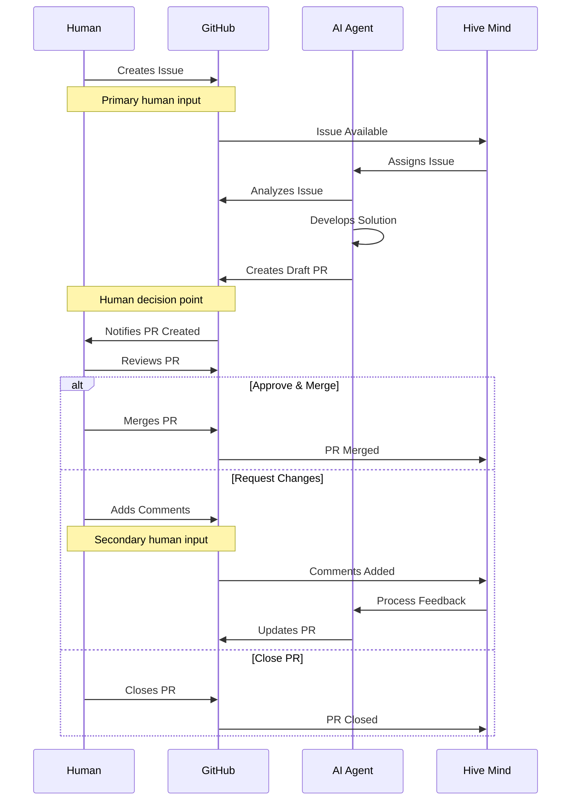
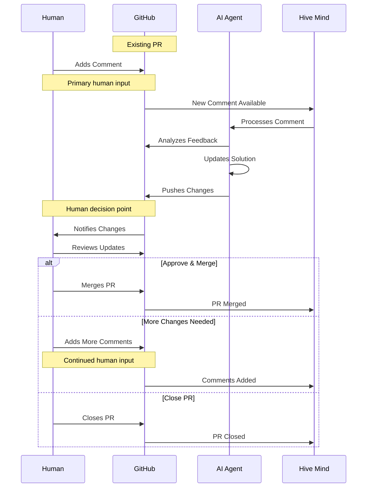

[](https://npmjs.com/@link-assistant/hive-mind)
[](https://github.com/link-assistant/hive-mind/blob/main/LICENSE)
[](https://github.com/link-assistant/hive-mind/stargazers)

[](https://gitpod.io/#https://github.com/link-assistant/hive-mind)
[](https://github.com/codespaces/new?hide_repo_select=true&ref=main&repo=link-assistant/hive-mind)

# Hive Mind 🧠

**The master mind AI that controls hive of AI.** The orchestrator AI that controls AIs. The HIVE MIND. The SWARM MIND.

It is also possible to connect this AI to collective human intelligence, meaning this system can communicate with humans for requirements, expertise, feedback.

[](https://github.com/konard/problem-solving)

Inspired by [konard/problem-solving](https://github.com/konard/problem-solving)

## Why Hive Mind?

**Hive Mind is the most autonomous, cloud-ready AI issue solver that eliminates developer babysitting while maintaining human oversight on critical decisions.**

Hive Mind is a **generalist AI** (mini-AGI) capable of working on a wide range of tasks - not just programming. Almost anything that can be done with files in a repository can be automated.

| Feature                      | What It Means For You                                                                              |
| ---------------------------- | -------------------------------------------------------------------------------------------------- |
| **No Babysitting**           | Full autonomous mode with sudo access. AI has creative freedom like a real programmer.             |
| **Cloud Isolation**          | Runs on dedicated VMs or Docker. Easy to restore if broken.                                        |
| **Full Internet + Sudo**     | AI can install packages, fetch docs, and configure the system as needed.                           |
| **Pre-installed Toolchain**  | 25GB+ ready: 10 language runtimes, 2 theorem provers, build tools. Can install more.               |
| **Token Efficiency**         | Routine tasks automated in code, so AI tokens focus on creative problem-solving.                   |
| **Time Freedom**             | What takes humans 2-8 hours, AI completes in 10-25 minutes. "The code is written while you sleep." |
| **Scale with Orchestration** | Parallel workers feel like a team of developers, all for ~$200/month.                              |
| **Human Control**            | AI creates draft PRs - you decide what merges. Quality gates where they matter.                    |
| **Any Device Programming**   | Manage AI from any device with `/solve` and `/hive`. No PC, IDE, or laptop required.               |
| **100% Open Source**         | Unlicense (public domain). Full transparency, no vendor lock-in.                                   |

> _"Compared to Codex for $200, this solution is fire."_ - User feedback

**Cost**: Claude MAX subscription (~$200/month, currently 50% off = $400 value) provides almost unlimited usage for Hive Mind - the best value/quality balance on the market.

Hive Mind has high creativity indistinguishable from average programmers. It asks questions if requirements are unclear, and you can clarify on the go via PR comments.

For detailed features and comparisons, see [docs/FEATURES.md](./docs/FEATURES.md) and [docs/COMPARISON.md](./docs/COMPARISON.md).

## ⚠️ WARNING

It is UNSAFE to run this software on your developer machine.

It is recommended to use SEPARATE Ubuntu 24.04 installation (installation script is prepared for you).

This software uses full autonomous mode of Claude Code, that means it is free to execute any commands it sees fit.

That means it can lead to unexpected side effects.

There is also a known issue of space leakage. So you need to make sure you are able to reinstall your virtual machine to clear space and/or any damage to the virtual machine.

### ⚠️ CRITICAL: Token and Sensitive Data Security

**THIS SOFTWARE CANNOT GUARANTEE ANY SAFETY FOR YOUR TOKENS OR OTHER SENSITIVE DATA ON THE VIRTUAL MACHINE.**

There are infinite ways to extract tokens from a virtual machine connected to the internet. This includes but is not limited to:

- **Claude MAX tokens** - Required for AI operations
- **GitHub tokens** - Required for repository access
- **API keys and credentials** - Any sensitive data on the system

**IMPORTANT SECURITY CONSIDERATIONS:**

- Running on a developer machine is **ABSOLUTELY UNSAFE**
- Running on a virtual machine is **LESS UNSAFE** but still has risks
- Even though your developer machine data isn't directly exposed, the VM still contains sensitive tokens
- Any token stored on an internet-connected system can potentially be compromised

**USE THIS SOFTWARE ENTIRELY AT YOUR OWN RISK AND RESPONSIBILITY.**

We strongly recommend:

- Using dedicated, isolated virtual machines
- Rotating tokens regularly
- Monitoring token usage for suspicious activity
- Never using production tokens or credentials
- Being prepared to revoke and replace all tokens used with this system

Minimum system requirements to run `hive.mjs`:

```
1 CPU Core
1 GB RAM
> 4 GB SWAP
50 GB disk space
```

## 🚀 Quick Start

### Global Installation

#### Using Bun (Recommended)

```bash
bun install -g @link-assistant/hive-mind
```

#### Using Node.js

```bash
npm install -g @link-assistant/hive-mind
```

### Installing Docker

If you don't have Docker installed yet, follow these steps to install Docker Engine on Ubuntu:

```bash
# Install prerequisites
sudo apt update
sudo apt install ca-certificates curl

# Add Docker's official GPG key
sudo install -m 0755 -d /etc/apt/keyrings
sudo curl -fsSL https://download.docker.com/linux/ubuntu/gpg -o /etc/apt/keyrings/docker.asc
sudo chmod a+r /etc/apt/keyrings/docker.asc

# Add Docker repository
sudo tee /etc/apt/sources.list.d/docker.sources <<EOF
Types: deb
URIs: https://download.docker.com/linux/ubuntu
Suites: $(. /etc/os-release && echo "${UBUNTU_CODENAME:-$VERSION_CODENAME}")
Components: stable
Signed-By: /etc/apt/keyrings/docker.asc
EOF

# Install Docker
sudo apt update
sudo apt install docker-ce docker-ce-cli containerd.io docker-buildx-plugin docker-compose-plugin

# Verify installation
sudo docker run hello-world
```

**For other operating systems** or detailed instructions, see the [official Docker documentation](https://docs.docker.com/engine/install/).

### Using Docker

Run the Hive Mind using Docker for safer local installation - no manual setup required:

**Note:** Docker is much safer for local installation and can be used to install multiple isolated instances on a server or Kubernetes cluster. For Kubernetes deployments, see the [Helm chart installation](#helm-installation-kubernetes) section below.

```bash
# Pull the latest image from Docker Hub
docker pull konard/hive-mind:latest

# Run an interactive session
docker run -it konard/hive-mind:latest

# IMPORTANT: Authenticate AFTER the Docker image is installed
# This avoids build timeouts and allows the installation to complete successfully

# Inside the container, authenticate with GitHub
gh-setup-git-identity

# Authenticate with Claude
claude

# Now you can use hive and solve commands
solve https://github.com/owner/repo/issues/123
```

**Benefits of Docker:**

- ✅ Pre-configured Ubuntu 24.04 environment
- ✅ All dependencies pre-installed
- ✅ Isolated from your host system
- ✅ Easy to run multiple instances with different GitHub accounts
- ✅ Consistent environment across different machines

See [docs/DOCKER.md](./docs/DOCKER.md) for advanced Docker usage.

### Helm Installation (Kubernetes)

Deploy Hive Mind on Kubernetes using Helm:

```bash
# Add the Hive Mind Helm repository
helm repo add link-assistant https://link-assistant.github.io/hive-mind
helm repo update

# Install Hive Mind
helm install hive-mind link-assistant/hive-mind

# Or install with custom values
helm install hive-mind link-assistant/hive-mind -f values.yaml
```

**Benefits of Helm:**

- ✅ Easy deployment to Kubernetes clusters
- ✅ Declarative configuration management
- ✅ Simple upgrades and rollbacks
- ✅ Production-ready with configurable resources
- ✅ Supports multiple replicas and scaling

See [docs/HELM.md](./docs/HELM.md) for detailed Helm configuration options.

**Note:** The Helm chart is published to [ArtifactHub](https://artifacthub.io/packages/helm/link-assistant/hive-mind) for easy discovery.

### Installation on Ubuntu 24.04 server

1. Reset/install VPS/VDS server with fresh Ubuntu 24.04
2. Login to `root` user.
3. Execute main installation script

   ```bash
   curl -fsSL -o- https://github.com/link-assistant/hive-mind/raw/refs/heads/main/scripts/ubuntu-24-server-install.sh | bash
   ```

   **Note:** The installation script will NOT run `gh auth login` automatically. This is intentional to support Docker builds without timeouts. Authentication is performed in the next steps.

4. Login to `hive` user

   ```bash
   su - hive
   ```

5. **IMPORTANT:** Authenticate with GitHub CLI AFTER installation is complete

   ```bash
   gh-setup-git-identity
   ```

   Note: Follow the prompts to authenticate with your GitHub account. This is required for the gh tool to work, and the system will perform all actions using this GitHub account. This step must be done AFTER the installation script completes to avoid build timeouts in Docker environments.

6. Claude Code CLI, OpenCode AI CLI, and @link-assistant/agent are preinstalled with the previous script. Now you need to make sure claude is authorized. Execute claude command, and follow all steps to authorize the local claude

   ```bash
   claude
   ```

   Note: Both opencode and agent come with free Grok Code Fast 1 model by default - so no authorization is required for these tools.

7. Launch the Hive Mind telegram bot:

   **Using Links Notation (recommended):**

   ```
   screen -R bot # Enter new screen for bot

   hive-telegram-bot --configuration "
     TELEGRAM_BOT_TOKEN: '849...355:AAG...rgk_YZk...aPU'
     TELEGRAM_ALLOWED_CHATS:
       -1002975819706
       -1002861722681
     TELEGRAM_HIVE_OVERRIDES:
       --all-issues
       --once
       --skip-issues-with-prs
       --attach-logs
       --verbose
       --no-tool-check
       --auto-resume-on-limit-reset
     TELEGRAM_SOLVE_OVERRIDES:
       --attach-logs
       --verbose
       --no-tool-check
       --auto-resume-on-limit-reset
     TELEGRAM_BOT_VERBOSE: true
   "

   # Press CTRL + A + D for detach from screen
   ```

   **Using individual command-line options:**

   ```
   screen -R bot # Enter new screen for bot

   hive-telegram-bot --token 849...355:AAG...rgk_YZk...aPU --allowed-chats "(
     -1002975819706
     -1002861722681
   )" --hive-overrides "(
     --all-issues
     --once
     --skip-issues-with-prs
     --attach-logs
     --verbose
     --no-tool-check
     --auto-resume-on-limit-reset
   )" --solve-overrides "(
     --attach-logs
     --verbose
     --no-tool-check
     --auto-resume-on-limit-reset
   )" --verbose

   # Press CTRL + A + D for detach from screen
   ```

   Note: You may need to register you own bot with https://t.me/BotFather to get the bot token.

#### Codex sign-in

1. Connect to your instance of VPS with Hive Mind installed, using SSH with tunnel opened

```bash
ssh -L 1455:localhost:1455 root@123.123.123.123
```

2. Start codex login oAuth server:

```bash
codex login
```

The oAuth callback server on 1455 port will be started, and the link to oAuth will be printed, copy the link.

3. Use your browser on machine where you started the tunnel from, paste there the link from `codex login` command, and go there using your browser. Once redirected to localhost:1455 you will see successful login page, and in `codex login` you will see `Successfully logged in`. After that `codex login` command will complete, and you can use `codex` command as usual to verify. It should also be working with `--tool codex` in `solve` and `hive` commands.

### Core Operations

```bash
# Solve using maximum power
solve https://github.com/Veronika89-lang/index.html/issues/1 --auto-continue --attach-logs --verbose --model opus --auto-fork --think max

# Solve GitHub issues automatically (auto-fork if no write access)
solve https://github.com/owner/repo/issues/123 --auto-fork --model sonnet

# Solve issue with PR to custom branch (manual fork mode)
solve https://github.com/owner/repo/issues/123 --base-branch develop --fork

# Continue working on existing PR
solve https://github.com/owner/repo/pull/456 --model opus

# Resume from Claude session when limit is reached
solve https://github.com/owner/repo/issues/123 --resume session-id

# Start hive orchestration (monitor and solve issues automatically)
hive https://github.com/owner/repo --monitor-tag "help wanted" --concurrency 3

# Monitor all issues in organization with auto-fork
hive https://github.com/microsoft --all-issues --max-issues 10 --auto-fork

# Run collaborative review process
review --repo owner/repo --pr 456

# Multiple AI reviewers for consensus
./reviewers-hive.mjs --agents 3 --consensus-threshold 0.8
```

## 📋 Core Components

| Script                                      | Purpose                       | Key Features                                                             |
| ------------------------------------------- | ----------------------------- | ------------------------------------------------------------------------ |
| `solve.mjs` (stable)                        | GitHub issue solver           | Auto fork, branch creation, PR generation, resume sessions, fork support |
| `hive.mjs` (stable)                         | AI orchestration & monitoring | Multi-repo monitoring, concurrent workers, issue queue management        |
| `review.mjs` (alpha)                        | Code review automation        | Collaborative AI reviews, automated feedback                             |
| `reviewers-hive.mjs` (alpha / experimental) | Review team management        | Multi-agent consensus, reviewer assignment                               |
| `telegram-bot.mjs` (stable)                 | Telegram bot interface        | Remote command execution, group chat support, diagnostic tools           |

> **Note**: For a comprehensive analysis of the "Could not process image" error in AI issue solvers, see the [Case Study: Issue #597](docs/case-studies/issue-597/README.md). The case study includes root cause analysis, timeline reconstruction, and evidence of GitHub's time-limited S3 URLs causing image processing failures. Separate tools for downloading GitHub issues and PRs with embedded images are being developed at [gh-download-issue](https://github.com/link-foundation/gh-download-issue) and [gh-download-pull-request](https://github.com/link-foundation/gh-download-pull-request).

## 🔧 solve Options

```bash
solve <issue-url> [options]
```

**Most frequently used options:**

| Option          | Alias | Description                             | Default   |
| --------------- | ----- | --------------------------------------- | --------- |
| `--model`       | `-m`  | AI model to use (sonnet, opus, haiku)   | sonnet    |
| `--think`       |       | Thinking level (low, medium, high, max) | -         |
| `--base-branch` | `-b`  | Target branch for PR                    | (default) |

**Other useful options:**

| Option          | Alias | Description                                      | Default |
| --------------- | ----- | ------------------------------------------------ | ------- |
| `--tool`        |       | AI tool (claude, opencode, codex, agent)         | claude  |
| `--verbose`     | `-v`  | Enable verbose logging                           | false   |
| `--attach-logs` |       | Attach logs to PR (⚠️ may expose sensitive data) | false   |
| `--help`        | `-h`  | Show all available options                       | -       |

> **📖 Full options list**: See [docs/CONFIGURATION.md](./docs/CONFIGURATION.md#solve-options) for all available options including forking, auto-continue, watch mode, and experimental features.

## 🔧 hive Options

```bash
hive <github-url> [options]
```

**Most frequently used options:**

| Option         | Alias | Description                             | Default |
| -------------- | ----- | --------------------------------------- | ------- |
| `--model`      | `-m`  | AI model to use (sonnet, opus, haiku)   | sonnet  |
| `--think`      |       | Thinking level (low, medium, high, max) | -       |
| `--all-issues` | `-a`  | Monitor all issues (ignore labels)      | false   |
| `--once`       |       | Single run (don't monitor continuously) | false   |

**Other useful options:**

| Option                   | Alias | Description                                       | Default |
| ------------------------ | ----- | ------------------------------------------------- | ------- |
| `--tool`                 |       | AI tool (claude, opencode, agent)                 | claude  |
| `--concurrency`          | `-c`  | Number of parallel workers                        | 2       |
| `--skip-issues-with-prs` | `-s`  | Skip issues with existing PRs                     | false   |
| `--verbose`              | `-v`  | Enable verbose logging                            | false   |
| `--attach-logs`          |       | Attach logs to PRs (⚠️ may expose sensitive data) | false   |
| `--help`                 | `-h`  | Show all available options                        | -       |

> **📖 Full options list**: See [docs/CONFIGURATION.md](./docs/CONFIGURATION.md#hive-options) for all available options including project monitoring, YouTrack integration, and experimental features.

## 🤖 Telegram Bot

The Hive Mind includes a Telegram bot interface (SwarmMindBot) for remote command execution.

### 🚀 Test Drive

Want to see the Hive Mind in action? Join our Telegram channel where you can execute the Hive Mind on your own issues and watch AI solve them:

**[Join https://t.me/hive_mind_pull_requests](https://t.me/hive_mind_pull_requests)**

### Setup

1. **Get Bot Token**
   - Talk to [@BotFather](https://t.me/BotFather) on Telegram
   - Create a new bot and get your token
   - Add the bot to your group chat and make it an admin

2. **Configure Environment**

   ```bash
   # Copy the example configuration
   cp .env.example .env

   # Edit and add your bot token
   echo "TELEGRAM_BOT_TOKEN=your_bot_token_here" >> .env

   # Optional: Restrict to specific chats
   # Get chat ID using /help command, then add:
   echo "TELEGRAM_ALLOWED_CHATS=123456789,987654321" >> .env
   ```

3. **Start the Bot**

   ```bash
   hive-telegram-bot
   ```

   **Recommended: Capture logs with tee**

   When running the bot for extended periods, it's recommended to capture logs to a file using `tee`. This ensures you can review logs later even if the terminal buffer overflows:

   ```bash
   hive-telegram-bot 2>&1 | tee -a logs/bot-$(date +%Y%m%d).log
   ```

   Or create a logs directory and start with automatic log rotation:

   ```bash
   mkdir -p logs
   hive-telegram-bot 2>&1 | tee -a "logs/bot-$(date +%Y%m%d-%H%M%S).log"
   ```

### Bot Commands

All commands work in **group chats only** (not in private messages with the bot):

#### `/solve` - Solve GitHub Issues

```
/solve <github-url> [options]

Examples:
/solve https://github.com/owner/repo/issues/123 --model sonnet
/solve https://github.com/owner/repo/issues/123 --model opus --think max

Free Models (with --tool agent):
/solve https://github.com/owner/repo/issues/123 --tool agent --model kimi-k2.5-free
/solve https://github.com/owner/repo/issues/123 --tool agent --model minimax-m2.1-free
/solve https://github.com/owner/repo/issues/123 --tool agent --model gpt-5-nano
/solve https://github.com/owner/repo/issues/123 --tool agent --model glm-4.7-free
/solve https://github.com/owner/repo/issues/123 --tool agent --model big-pickle

Free Models via Kilo Gateway (with --tool agent):
/solve https://github.com/owner/repo/issues/123 --tool agent --model kilo/glm-5-free
/solve https://github.com/owner/repo/issues/123 --tool agent --model kilo/glm-4.7-free
/solve https://github.com/owner/repo/issues/123 --tool agent --model kilo/kimi-k2.5-free
```

> **📖 Free Models Guide**: See [docs/FREE_MODELS.md](./docs/FREE_MODELS.md) for comprehensive information about all free models including OpenCode Zen and Kilo Gateway providers.

#### `/hive` - Run Hive Orchestration

```
/hive <github-url> [options]

Examples:
/hive https://github.com/owner/repo
/hive https://github.com/owner/repo --all-issues --max-issues 10
/hive https://github.com/microsoft --all-issues --concurrency 3
```

#### `/limits` - Show Usage Limits

```
/limits

Shows:
- CPU usage and load average
- RAM usage (used vs total)
- Disk space usage
- GitHub API rate limits
- Claude usage limits (session and weekly)
```

#### `/help` - Get Help and Diagnostic Info

```
/help

Shows:
- Chat ID (needed for TELEGRAM_ALLOWED_CHATS)
- Chat type
- Available commands
- Usage examples
```

### Features

- ✅ **Group Chat Only**: Commands work only in group chats (not private messages)
- ✅ **Full Options Support**: All command-line options work in Telegram
- ✅ **Screen Sessions**: Commands run in detached screen sessions
- ✅ **Chat Restrictions**: Optional whitelist of allowed chat IDs
- ✅ **Diagnostic Tools**: Get chat ID and configuration info

### Security Notes

- Only works in group chats where the bot is admin
- Optional chat ID restrictions via `TELEGRAM_ALLOWED_CHATS`
- Commands run as the system user running the bot
- Ensure proper authentication (`gh auth login`, `claude-profiles`)

## 🏗️ Architecture

The Hive Mind operates on three layers:

1. **Orchestration Layer** (`hive.mjs`) - Coordinates multiple AI agents
2. **Execution Layer** (`solve.mjs`, `review.mjs`) - Performs specific tasks
3. **Human Interface Layer** - Enables human-AI collaboration

### Data Flow

#### Mode 1: Issue → Pull Request Flow



#### Mode 2: Pull Request → Comments Flow



📖 **For comprehensive data flow documentation including human feedback integration points, see [docs/flow.md](./docs/flow.md)**

## 📊 Usage Examples

### Automated Issue Resolution

```bash
# Auto-fork and solve issue (automatic fork detection for public repos)
solve https://github.com/owner/repo/issues/123 --auto-fork --model opus

# Manual fork and solve issue (works for both public and private repos)
solve https://github.com/owner/repo/issues/123 --fork --model opus

# Continue work on existing PR
solve https://github.com/owner/repo/pull/456 --verbose

# Solve with detailed logging and solution attachment
solve https://github.com/owner/repo/issues/123 --verbose --attach-logs

# Dry run to see what would happen
solve https://github.com/owner/repo/issues/123 --dry-run
```

### Multi-Repository Orchestration

```bash
# Monitor single repository with specific label
hive https://github.com/owner/repo --monitor-tag "bug" --concurrency 4

# Monitor all issues in an organization with auto-fork
hive https://github.com/microsoft --all-issues --max-issues 20 --once --auto-fork

# Monitor user repositories with high concurrency
hive https://github.com/username --all-issues --concurrency 8 --interval 120 --auto-fork

# Skip issues that already have PRs
hive https://github.com/org/repo --skip-issues-with-prs --verbose

# Auto-cleanup temporary files and auto-fork if needed
hive https://github.com/org/repo --auto-cleanup --auto-fork --concurrency 5
```

### Session Management

```bash
# Resume when Claude hits limit
solve https://github.com/owner/repo/issues/123 --resume 657e6db1-6eb3-4a8d

# Continue session interactively in Claude Code
(cd /tmp/gh-issue-solver-123456789 && claude --resume session-id)
```

## 🔍 Monitoring & Logging

Find resume commands in logs:

```bash
grep -E '\(cd /tmp/gh-issue-solver-[0-9]+ && claude --resume [0-9a-f-]{36}\)' hive-*.log
```

## 🔧 Configuration

**Authentication:**

- `gh auth login` - GitHub CLI authentication
- `claude-profiles` - Claude authentication profile migration to server

**OpenRouter Integration:**

Use OpenRouter to access 500+ AI models from 60+ providers with a single API key. See [docs/OPENROUTER.md](./docs/OPENROUTER.md) for setup instructions covering both Claude Code CLI and @link-assistant/agent.

**Environment Variables & Advanced Options:**

For comprehensive configuration including environment variables, timeouts, retry limits, Telegram bot settings, YouTrack integration, and all CLI options, see [docs/CONFIGURATION.md](./docs/CONFIGURATION.md).

## 🐛 Reporting Issues

### Hive Mind Issues

If you encounter issues with **Hive Mind** (this project), please report them on our GitHub Issues page:

- **Repository**: https://github.com/link-assistant/hive-mind
- **Issues**: https://github.com/link-assistant/hive-mind/issues

### Claude Code CLI Issues

If you encounter issues with the **Claude Code CLI** itself (e.g., `claude` command errors, installation problems, or CLI bugs), please report them to the official Claude Code repository:

- **Repository**: https://github.com/anthropics/claude-code
- **Issues**: https://github.com/anthropics/claude-code/issues

## 🛡️ File Size Enforcement

All documentation files are automatically checked:

```bash
find docs/ -name "*.md" -exec wc -l {} + | awk '$1 > 1000 {print "ERROR: " $2 " has " $1 " lines (max 1000)"}'
```

## Server diagnostics

Identify screens that are parents of processes that eating the resources

```bash
TARGETS="62220 65988 63094 66606 1028071 4127023"

# build screen PID -> session name map
declare -A NAME
while read -r id; do spid=${id%%.*}; NAME[$spid]="$id"; done \
  < <(screen -ls | awk '/(Detached|Attached)/{print $1}')

# check each PID's environment for STY and map back to session
for p in $TARGETS; do
  sty=$(tr '\0' '\n' < /proc/$p/environ 2>/dev/null | awk -F= '$1=="STY"{print $2}')
  if [ -n "$sty" ]; then
    spid=${sty%%.*}
    echo "$p  ->  ${NAME[$spid]:-$sty}"
  else
    echo "$p  ->  (no STY; not from screen or env cleared / double-forked)"
  fi
done
```

Show details about the proccess

```bash
procinfo() {
  local pid=$1
  if [ -z "$pid" ]; then
    echo "Usage: procinfo <pid>"
    return 1
  fi
  if [ ! -d "/proc/$pid" ]; then
    echo "Process $pid not found."
    return 1
  fi

  echo "=== Process $pid ==="
  # Basic process info
  ps -p "$pid" -o user=,uid=,pid=,ppid=,c=,stime=,etime=,tty=,time=,cmd=

  echo
  # Working directory
  echo "CWD: $(readlink -f /proc/$pid/cwd 2>/dev/null)"

  # Executable path
  echo "EXE: $(readlink -f /proc/$pid/exe 2>/dev/null)"

  # Root directory of the process
  echo "ROOT: $(readlink -f /proc/$pid/root 2>/dev/null)"

  # Command line (full, raw)
  echo "CMDLINE:"
  tr '\0' ' ' < /proc/$pid/cmdline 2>/dev/null
  echo

  # Environment variables
  echo
  echo "ENVIRONMENT (key=value):"
  tr '\0' '\n' < /proc/$pid/environ 2>/dev/null | head -n 20

  # Open files (first few)
  echo
  echo "OPEN FILES:"
  ls -l /proc/$pid/fd 2>/dev/null | head -n 10

  # Child processes
  echo
  echo "CHILDREN:"
  ps --ppid "$pid" -o pid=,cmd= 2>/dev/null
}
procinfo 62220
```

## Maintenance

### Reboot server.

```
sudo reboot
```

That will remove all dangling unused proccesses and screens, which will in turn free the RAM and reduce CPU load. Also reboot may clear all temporary files, so next step can do nothing if reboot was done.

### Cleanup disk space.

```
df -h

rm -rf /tmp

df -h
```

These commands should be executed under `hive` user. If you have accidentally removed the `/tmp` folder itself under `root` user, you will need to restore it like this:

```bash
sudo mkdir -p /tmp
sudo chown root:root /tmp
sudo chmod 1777 /tmp
```

### Close all screens to free up RAM

```bash
# close all (Attached or Detached) sessions
screen -ls | awk '/(Detached|Attached)/{print $1}' \
| while read s; do screen -S "$s" -X quit; done

# remove any zombie sockets
screen -wipe

# verify
screen -ls
```

That can be done, but not recommended as reboot have better effect.

## 📄 License

Unlicense License - see [LICENSE](./LICENSE)

## 🏆 Best Practices

Hive Mind works even better when repositories have strong CI/CD pipelines. See [BEST-PRACTICES.md](./docs/BEST-PRACTICES.md) for recommended configurations that maximize AI solver quality.

Key benefits of proper CI/CD:

- AI solvers iterate until all checks pass
- Consistent quality regardless of human/AI team composition
- File size limits ensure code is readable by both AI and humans

Ready-to-use templates are available for JavaScript, Rust, Python, Go, C#, and Java.

## 🤖 Contributing

This project uses AI-driven development. See [CONTRIBUTING.md](./docs/CONTRIBUTING.md) for human-AI collaboration guidelines.
