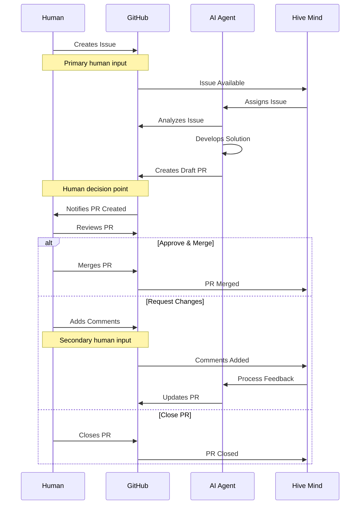
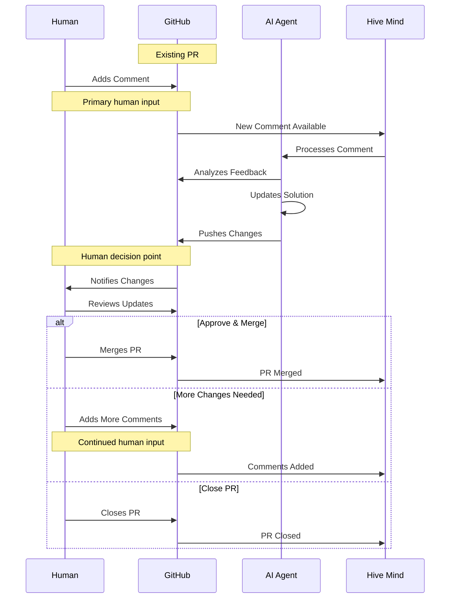

[](https://npmjs.com/@link-assistant/hive-mind)
[](https://github.com/link-assistant/hive-mind/blob/main/LICENSE)
[](https://github.com/link-assistant/hive-mind/stargazers)

[](https://gitpod.io/#https://github.com/link-assistant/hive-mind)
[](https://github.com/codespaces/new?hide_repo_select=true&ref=main&repo=link-assistant/hive-mind)

# Hive Mind

**The master mind AI that controls hive of AI.** The orchestrator AI that controls AIs. The HIVE MIND. The SWARM MIND.

It is also possible to connect this AI to collective human intelligence, meaning this system can communicate with humans for requirements, expertise, feedback.

[](https://github.com/konard/problem-solving)

Inspired by [konard/problem-solving](https://github.com/konard/problem-solving)

## Why Hive Mind?

**Hive Mind is the most autonomous, cloud-ready AI issue solver that eliminates developer babysitting while maintaining human oversight on critical decisions.**

Hive Mind is a **generalist AI** (mini-AGI) capable of working on a wide range of tasks - not just programming. Almost anything that can be done with files in a repository can be automated.

| Feature                      | What It Means For You                                                                              |
| ---------------------------- | -------------------------------------------------------------------------------------------------- |
| **No Babysitting**           | Full autonomous mode with sudo access. AI has creative freedom like a real programmer.             |
| **Cloud Isolation**          | Runs on dedicated VMs or Docker. Easy to restore if broken.                                        |
| **Full Internet + Sudo**     | AI can install packages, fetch docs, and configure the system as needed.                           |
| **Pre-installed Toolchain**  | 25GB+ ready: 10 language runtimes, 2 theorem provers, build tools. Can install more.               |
| **Token Efficiency**         | Routine tasks automated in code, so AI tokens focus on creative problem-solving.                   |
| **Time Freedom**             | What takes humans 2-8 hours, AI completes in 10-25 minutes. "The code is written while you sleep." |
| **Scale with Orchestration** | Parallel workers feel like a team of developers, all for ~$200/month.                              |
| **Human Control**            | AI creates draft PRs - you decide what merges. Quality gates where they matter.                    |
| **Any Device Programming**   | Manage AI from any device with `/solve` and `/hive`. No PC, IDE, or laptop required.               |
| **100% Open Source**         | Unlicense (public domain). Full transparency, no vendor lock-in.                                   |

> _"Compared to Codex for $200, this solution is fire."_ - User feedback

**Cost**: Claude MAX subscription (~$200/month, currently 50% off = $400 value) provides almost unlimited usage for Hive Mind - the best value/quality balance on the market.

Hive Mind has high creativity indistinguishable from average programmers. It asks questions if requirements are unclear, and you can clarify on the go via PR comments.

For detailed features and comparisons, see [docs/FEATURES.md](./docs/FEATURES.md) and [docs/COMPARISON.md](./docs/COMPARISON.md).

## WARNING

It is UNSAFE to run this software on your developer machine.

It is recommended to use SEPARATE Ubuntu 24.04 installation (installation script is prepared for you).

This software uses full autonomous mode of Claude Code, that means it is free to execute any commands it sees fit.

That means it can lead to unexpected side effects.

There is also a known issue of space leakage. So you need to make sure you are able to reinstall your virtual machine to clear space and/or any damage to the virtual machine.

### CRITICAL: Token and Sensitive Data Security

**THIS SOFTWARE CANNOT GUARANTEE ANY SAFETY FOR YOUR TOKENS OR OTHER SENSITIVE DATA ON THE VIRTUAL MACHINE.**

There are infinite ways to extract tokens from a virtual machine connected to the internet. This includes but is not limited to:

- **Claude MAX tokens** - Required for AI operations
- **GitHub tokens** - Required for repository access
- **API keys and credentials** - Any sensitive data on the system

**IMPORTANT SECURITY CONSIDERATIONS:**

- Running on a developer machine is **ABSOLUTELY UNSAFE**
- Running on a virtual machine is **LESS UNSAFE** but still has risks
- Even though your developer machine data isn't directly exposed, the VM still contains sensitive tokens
- Any token stored on an internet-connected system can potentially be compromised

**USE THIS SOFTWARE ENTIRELY AT YOUR OWN RISK AND RESPONSIBILITY.**

We strongly recommend:

- Using dedicated, isolated virtual machines
- Rotating tokens regularly
- Monitoring token usage for suspicious activity
- Never using production tokens or credentials
- Being prepared to revoke and replace all tokens used with this system

**Minimum system requirements:**

```
1 CPU Core
1 GB RAM
> 4 GB SWAP
50 GB disk space
```

## Quick Start

Choose your preferred installation method:

| Method | Best For | Guide |
| ------ | -------- | ----- |
| **Docker** | Local development, multiple instances | [Docker Installation](#docker-installation) |
| **Helm/Kubernetes** | Production deployments, scaling | [Helm Installation](#helm-installation) |
| **Ubuntu 24.04 Server** | Dedicated VMs/VPS | [Server Installation](#ubuntu-2404-server-installation) |
| **Global npm/bun** | Quick local testing | [Global Installation](#global-installation) |

### Docker Installation

**Safest option for local installation.** Runs in isolated containers with all dependencies pre-installed.

```bash
# Pull and run
docker pull konard/hive-mind:latest
docker run -it konard/hive-mind:latest

# Inside the container, authenticate:
gh-setup-git-identity
claude

# Ready to use!
```

**Benefits:**

- Pre-configured Ubuntu 24.04 environment
- All dependencies pre-installed
- Isolated from your host system
- Easy to run multiple instances

See [docs/DOCKER.md](./docs/DOCKER.md) for persistent storage, Docker Compose, and CI/CD configuration.

### Helm Installation

**Best for Kubernetes production deployments.**

```bash
# Add repository and install
helm repo add link-assistant https://link-assistant.github.io/hive-mind
helm repo update
helm install hive-mind link-assistant/hive-mind
```

**Benefits:**

- Declarative configuration management
- Simple upgrades and rollbacks
- Production-ready with configurable resources
- Supports multiple replicas and scaling

See [docs/HELM.md](./docs/HELM.md) for configuration, authentication secrets, and production examples.

### Ubuntu 24.04 Server Installation

**Best for dedicated VMs/VPS.**

1. Reset/install VPS with fresh Ubuntu 24.04
2. Login as `root` and run:

   ```bash
   curl -fsSL -o- https://github.com/link-assistant/hive-mind/raw/refs/heads/main/scripts/ubuntu-24-server-install.sh | bash
   ```

3. Switch to `hive` user and authenticate:

   ```bash
   su - hive
   gh-setup-git-identity
   claude
   ```

### Global Installation

**For quick testing (not recommended for production).**

```bash
# Using Bun (Recommended)
bun install -g @link-assistant/hive-mind

# Using Node.js
npm install -g @link-assistant/hive-mind
```

## Usage

Once installed and authenticated, you can use Hive Mind via:

- **CLI commands** (`solve`, `hive`) - Direct terminal usage
- **Telegram bot** - Remote control from any device

### Quick Examples

```bash
# Solve a GitHub issue
solve https://github.com/owner/repo/issues/123 --model sonnet

# Solve with maximum power
solve https://github.com/owner/repo/issues/123 --model opus --think max --auto-fork

# Monitor and solve all issues in a repo
hive https://github.com/owner/repo --all-issues --once
```

**Full usage documentation:** See [docs/USAGE.md](./docs/USAGE.md) for complete CLI reference, Telegram bot setup, and all options.

## Core Components

| Script                                      | Purpose                       | Key Features                                                             |
| ------------------------------------------- | ----------------------------- | ------------------------------------------------------------------------ |
| `solve.mjs` (stable)                        | GitHub issue solver           | Auto fork, branch creation, PR generation, resume sessions, fork support |
| `hive.mjs` (stable)                         | AI orchestration & monitoring | Multi-repo monitoring, concurrent workers, issue queue management        |
| `review.mjs` (alpha)                        | Code review automation        | Collaborative AI reviews, automated feedback                             |
| `reviewers-hive.mjs` (alpha / experimental) | Review team management        | Multi-agent consensus, reviewer assignment                               |
| `telegram-bot.mjs` (stable)                 | Telegram bot interface        | Remote command execution, group chat support, diagnostic tools           |

> **Note**: For a comprehensive analysis of the "Could not process image" error in AI issue solvers, see the [Case Study: Issue #597](docs/case-studies/issue-597/README.md).

## Architecture

The Hive Mind operates on three layers:

1. **Orchestration Layer** (`hive.mjs`) - Coordinates multiple AI agents
2. **Execution Layer** (`solve.mjs`, `review.mjs`) - Performs specific tasks
3. **Human Interface Layer** - Enables human-AI collaboration

### Data Flow

#### Mode 1: Issue -> Pull Request Flow



#### Mode 2: Pull Request -> Comments Flow



For comprehensive data flow documentation including human feedback integration points, see [docs/flow.md](./docs/flow.md).

## Configuration

For detailed configuration options see [docs/CONFIGURATION.md](./docs/CONFIGURATION.md).

## Documentation

| Document | Description |
| -------- | ----------- |
| [docs/USAGE.md](./docs/USAGE.md) | Complete CLI and Telegram bot usage guide |
| [docs/CONFIGURATION.md](./docs/CONFIGURATION.md) | All configuration options and environment variables |
| [docs/FEATURES.md](./docs/FEATURES.md) | Detailed feature explanations |
| [docs/COMPARISON.md](./docs/COMPARISON.md) | Comparisons with alternatives |
| [docs/DOCKER.md](./docs/DOCKER.md) | Docker installation and configuration |
| [docs/HELM.md](./docs/HELM.md) | Kubernetes/Helm deployment guide |
| [docs/BEST-PRACTICES.md](./docs/BEST-PRACTICES.md) | CI/CD recommendations for best results |

## Reporting Issues

### Hive Mind Issues

If you encounter issues with **Hive Mind** (this project), please report them on our GitHub Issues page:

- **Repository**: https://github.com/link-assistant/hive-mind
- **Issues**: https://github.com/link-assistant/hive-mind/issues

### Claude Code CLI Issues

If you encounter issues with the **Claude Code CLI** itself (e.g., `claude` command errors, installation problems, or CLI bugs), please report them to the official Claude Code repository:

- **Repository**: https://github.com/anthropics/claude-code
- **Issues**: https://github.com/anthropics/claude-code/issues

## Server Diagnostics

Identify screens that are parents of processes consuming resources:

```bash
TARGETS="62220 65988 63094 66606 1028071 4127023"

# build screen PID -> session name map
declare -A NAME
while read -r id; do spid=${id%%.*}; NAME[$spid]="$id"; done \
  < <(screen -ls | awk '/(Detached|Attached)/{print $1}')

# check each PID's environment for STY and map back to session
for p in $TARGETS; do
  sty=$(tr '\0' '\n' < /proc/$p/environ 2>/dev/null | awk -F= '$1=="STY"{print $2}')
  if [ -n "$sty" ]; then
    spid=${sty%%.*}
    echo "$p  ->  ${NAME[$spid]:-$sty}"
  else
    echo "$p  ->  (no STY; not from screen or env cleared / double-forked)"
  fi
done
```

Show details about a process:

```bash
procinfo() {
  local pid=$1
  if [ -z "$pid" ]; then
    echo "Usage: procinfo <pid>"
    return 1
  fi
  if [ ! -d "/proc/$pid" ]; then
    echo "Process $pid not found."
    return 1
  fi

  echo "=== Process $pid ==="
  ps -p "$pid" -o user=,uid=,pid=,ppid=,c=,stime=,etime=,tty=,time=,cmd=

  echo
  echo "CWD: $(readlink -f /proc/$pid/cwd 2>/dev/null)"
  echo "EXE: $(readlink -f /proc/$pid/exe 2>/dev/null)"
  echo "ROOT: $(readlink -f /proc/$pid/root 2>/dev/null)"

  echo "CMDLINE:"
  tr '\0' ' ' < /proc/$pid/cmdline 2>/dev/null
  echo

  echo
  echo "ENVIRONMENT (key=value):"
  tr '\0' '\n' < /proc/$pid/environ 2>/dev/null | head -n 20

  echo
  echo "OPEN FILES:"
  ls -l /proc/$pid/fd 2>/dev/null | head -n 10

  echo
  echo "CHILDREN:"
  ps --ppid "$pid" -o pid=,cmd= 2>/dev/null
}
procinfo 62220
```

## Maintenance

### Reboot Server

```bash
sudo reboot
```

This removes all dangling unused processes and screens, freeing RAM and reducing CPU load. Reboot may also clear temporary files.

### Cleanup Disk Space

```bash
df -h
rm -rf /tmp
df -h
```

Execute under `hive` user. If you accidentally removed `/tmp` as `root`, restore it:

```bash
sudo mkdir -p /tmp
sudo chown root:root /tmp
sudo chmod 1777 /tmp
```

### Close All Screens

```bash
# Close all sessions
screen -ls | awk '/(Detached|Attached)/{print $1}' \
| while read s; do screen -S "$s" -X quit; done

# Remove zombie sockets
screen -wipe

# Verify
screen -ls
```

## License

Unlicense License - see [LICENSE](./LICENSE)

## Best Practices

Hive Mind works even better when repositories have strong CI/CD pipelines. See [BEST-PRACTICES.md](./docs/BEST-PRACTICES.md) for recommended configurations.

Key benefits of proper CI/CD:

- AI solvers iterate until all checks pass
- Consistent quality regardless of human/AI team composition
- File size limits ensure code is readable by both AI and humans

Ready-to-use templates are available for JavaScript, Rust, Python, Go, C#, and Java.

## Contributing

This project uses AI-driven development. See [CONTRIBUTING.md](./docs/CONTRIBUTING.md) for human-AI collaboration guidelines.
