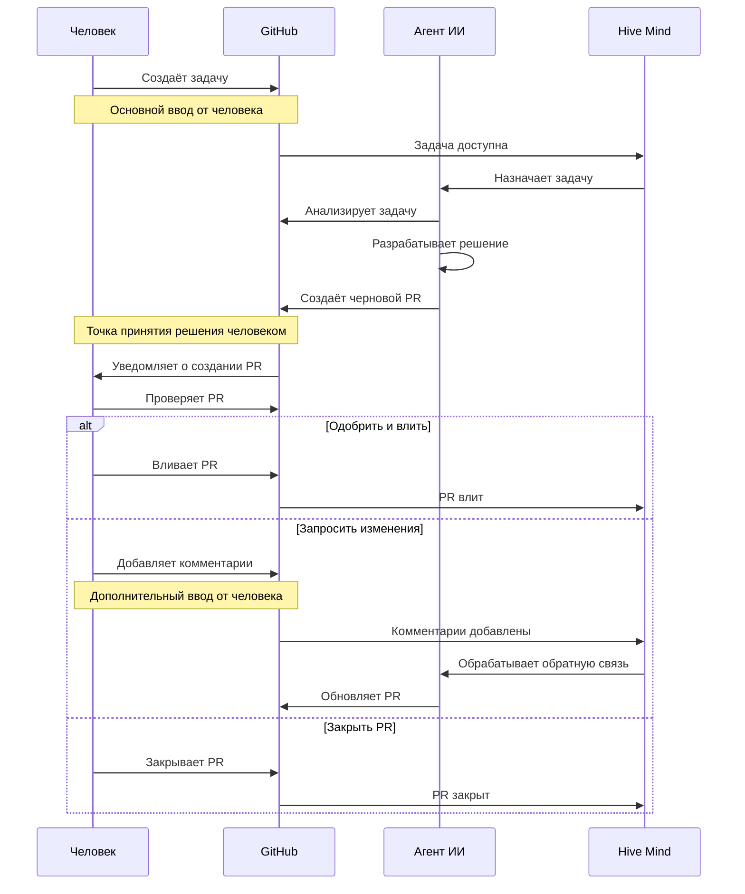
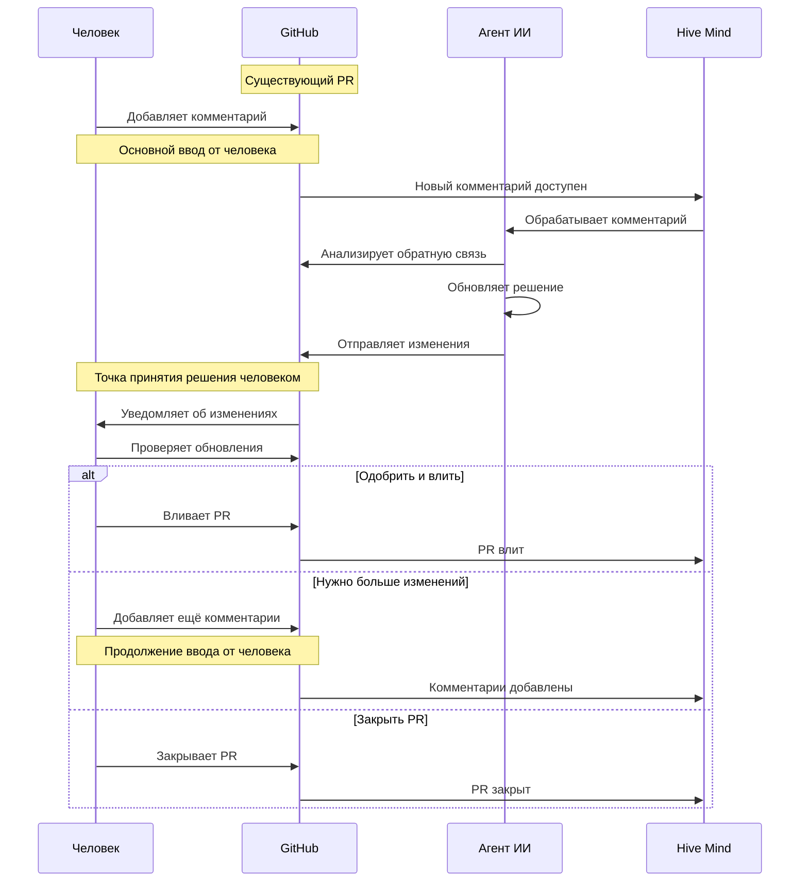

[](https://npmjs.com/@link-assistant/hive-mind)
[](https://github.com/link-assistant/hive-mind/blob/main/LICENSE)
[](https://github.com/link-assistant/hive-mind/stargazers)

[](https://gitpod.io/#https://github.com/link-assistant/hive-mind)
[](https://github.com/codespaces/new?hide_repo_select=true&ref=main&repo=link-assistant/hive-mind)

# Hive Mind 🧠 (languages: [en](README.md) • [zh](README.zh.md) • [hi](README.hi.md) • ru)

**Главный ИИ, управляющий роем ИИ.** Оркестрирующий ИИ, который управляет другими ИИ. HIVE MIND. SWARM MIND.

Также возможно подключить этот ИИ к коллективному человеческому интеллекту — система умеет общаться с людьми для уточнения требований, получения экспертных знаний и обратной связи.

[](https://github.com/konard/problem-solving)

Вдохновлено проектом [konard/problem-solving](https://github.com/konard/problem-solving)

## Зачем нужен Hive Mind?

**Hive Mind — наиболее автономный, облачно-ориентированный ИИ-решатель задач, который устраняет необходимость постоянного контроля со стороны разработчика, сохраняя при этом человеческий надзор над критически важными решениями.**

Hive Mind — это **универсальный ИИ** (мини-AGI), способный работать над широким спектром задач, а не только над программированием. Практически всё, что можно сделать с файлами в репозитории, поддаётся автоматизации.

| Возможность                              | Что это означает для вас                                                                                                                                           |
| ---------------------------------------- | ------------------------------------------------------------------------------------------------------------------------------------------------------------------ |
| **Без постоянного контроля**             | Полный автономный режим с правами sudo. ИИ обладает творческой свободой, как настоящий программист.                                                                |
| **Изоляция в облаке**                    | Работает на выделенных виртуальных машинах или в Docker. Легко восстановить в случае поломки.                                                                      |
| **Полный доступ к интернету + Sudo**     | ИИ может устанавливать пакеты, получать документацию и настраивать систему по мере необходимости.                                                                  |
| **Предустановленный инструментарий**     | Более 25 ГБ готово к работе: 10 языковых сред выполнения, 2 средства доказательства теорем, инструменты сборки. Можно установить дополнительные.                   |
| **Эффективность токенов**                | Рутинные задачи автоматизированы в коде, поэтому токены ИИ сосредоточены на творческом решении проблем.                                                            |
| **Свобода времени**                      | То, что занимает у людей 2–8 часов, ИИ выполняет за 10–25 минут за рабочую сессию. Возможно массовое выполнение задач в репозитории. «Код пишется, пока вы спите». |
| **Масштабирование с оркестрацией**       | Параллельные воркеры ощущаются как команда разработчиков — всё примерно за $200 в месяц.                                                                           |
| **Контроль со стороны человека**         | ИИ создаёт черновые PR — вы решаете, что вливать. Контроль качества там, где это важно.                                                                            |
| **Программирование с любого устройства** | Управляйте ИИ с любого устройства через `/solve` и `/hive` посредством Telegram-бота. ПК, IDE или ноутбук не нужны.                                                |
| **100% открытый исходный код**           | Лицензия Unlicense (общественное достояние). Полная прозрачность, без привязки к поставщику.                                                                       |

> _«По сравнению с Codex за $200, это решение — огонь.»_ — отзыв пользователя

**Стоимость**: подписка Claude MAX (~$200 в месяц, сейчас со скидкой 50% = ценность $400) обеспечивает практически неограниченное использование для Hive Mind — лучшее соотношение цены и качества на рынке.

Hive Mind обладает высоким уровнем творчества, неотличимым от среднего программиста. Он задаёт вопросы, если требования неясны, и вы можете уточнять их на ходу через комментарии к PR.

Подробные возможности и сравнения см. в [docs/FEATURES.ru.md](./docs/FEATURES.ru.md) и [docs/COMPARISON.ru.md](./docs/COMPARISON.ru.md).

## ⚠️ ПРЕДУПРЕЖДЕНИЕ

Запускать это программное обеспечение на вашей рабочей машине НЕБЕЗОПАСНО.

Рекомендуется использовать Docker для установки (как локально, так и на серверах). Смотрите раздел [Установка через Docker](#использование-docker) ниже.

Это программное обеспечение использует полностью автономный режим Claude Code, а значит, оно может выполнять любые команды по своему усмотрению.

Это может привести к непредвиденным побочным эффектам.

Также существует известная проблема утечки дискового пространства. Убедитесь, что вы в состоянии переустановить виртуальную машину для освобождения места и/или устранения любых повреждений.

### ⚠️ КРИТИЧЕСКИ ВАЖНО: Безопасность токенов и конфиденциальных данных

**ЭТО ПРОГРАММНОЕ ОБЕСПЕЧЕНИЕ НЕ МОЖЕТ ГАРАНТИРОВАТЬ БЕЗОПАСНОСТЬ ВАШИХ ТОКЕНОВ ИЛИ ДРУГИХ КОНФИДЕНЦИАЛЬНЫХ ДАННЫХ НА ВИРТУАЛЬНОЙ МАШИНЕ.**

Существует бесконечное множество способов извлечь токены с виртуальной машины, подключённой к интернету. Это включает, но не ограничивается:

- **Токены Claude MAX** — необходимы для работы ИИ
- **Токены GitHub** — необходимы для доступа к репозиториям
- **API-ключи и учётные данные** — любые конфиденциальные данные в системе

**ВАЖНЫЕ СООБРАЖЕНИЯ ПО БЕЗОПАСНОСТИ:**

- Запуск на рабочей машине разработчика **АБСОЛЮТНО НЕБЕЗОПАСЕН**
- Запуск на виртуальной машине **МЕНЕЕ НЕБЕЗОПАСЕН**, но всё ещё несёт риски
- Даже если данные вашей рабочей машины не подвергаются прямому воздействию, виртуальная машина всё равно содержит конфиденциальные токены
- Любой токен, хранящийся в системе, подключённой к интернету, потенциально может быть скомпрометирован

**ИСПОЛЬЗУЙТЕ ЭТО ПРОГРАММНОЕ ОБЕСПЕЧЕНИЕ ИСКЛЮЧИТЕЛЬНО НА СВОЙ СТРАХ И РИСК.**

Мы настоятельно рекомендуем:

- Использовать выделенные изолированные виртуальные машины
- Регулярно ротировать токены
- Отслеживать использование токенов на предмет подозрительной активности
- Никогда не использовать производственные токены или учётные данные
- Быть готовыми отозвать и заменить все токены, используемые в этой системе

Минимальные системные требования для запуска `hive.mjs`:

```
1 ядро CPU
1 ГБ ОЗУ
> 4 ГБ SWAP
50 ГБ дискового пространства
```

## 🚀 Быстрый старт

### Глобальная установка

#### С помощью Bun (рекомендуется)

```bash
bun install -g @link-assistant/hive-mind
```

#### С помощью Node.js

```bash
npm install -g @link-assistant/hive-mind
```

### Установка Docker

Если у вас ещё не установлен Docker, выполните следующие шаги для установки Docker Engine на Ubuntu:

```bash
# Install prerequisites
sudo apt update
sudo apt install ca-certificates curl

# Add Docker's official GPG key
sudo install -m 0755 -d /etc/apt/keyrings
sudo curl -fsSL https://download.docker.com/linux/ubuntu/gpg -o /etc/apt/keyrings/docker.asc
sudo chmod a+r /etc/apt/keyrings/docker.asc

# Add Docker repository
sudo tee /etc/apt/sources.list.d/docker.sources <<EOF
Types: deb
URIs: https://download.docker.com/linux/ubuntu
Suites: $(. /etc/os-release && echo "${UBUNTU_CODENAME:-$VERSION_CODENAME}")
Components: stable
Signed-By: /etc/apt/keyrings/docker.asc
EOF

# Install Docker
sudo apt update
sudo apt install docker-ce docker-ce-cli containerd.io docker-buildx-plugin docker-compose-plugin

# Verify installation
sudo docker run hello-world
```

**Для других операционных систем** или подробных инструкций см. [официальную документацию Docker](https://docs.docker.com/engine/install/).

### Использование Docker

Запустите Hive Mind с помощью Docker для более безопасной локальной установки — ручная настройка не требуется:

**Примечание:** Docker значительно безопаснее для локальной установки и позволяет запускать несколько изолированных экземпляров на сервере или в кластере Kubernetes. Для развёртывания в Kubernetes см. раздел [Установка через Helm](#установка-через-helm-kubernetes-экспериментально) ниже.

```bash
# Pull the latest image from Docker Hub
docker pull konard/hive-mind:latest

# Start hive-mind container
docker run -dit --name hive-mind konard/hive-mind:latest

# Verify container started
docker ps -a

# Enter additional terminal process to do installation
docker exec -it hive-mind /bin/bash

# Inside the container, authenticate with GitHub
gh-setup-git-identity

# Authenticate with Claude
claude

# Optionally set configuration like this:
# Use /config command and set:
# Reduce motion                             true # Will save your ssh trafic, and make Claude Code more responsive (less latency)
# Thinking mode                             false # Anthropic models perform better and cheaper without thinking
# Model                                     haiku # chepear for connection testing manually
# Claude in Chrome enabled by default       false # No need for Chrome support on server

# Optionally test Claude connection
claude -p hi --model haiku

# You might need to update hive-mind and agent to latest versions:
bun install -g @link-assistant/hive-mind
bun install -g @link-assistant/agent

# Now you can use hive and solve commands
solve https://github.com/owner/repo/issues/123

# Or you can run telegram bot:

# Exit from additional bash session
exit

# Attach to main bash process
docker attach hive-mind

# Run bot here

# Press Ctrl + P, Ctrl + Q to detach without destroying the container (no stopping of main bash process)

# --- Persisting auth data across restarts ---

# Extract auth data from a running (or stopped) container to the host:
mkdir -p ~/.hive-mind
docker cp hive-mind:/home/box/.claude ~/.hive-mind/claude
docker cp hive-mind:/home/box/.claude.json ~/.hive-mind/claude.json
docker cp hive-mind:/home/box/.config/gh ~/.hive-mind/gh

# Fix ownership to match the box user inside the container:
BOX_UID=$(docker exec hive-mind id -u box)
chown -R $BOX_UID:$BOX_UID ~/.hive-mind/claude ~/.hive-mind/gh
chown $BOX_UID:$BOX_UID ~/.hive-mind/claude.json

# On subsequent runs, mount the auth data to keep it between restarts:
docker run -dit \
  --name hive-mind \
  --restart unless-stopped \
  -v /root/.hive-mind/claude:/home/box/.claude \
  -v /root/.hive-mind/claude.json:/home/box/.claude.json \
  -v /root/.hive-mind/gh:/home/box/.config/gh \
  konard/hive-mind:latest
```

**Преимущества Docker:**

- ✅ Предварительно настроенная среда Ubuntu 24.04
- ✅ Все зависимости предустановлены
- ✅ Изолирован от хост-системы
- ✅ Легко запускать несколько экземпляров с разными аккаунтами GitHub
- ✅ Единообразная среда на разных машинах

См. [docs/DOCKER.ru.md](./docs/DOCKER.ru.md) для расширенного использования Docker.

#### Остановка и удаление контейнера Docker

```
# Attach to main docker process to stop the container
docker attach hive-mind

^C # stop the telegram bot

exit # exit/stop the container

docker ps -a # show list of docker containers
# CONTAINER ID   IMAGE                     COMMAND       CREATED      STATUS                        PORTS     NAMES
# fd0fd4470ec3   konard/hive-mind:latest   "/bin/bash"   5 days ago   Exited (130) 16 seconds ago             hive-mind


df -h # check disk space
# Filesystem      Size  Used Avail Use% Mounted on
# tmpfs           1.2G  1.1M  1.2G   1% /run
# /dev/sda1        96G   87G  9.8G  90% /
# tmpfs           5.9G     0  5.9G   0% /dev/shm
# tmpfs           5.0M     0  5.0M   0% /run/lock
# /dev/sda16      881M  117M  703M  15% /boot
# /dev/sda15      105M  6.2M   99M   6% /boot/efi
# tmpfs           1.2G   12K  1.2G   1% /run/user/0

docker rm hive-mind # remove docker container frees space used by the container, does not delete image

df -h # check disk space (to confirm space is freed)
# Filesystem      Size  Used Avail Use% Mounted on
# tmpfs           1.2G  1.1M  1.2G   1% /run
# /dev/sda1        96G   26G   71G  27% /
# tmpfs           5.9G     0  5.9G   0% /dev/shm
# tmpfs           5.0M     0  5.0M   0% /run/lock
# /dev/sda16      881M  117M  703M  15% /boot
# /dev/sda15      105M  6.2M   99M   6% /boot/efi
# tmpfs           1.2G   12K  1.2G   1% /run/user/0
```

### Установка через Helm (Kubernetes) (Экспериментально)

> ⚠️ **ЭКСПЕРИМЕНТАЛЬНО:** Метод установки через Helm/Kubernetes является экспериментальным и может быть нестабильным.
>
> Для более надёжной установки рекомендуем использовать [Docker](#использование-docker).
>
> См. [docs/HELM.ru.md](./docs/HELM.ru.md) для полных инструкций по установке через Helm и параметров конфигурации.

### Установка на сервер Ubuntu 24.04 (Устарело)

> ⚠️ **УСТАРЕЛО:** Данный метод установки больше не рекомендуется.
>
> **Теперь мы рекомендуем использовать Docker для всех установок** — как на машинах разработчиков, так и на серверах.
> Docker обеспечивает лучшую изоляцию, более простое управление и единообразные среды.
>
> Пожалуйста, используйте [метод установки через Docker](#использование-docker) выше.
> Для развёртывания в Kubernetes см. раздел [Установка через Helm](#установка-через-helm-kubernetes-экспериментально).
>
> Устаревшие инструкции по установке на «голое железо» перенесены в [docs/UBUNTU-SERVER.ru.md](./docs/UBUNTU-SERVER.ru.md) для справки.

### Основные операции

```bash
# Solve using maximum power
solve https://github.com/Veronika89-lang/index.html/issues/1 --attach-logs --verbose --model opus --think max

# Solve GitHub issues automatically
solve https://github.com/owner/repo/issues/123 --model sonnet

# Solve issue with PR to custom branch (manual fork mode)
solve https://github.com/owner/repo/issues/123 --base-branch develop --fork

# Continue working on existing PR
solve https://github.com/owner/repo/pull/456 --model opus

# Resume from Claude session when limit is reached
solve https://github.com/owner/repo/issues/123 --resume session-id

# Start hive orchestration (monitor and solve issues automatically)
hive https://github.com/owner/repo --monitor-tag "help wanted" --concurrency 3

# Monitor all issues in organization
hive https://github.com/microsoft --all-issues --max-issues 10

# Run collaborative review process
review --repo owner/repo --pr 456

# Multiple AI reviewers for consensus
./reviewers-hive.mjs --agents 3 --consensus-threshold 0.8
```

## 📋 Основные компоненты

| Скрипт                                     | Назначение                      | Ключевые возможности                                                                |
| ------------------------------------------ | ------------------------------- | ----------------------------------------------------------------------------------- |
| `solve.mjs` (стабильный)                   | Решатель задач GitHub           | Автофорк, создание веток, генерация PR, возобновление сессий, поддержка форков      |
| `hive.mjs` (стабильный)                    | Оркестрация и мониторинг ИИ     | Мониторинг нескольких репозиториев, параллельные воркеры, управление очередью задач |
| `review.mjs` (альфа)                       | Автоматизация проверки кода     | Совместные проверки ИИ, автоматизированная обратная связь                           |
| `reviewers-hive.mjs` (альфа / эксперимент) | Управление командой проверяющих | Консенсус мультиагентов, назначение проверяющих                                     |
| `telegram-bot.mjs` (стабильный)            | Интерфейс Telegram-бота         | Удалённое выполнение команд, поддержка групповых чатов, диагностические инструменты |

## 🔧 Параметры solve

```bash
solve <issue-url> [options]
```

**Наиболее часто используемые параметры:**

| Параметр        | Сокр. | Описание                                     | По умолчанию   |
| --------------- | ----- | -------------------------------------------- | -------------- |
| `--model`       | `-m`  | Используемая модель ИИ (sonnet, opus, haiku) | sonnet         |
| `--think`       |       | Уровень мышления (low, medium, high, max)    | -              |
| `--base-branch` | `-b`  | Целевая ветка для PR                         | (по умолчанию) |

**Другие полезные параметры:**

| Параметр                 | Сокр. | Описание                                                              | По умолчанию |
| ------------------------ | ----- | --------------------------------------------------------------------- | ------------ |
| `--tool`                 |       | Инструмент ИИ (claude, opencode, codex, agent, qwen, gemini)          | claude       |
| `--verbose`              | `-v`  | Включить подробное логирование                                        | false        |
| `--attach-logs`          |       | Прикрепить логи к PR (⚠️ может раскрыть конфиденциальные данные)      | false        |
| `--auto-init-repository` |       | Автоматически инициализировать пустые репозитории (создаёт README.md) | false        |
| `--help`                 | `-h`  | Показать все доступные параметры                                      | -            |

> **📖 Полный список параметров**: см. [docs/CONFIGURATION.ru.md](./docs/CONFIGURATION.ru.md#solve-options), включая форкинг, автопродолжение, режим наблюдения и экспериментальные функции.

## 🔧 Параметры hive

```bash
hive <github-url> [options]
```

**Наиболее часто используемые параметры:**

| Параметр       | Сокр. | Описание                                        | По умолчанию |
| -------------- | ----- | ----------------------------------------------- | ------------ |
| `--model`      | `-m`  | Используемая модель ИИ (sonnet, opus, haiku)    | sonnet       |
| `--think`      |       | Уровень мышления (low, medium, high, max)       | -            |
| `--all-issues` | `-a`  | Мониторинг всех задач (игнорировать метки)      | false        |
| `--once`       |       | Одиночный запуск (без непрерывного мониторинга) | false        |

**Другие полезные параметры:**

| Параметр                 | Сокр. | Описание                                                          | По умолчанию |
| ------------------------ | ----- | ----------------------------------------------------------------- | ------------ |
| `--tool`                 |       | Инструмент ИИ (claude, opencode, codex, agent, qwen, gemini)      | claude       |
| `--concurrency`          | `-c`  | Количество параллельных воркеров                                  | 2            |
| `--skip-issues-with-prs` | `-s`  | Пропускать задачи с существующими PR                              | false        |
| `--verbose`              | `-v`  | Включить подробное логирование                                    | false        |
| `--attach-logs`          |       | Прикреплять логи к PR (⚠️ может раскрыть конфиденциальные данные) | false        |
| `--help`                 | `-h`  | Показать все доступные параметры                                  | -            |

> **📖 Полный список параметров**: см. [docs/CONFIGURATION.ru.md](./docs/CONFIGURATION.ru.md#hive-options), включая мониторинг проектов, интеграцию с YouTrack и экспериментальные функции.

## 🤖 Telegram-бот

Hive Mind включает интерфейс Telegram-бота (SwarmMindBot) для удалённого выполнения команд.

### 🚀 Тест-драйв

Хотите увидеть Hive Mind в действии? Запросите бесплатную демонстрацию или получите более быструю поддержку, написав разработчику напрямую в Telegram:

**[Написать @drakonard в Telegram](https://t.me/drakonard)**

### Настройка

1. **Получить токен бота**
   - Напишите [@BotFather](https://t.me/BotFather) в Telegram
   - Создайте нового бота и получите токен
   - Добавьте бота в групповой чат и назначьте его администратором

2. **Настроить окружение**

   ```bash
   # Copy the example configuration
   cp .env.example .env

   # Edit and add your bot token
   echo "TELEGRAM_BOT_TOKEN=your_bot_token_here" >> .env

   # Optional: Restrict to specific chats
   # Get chat ID using /help command, then add:
   echo "TELEGRAM_ALLOWED_CHATS=123456789,987654321" >> .env
   ```

3. **Запустить бота**

   ```bash
   hive-telegram-bot
   ```

   **Рекомендуется: захват логов с помощью tee**

   При длительной работе бота рекомендуется сохранять логи в файл с помощью `tee`. Это позволит просмотреть логи позже, даже если буфер терминала переполнится:

   ```bash
   hive-telegram-bot 2>&1 | tee -a logs/bot-$(date +%Y%m%d).log
   ```

   Или создайте директорию для логов и запустите с автоматической ротацией:

   ```bash
   mkdir -p logs
   hive-telegram-bot 2>&1 | tee -a "logs/bot-$(date +%Y%m%d-%H%M%S).log"
   ```

   **Экспериментально: live terminal watch**

   ```bash
   hive-telegram-bot --auto-start-screen-watch-message
   ```

   Этот opt-in флаг запускает отдельное live terminal сообщение для публичных
   сессий `/solve`. Для приватных репозиториев или репозиториев с неизвестной
   видимостью watch-сообщение автоматически не запускается.

### Команды бота

Большинство операционных команд работают **только в групповых чатах** (не в
личных сообщениях боту). Команды, которые намеренно доставляют приватные
обновления, например `/terminal_watch`, также можно использовать в личных
сообщениях:

#### `/solve` — Решение задач GitHub

```
/solve <github-url> [options]

Examples:
/solve https://github.com/owner/repo/issues/123 --model sonnet
/solve https://github.com/owner/repo/issues/123 --model opus --think max

Aliases:
/do и /continue эквивалентны /solve
/claude эквивалентна /solve --tool claude
/codex эквивалентна /solve --tool codex
/opencode эквивалентна /solve --tool opencode
/agent эквивалентна /solve --tool agent
/qwen эквивалентна /solve --tool qwen
/gemini эквивалентна /solve --tool gemini

Tool alias examples:
/codex https://github.com/owner/repo/issues/123 --model gpt-5.5
/opencode https://github.com/owner/repo/issues/123 --model grok-code-fast-1
/agent https://github.com/owner/repo/issues/123 --model nemotron-3-super-free
/gemini https://github.com/owner/repo/issues/123 --model flash
/qwen https://github.com/owner/repo/issues/123 --model qwen3-coder-plus
/gemini https://github.com/owner/repo/issues/123 --model gemini-2.5-flash

Free Models (with --tool agent):
/solve https://github.com/owner/repo/issues/123 --tool agent --model nemotron-3-super-free
/solve https://github.com/owner/repo/issues/123 --tool agent --model opencode/nemotron-3-super-free
/solve https://github.com/owner/repo/issues/123 --tool agent --model minimax-m2.5-free
/solve https://github.com/owner/repo/issues/123 --tool agent --model gpt-5-nano

Free Models via Kilo Gateway (with --tool agent):
/solve https://github.com/owner/repo/issues/123 --tool agent --model kilo/glm-5-free
/solve https://github.com/owner/repo/issues/123 --tool agent --model kilo/glm-4.5-air-free
/solve https://github.com/owner/repo/issues/123 --tool agent --model kilo/deepseek-r1-free
```

> **📖 Руководство по бесплатным моделям**: см. [docs/FREE_MODELS.ru.md](./docs/FREE_MODELS.ru.md) для получения полной информации обо всех бесплатных моделях, включая провайдеры OpenCode Zen и Kilo Gateway.

#### `/hive` — Запуск оркестрации Hive

```
/hive <github-url> [options]

Examples:
/hive https://github.com/owner/repo
/hive https://github.com/owner/repo --all-issues --max-issues 10
/hive https://github.com/microsoft --all-issues --concurrency 3
```

#### `/limits` — Показать лимиты использования

```
/limits

Shows:
- CPU usage and load average
- RAM usage (used vs total)
- Disk space usage
- GitHub API rate limits
- Claude usage limits (session and weekly)
```

#### `/terminal_watch` — Live Session Log

```
/terminal_watch <uuid> [--size 120x25]

Examples:
/terminal_watch 4d934f71-4cdb-4b8c-b474-582116d12c12
/terminal_watch 4d934f71-4cdb-4b8c-b474-582116d12c12 --width 100 --height 20
```

Также можно ответить на сообщение сессии бота командой `/terminal_watch`. Команда
обновляет отдельное сообщение Telegram последними строками лога сессии,
полученного через `$ --status <uuid>`, и прикрепляет полный файл лога после
завершения сессии. Логи публичных репозиториев можно смотреть в чате; логи
приватных репозиториев или репозиториев с неизвестной видимостью доставляются
только личным сообщением.

#### `/help` — Получить справку и диагностическую информацию

```
/help

Shows:
- Chat ID (needed for TELEGRAM_ALLOWED_CHATS)
- Chat type
- Available commands
- Usage examples
```

### Возможности

- ✅ **Запуск из групповых чатов**: workflows `/solve` и `/hive` запускаются из авторизованных групповых чатов
- ✅ **Полная поддержка параметров**: все параметры командной строки работают в Telegram
- ✅ **Screen-сессии**: команды запускаются в отсоединённых screen-сессиях
- ✅ **Live Terminal Watch**: `/terminal_watch` и opt-in auto-start показывают live session logs
- ✅ **Ограничения по чатам**: опциональный белый список разрешённых ID чатов
- ✅ **Диагностические инструменты**: получение ID чата и информации о конфигурации

#### Live Terminal Watch

Если включить `--auto-start-screen-watch-message`, бот автоматически запускает
отдельное live terminal watch сообщение для публичных сессий `/solve`:

- **Manual Watch**: `/terminal_watch <uuid>` или ответ командой `/terminal_watch`
- **Real-time Updates**: смотрите live session log output во время выполнения команд
- **Auto-freeze**: сообщение замораживается после завершения команды
- **Log Attachment**: полные логи автоматически прикрепляются после завершения сессии
- **Security**: auto-start отключён для приватных репозиториев и репозиториев с неизвестной видимостью
- **Smart Updates**: обновляет сообщение только при реальных изменениях (rate-limited для защиты от API limits)

### Замечания по безопасности

- Работает только в групповых чатах, где бот является администратором
- Опциональное ограничение по ID чата через `TELEGRAM_ALLOWED_CHATS`
- Команды выполняются от имени системного пользователя, запустившего бота
- Убедитесь в наличии надлежащей аутентификации (`gh auth login`, `claude-profiles`)

## 🏆 Лучшие практики

Hive Mind работает ещё лучше, когда в репозиториях есть надёжные CI/CD-пайплайны и чётко сформулированные требования к задачам. Смотрите:

- [BEST-PRACTICES.ru.md](./docs/BEST-PRACTICES.ru.md) — универсальные промпты, рекомендации по написанию задач, улучшение архитектуры и паттерны субагентов
- [CI-CD-BEST-PRACTICES.ru.md](./docs/CI-CD-BEST-PRACTICES.ru.md) — настройка CI/CD-пайплайнов, рекомендуемые шаблоны и стратегии применения

Ключевые преимущества правильного CI/CD:

- Решатели ИИ итерируют до тех пор, пока все проверки не пройдут
- Стабильное качество вне зависимости от состава команды (люди и/или ИИ)
- Ограничения на размер файлов обеспечивают читаемость кода как для ИИ, так и для людей

Готовые к использованию шаблоны доступны для JavaScript, Rust, Python, Go, C# и Java.

## 🏗️ Архитектура

Hive Mind работает на трёх уровнях:

1. **Уровень оркестрации** (`hive.mjs`) — координирует несколько агентов ИИ
2. **Уровень выполнения** (`solve.mjs`, `review.mjs`) — выполняет конкретные задачи
3. **Уровень взаимодействия с людьми** — обеспечивает сотрудничество между людьми и ИИ

### Потоки данных

#### Режим 1: Задача → Pull Request



#### Режим 2: Pull Request → Комментарии



📖 **Исчерпывающую документацию по потокам данных, включая точки интеграции обратной связи от людей, см. в [docs/flow.ru.md](./docs/flow.ru.md)**

## 📊 Примеры использования

### Автоматическое решение задач

```bash
# Solve issue (automatically forks if no write access)
solve https://github.com/owner/repo/issues/123 --model opus

# Manual fork and solve issue (works for both public and private repos)
solve https://github.com/owner/repo/issues/123 --fork --model opus

# Continue work on existing PR
solve https://github.com/owner/repo/pull/456 --verbose

# Solve with detailed logging and solution attachment
solve https://github.com/owner/repo/issues/123 --verbose --attach-logs

# Dry run to see what would happen
solve https://github.com/owner/repo/issues/123 --dry-run
```

### Оркестрация нескольких репозиториев

```bash
# Monitor single repository with specific label
hive https://github.com/owner/repo --monitor-tag "bug" --concurrency 4

# Monitor all issues in an organization
hive https://github.com/microsoft --all-issues --max-issues 20 --once

# Monitor user repositories with high concurrency
hive https://github.com/username --all-issues --concurrency 8 --interval 120

# Skip issues that already have PRs
hive https://github.com/org/repo --skip-issues-with-prs --verbose

# Auto-cleanup temporary files
hive https://github.com/org/repo --auto-cleanup --concurrency 5
```

### Управление сессиями

```bash
# Resume when Claude hits limit
solve https://github.com/owner/repo/issues/123 --resume 657e6db1-6eb3-4a8d

# Continue session interactively in Claude Code
(cd /tmp/gh-issue-solver-123456789 && claude --resume session-id)
```

### Очистка диска

`cleanup` освобождает место на диске, удаляя устаревшие временные каталоги/файлы
hive-mind (клоны для каждой задачи вида `/tmp/gh-issue-solver-*`, файлы
конфигурации MCP, каталоги загрузки логов и т. д.), при этом **сохраняя папки,
относящиеся к выполняющимся в данный момент задачам**, защищённые системные пути и
любой клон с незакоммиченными или неотправленными изменениями. Он обнаруживает
активные задачи по запущенным процессам и активным сессиям изоляции и сопоставляет
клоны с задачами по имени ветки, используя ту же логику, что и `solve`
(issue → `issue-{n}-{hex}`; PR → его разрешённая head-ветка).

```bash
# Предпросмотр: список сохраняемых и удаляемых папок (ничего не удаляет)
cleanup --dry-run

# Реально удалить устаревшие временные файлы (сначала запросит подтверждение)
cleanup

# Удалить без запроса подтверждения
cleanup --force

# Учитывать также не-hive-mind временные записи (более агрессивно)
cleanup --all --dry-run

# Разрешить удаление /tmp/start-command (по умолчанию сохраняется; хранит логи изоляции)
cleanup --force-start-command

# Очистка Ubuntu / системы (кэши apt, логи journald, кэш npm)
cleanup --system --sudo

# Отключить обнаружение активных задач (сохраняются только защищённые пути)
cleanup --no-keep-active-tasks-folders --dry-run
```

Запустите `cleanup --help`, чтобы увидеть полный список опций. Команда удобна для
режима dry-run и записывает лог `cleanup-*.log` с меткой времени при каждом запуске.

## 🔍 Мониторинг и логирование

Найдите команды возобновления в логах:

```bash
grep -E '\(cd /tmp/gh-issue-solver-[0-9]+ && claude --resume [0-9a-f-]{36}\)' hive-*.log
```

## 🔧 Конфигурация

**Аутентификация:**

- `gh auth login` — аутентификация через GitHub CLI
- `claude-profiles` — миграция профиля аутентификации Claude на сервер

**Интеграция с OpenRouter:**

Используйте OpenRouter для доступа к 500+ моделям ИИ от 60+ провайдеров с одним API-ключом. См. [docs/OPENROUTER.ru.md](./docs/OPENROUTER.ru.md) для инструкций по настройке как для Claude Code CLI, так и для @link-assistant/agent.

**Переменные окружения и дополнительные параметры:**

Для исчерпывающей конфигурации, включая переменные окружения, тайм-ауты, лимиты повторных попыток, настройки Telegram-бота, интеграцию с YouTrack и все параметры CLI, см. [docs/CONFIGURATION.ru.md](./docs/CONFIGURATION.ru.md).

## 🐛 Сообщение об ошибках

### Ошибки Hive Mind

Если вы столкнулись с проблемами в **Hive Mind** (этом проекте), пожалуйста, сообщите о них на странице GitHub Issues:

- **Репозиторий**: https://github.com/link-assistant/hive-mind
- **Задачи**: https://github.com/link-assistant/hive-mind/issues

### Ошибки Claude Code CLI

Если вы столкнулись с проблемами в самом **Claude Code CLI** (например, ошибки команды `claude`, проблемы установки или ошибки CLI), пожалуйста, сообщите о них в официальный репозиторий Claude Code:

- **Репозиторий**: https://github.com/anthropics/claude-code
- **Задачи**: https://github.com/anthropics/claude-code/issues

## 🛡️ Контроль размера файлов

Все файлы документации автоматически проверяются:

```bash
find docs/ -name "*.md" -exec wc -l {} + | awk '$1 > 1000 {print "ERROR: " $2 " has " $1 " lines (max 1000)"}'
```

## Диагностика сервера

Определите screen-сессии, являющиеся родительскими для процессов, потребляющих ресурсы

```bash
TARGETS="62220 65988 63094 66606 1028071 4127023"

# build screen PID -> session name map
declare -A NAME
while read -r id; do spid=${id%%.*}; NAME[$spid]="$id"; done \
  < <(screen -ls | awk '/(Detached|Attached)/{print $1}')

# check each PID's environment for STY and map back to session
for p in $TARGETS; do
  sty=$(tr '\0' '\n' < /proc/$p/environ 2>/dev/null | awk -F= '$1=="STY"{print $2}')
  if [ -n "$sty" ]; then
    spid=${sty%%.*}
    echo "$p  ->  ${NAME[$spid]:-$sty}"
  else
    echo "$p  ->  (no STY; not from screen or env cleared / double-forked)"
  fi
done
```

Показать подробную информацию о процессе

```bash
procinfo() {
  local pid=$1
  if [ -z "$pid" ]; then
    echo "Usage: procinfo <pid>"
    return 1
  fi
  if [ ! -d "/proc/$pid" ]; then
    echo "Process $pid not found."
    return 1
  fi

  echo "=== Process $pid ==="
  # Basic process info
  ps -p "$pid" -o user=,uid=,pid=,ppid=,c=,stime=,etime=,tty=,time=,cmd=

  echo
  # Working directory
  echo "CWD: $(readlink -f /proc/$pid/cwd 2>/dev/null)"

  # Executable path
  echo "EXE: $(readlink -f /proc/$pid/exe 2>/dev/null)"

  # Root directory of the process
  echo "ROOT: $(readlink -f /proc/$pid/root 2>/dev/null)"

  # Command line (full, raw)
  echo "CMDLINE:"
  tr '\0' ' ' < /proc/$pid/cmdline 2>/dev/null
  echo

  # Environment variables
  echo
  echo "ENVIRONMENT (key=value):"
  tr '\0' '\n' < /proc/$pid/environ 2>/dev/null | head -n 20

  # Open files (first few)
  echo
  echo "OPEN FILES:"
  ls -l /proc/$pid/fd 2>/dev/null | head -n 10

  # Child processes
  echo
  echo "CHILDREN:"
  ps --ppid "$pid" -o pid=,cmd= 2>/dev/null
}
procinfo 62220
```

## Обслуживание

### Войти в последнюю screen-сессию

```bash
s=$(screen -ls | awk '/Detached/ {print $1; exit}'); echo "Entering $s"; screen -r "$s"; echo "Left $s";
```

### Войти в старейшую screen-сессию

```bash
s=$(screen -ls | awk '/Detached/ {last=$1} END{print last}'); echo "Entering $s"; screen -r "$s"; echo "Left $s";
```

### Перезагрузить сервер.

```bash
sudo reboot
```

Это удалит все зависшие неиспользуемые процессы и screen-сессии, что освободит ОЗУ и снизит нагрузку на CPU. Перезагрузка также может очистить все временные файлы, поэтому следующий шаг может не дать результата, если перезагрузка уже была выполнена.

### Очистить дисковое пространство.

```bash
df -h

rm -rf /tmp

df -h
```

Эти команды следует выполнять от имени пользователя `hive`. Если вы случайно удалили папку `/tmp` под пользователем `root`, восстановите её следующим образом:

```bash
sudo mkdir -p /tmp
sudo chown root:root /tmp
sudo chmod 1777 /tmp
```

### Закрыть все screen-сессии для освобождения ОЗУ

```bash
# close all (Attached or Detached) sessions
screen -ls | awk '/(Detached|Attached)/{print $1}' \
| while read s; do screen -S "$s" -X quit; done

# remove any zombie sockets
screen -wipe

# verify
screen -ls
```

### Top с полными аргументами каждой команды

```bash
top -c
```

### Показать полное дерево процессов

```bash
ps -eo pid,ppid,user,args --forest
```

или

```bash
ps axjf
```

### Завершить все команды, порождённые конкретной задачей

```bash
pkill -f gh-issue-solver-1773073065743
```

### Завершить все headless-браузеры, порождённые ms-playwright

```bash
pkill -f ms-playwright/chromium_headless_shell-1200
```

Это можно сделать, но не рекомендуется, так как перезагрузка даёт лучший эффект.

## 📄 Лицензия

Лицензия Unlicense — см. [LICENSE](./LICENSE)

## 🤖 Участие в разработке

Этот проект использует разработку на основе ИИ. См. [CONTRIBUTING.ru.md](./docs/CONTRIBUTING.ru.md) для руководства по сотрудничеству людей и ИИ.
