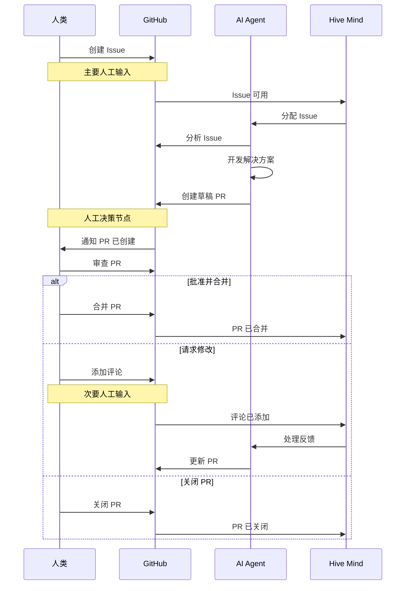
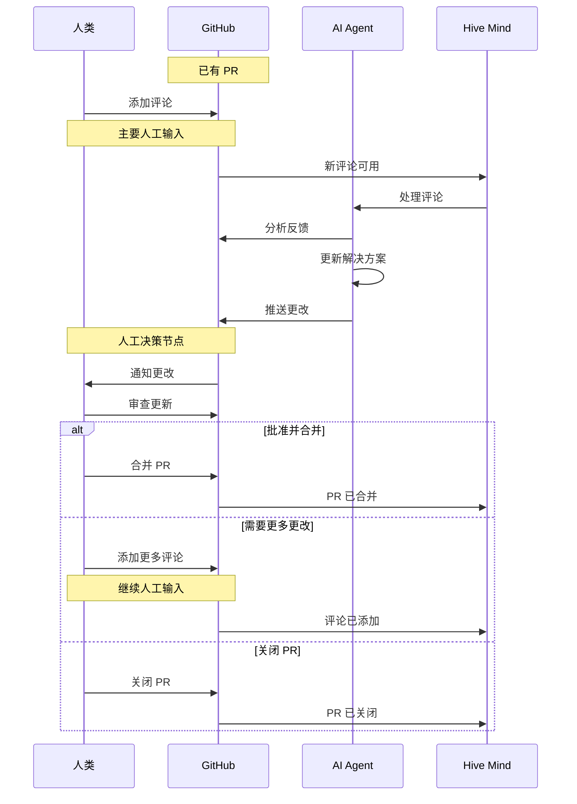

[](https://npmjs.com/@link-assistant/hive-mind)
[](https://github.com/link-assistant/hive-mind/blob/main/LICENSE)
[](https://github.com/link-assistant/hive-mind/stargazers)

[](https://gitpod.io/#https://github.com/link-assistant/hive-mind)
[](https://github.com/codespaces/new?hide_repo_select=true&ref=main&repo=link-assistant/hive-mind)

# Hive Mind 🧠 (languages: [en](README.md) • zh • [hi](README.hi.md) • [ru](README.ru.md))

**掌控 AI 蜂巢的核心 AI 大脑。** 这是一个统筹协调多个 AI 的编排 AI，即 HIVE MIND（蜂群思维）/ SWARM MIND（集群思维）。

该系统还可以接入人类集体智慧，这意味着它能够与人类沟通，获取需求、专业知识和反馈。

[](https://github.com/konard/problem-solving)

灵感来源于 [konard/problem-solving](https://github.com/konard/problem-solving)

## 为什么选择 Hive Mind？

**Hive Mind 是最自主、最适合云端部署的 AI 问题解决方案，无需开发者全程盯守，同时在关键决策上保留人工监督。**

Hive Mind 是一款**通用 AI**（迷你 AGI），能够处理广泛的任务，不仅限于编程。几乎所有可以通过操作仓库文件完成的事情，都可以实现自动化。

| 特性                       | 对您的意义                                                                                                    |
| -------------------------- | ------------------------------------------------------------------------------------------------------------- |
| **无需全程盯守**           | 完全自主模式，拥有 sudo 权限。AI 享有像真实程序员一样的创造自由。                                             |
| **云端隔离**               | 运行在专用虚拟机或 Docker 上，出现问题易于恢复。                                                              |
| **完整互联网 + Sudo 权限** | AI 可以按需安装软件包、获取文档并配置系统。                                                                   |
| **预装工具链**             | 25GB+ 开箱即用：10 种语言运行时、2 个定理证明器、构建工具，还可继续安装更多。                                 |
| **高效利用 Token**         | 常规任务通过代码自动化完成，让 AI Token 专注于创造性问题解决。                                                |
| **节省时间**               | 人类需要 2~8 小时的工作，AI 每个工作会话仅需 10~25 分钟完成。可批量执行仓库中的任务。"代码在你睡觉时已写好。" |
| **编排式扩展**             | 并行工作进程犹如一支开发团队，每月仅需约 $200。                                                               |
| **人工控制**               | AI 创建草稿 PR——由您决定是否合并。在关键节点设置质量把关。                                                    |
| **任意设备编程**           | 通过 Telegram 机器人使用 `/solve` 和 `/hive` 命令，在任意设备上管理 AI，无需 PC、IDE 或笔记本电脑。           |
| **100% 开源**              | Unlicense（公共领域）。完全透明，无供应商锁定。                                                               |

> _"与 $200 的 Codex 相比，这个解决方案简直是神器。"_ - 用户反馈

**费用**：Claude MAX 订阅（约 $200/月，目前五折优惠 = 价值 $400）可为 Hive Mind 提供几乎无限的使用量——市场上最佳的性价比。

Hive Mind 具备与普通程序员无异的高度创造力。当需求不明确时，它会主动提问，您也可以随时通过 PR 评论进行说明补充。

详细功能和对比信息，请参见 [docs/FEATURES.zh.md](./docs/FEATURES.zh.md) 和 [docs/COMPARISON.zh.md](./docs/COMPARISON.zh.md)。

## ⚠️ 警告

在您的开发机上运行此软件是**不安全的**。

建议使用 Docker 进行安装（本地和服务器均适用）。请参阅下方的 [Docker 安装](#使用-docker) 部分。

本软件使用 Claude Code 的完全自主模式，这意味着它可以自由执行任何它认为合适的命令。

这可能导致意想不到的副作用。

此外，已知存在磁盘空间泄漏问题。因此，您需要确保能够重新安装虚拟机以清理空间和/或修复虚拟机损坏。

### ⚠️ 重要：Token 与敏感数据安全

**本软件无法保证虚拟机上 TOKEN 或其他敏感数据的任何安全性。**

从连接互联网的虚拟机中提取 Token 的方式多种多样，包括但不限于：

- **Claude MAX Token** - AI 操作所必需
- **GitHub Token** - 仓库访问所必需
- **API 密钥和凭证** - 系统上的任何敏感数据

**重要安全注意事项：**

- 在开发者机器上运行是**绝对不安全的**
- 在虚拟机上运行**相对安全**，但仍存在风险
- 即使您的开发机数据没有直接暴露，虚拟机中仍含有敏感 Token
- 任何存储在联网系统上的 Token 都可能被攻击

**使用本软件须完全自担风险与责任。**

我们强烈建议：

- 使用专用的、隔离的虚拟机
- 定期轮换 Token
- 监控 Token 使用情况，发现可疑活动
- 切勿使用生产环境的 Token 或凭证
- 做好随时撤销并替换本系统所用所有 Token 的准备

运行 `hive.mjs` 的最低系统要求：

```
1 CPU 核心
1 GB RAM
> 4 GB SWAP
50 GB 磁盘空间
```

## 🚀 快速开始

### 全局安装

#### 使用 Bun（推荐）

```bash
bun install -g @link-assistant/hive-mind
```

#### 使用 Node.js

```bash
npm install -g @link-assistant/hive-mind
```

### 安装 Docker

如果您尚未安装 Docker，请按照以下步骤在 Ubuntu 上安装 Docker Engine：

```bash
# Install prerequisites
sudo apt update
sudo apt install ca-certificates curl

# Add Docker's official GPG key
sudo install -m 0755 -d /etc/apt/keyrings
sudo curl -fsSL https://download.docker.com/linux/ubuntu/gpg -o /etc/apt/keyrings/docker.asc
sudo chmod a+r /etc/apt/keyrings/docker.asc

# Add Docker repository
sudo tee /etc/apt/sources.list.d/docker.sources <<EOF
Types: deb
URIs: https://download.docker.com/linux/ubuntu
Suites: $(. /etc/os-release && echo "${UBUNTU_CODENAME:-$VERSION_CODENAME}")
Components: stable
Signed-By: /etc/apt/keyrings/docker.asc
EOF

# Install Docker
sudo apt update
sudo apt install docker-ce docker-ce-cli containerd.io docker-buildx-plugin docker-compose-plugin

# Verify installation
sudo docker run hello-world
```

**其他操作系统**或详细安装说明，请参阅 [Docker 官方文档](https://docs.docker.com/engine/install/)。

### 使用 Docker

使用 Docker 运行 Hive Mind，实现更安全的本地安装，无需手动配置：

**注意：** Docker 对本地安装更为安全，也可用于在服务器或 Kubernetes 集群上安装多个隔离实例。Kubernetes 部署请参见下方的 [Helm chart 安装](#helm-安装kubernetes实验性) 部分。

```bash
# Pull the latest image from Docker Hub
docker pull konard/hive-mind:latest

# Start hive-mind container
docker run -dit --name hive-mind konard/hive-mind:latest

# Verify container started
docker ps -a

# Enter additional terminal process to do installation
docker exec -it hive-mind /bin/bash

# Inside the container, authenticate with GitHub
gh-setup-git-identity

# Authenticate with Claude
claude

# Optionally set configuration like this:
# Use /config command and set:
# Reduce motion                             true # Will save your ssh trafic, and make Claude Code more responsive (less latency)
# Thinking mode                             false # Anthropic models perform better and cheaper without thinking
# Model                                     haiku # chepear for connection testing manually
# Claude in Chrome enabled by default       false # No need for Chrome support on server

# Optionally test Claude connection
claude -p hi --model haiku

# You might need to update hive-mind and agent to latest versions:
bun install -g @link-assistant/hive-mind
bun install -g @link-assistant/agent

# Now you can use hive and solve commands
solve https://github.com/owner/repo/issues/123

# Or you can run telegram bot:

# Exit from additional bash session
exit

# Attach to main bash process
docker attach hive-mind

# Run bot here

# Press Ctrl + P, Ctrl + Q to detach without destroying the container (no stopping of main bash process)

# --- Persisting auth data across restarts ---

# Extract auth data from a running (or stopped) container to the host:
mkdir -p ~/.hive-mind
docker cp hive-mind:/home/box/.claude ~/.hive-mind/claude
docker cp hive-mind:/home/box/.claude.json ~/.hive-mind/claude.json
docker cp hive-mind:/home/box/.config/gh ~/.hive-mind/gh

# Fix ownership to match the box user inside the container:
BOX_UID=$(docker exec hive-mind id -u box)
chown -R $BOX_UID:$BOX_UID ~/.hive-mind/claude ~/.hive-mind/gh
chown $BOX_UID:$BOX_UID ~/.hive-mind/claude.json

# On subsequent runs, mount the auth data to keep it between restarts:
docker run -dit \
  --name hive-mind \
  --restart unless-stopped \
  -v /root/.hive-mind/claude:/home/box/.claude \
  -v /root/.hive-mind/claude.json:/home/box/.claude.json \
  -v /root/.hive-mind/gh:/home/box/.config/gh \
  konard/hive-mind:latest
```

**Docker 的优势：**

- ✅ 预配置的 Ubuntu 24.04 环境
- ✅ 所有依赖项预先安装
- ✅ 与宿主系统隔离
- ✅ 可使用不同 GitHub 账号轻松运行多个实例
- ✅ 跨不同机器保持一致的环境

高级 Docker 用法请参见 [docs/DOCKER.zh.md](./docs/DOCKER.zh.md)。

#### 停止并删除 Docker 容器

```
# Attach to main docker process to stop the container
docker attach hive-mind

^C # stop the telegram bot

exit # exit/stop the container

docker ps -a # show list of docker containers
# CONTAINER ID   IMAGE                     COMMAND       CREATED      STATUS                        PORTS     NAMES
# fd0fd4470ec3   konard/hive-mind:latest   "/bin/bash"   5 days ago   Exited (130) 16 seconds ago             hive-mind


df -h # check disk space
# Filesystem      Size  Used Avail Use% Mounted on
# tmpfs           1.2G  1.1M  1.2G   1% /run
# /dev/sda1        96G   87G  9.8G  90% /
# tmpfs           5.9G     0  5.9G   0% /dev/shm
# tmpfs           5.0M     0  5.0M   0% /run/lock
# /dev/sda16      881M  117M  703M  15% /boot
# /dev/sda15      105M  6.2M   99M   6% /boot/efi
# tmpfs           1.2G   12K  1.2G   1% /run/user/0

docker rm hive-mind # remove docker container frees space used by the container, does not delete image

df -h # check disk space (to confirm space is freed)
# Filesystem      Size  Used Avail Use% Mounted on
# tmpfs           1.2G  1.1M  1.2G   1% /run
# /dev/sda1        96G   26G   71G  27% /
# tmpfs           5.9G     0  5.9G   0% /dev/shm
# tmpfs           5.0M     0  5.0M   0% /run/lock
# /dev/sda16      881M  117M  703M  15% /boot
# /dev/sda15      105M  6.2M   99M   6% /boot/efi
# tmpfs           1.2G   12K  1.2G   1% /run/user/0
```

### Helm 安装（Kubernetes）（实验性）

> ⚠️ **实验性：** Helm/Kubernetes 安装方式为实验性功能，可能不完全稳定。
>
> 如需更可靠的安装，建议改用 [Docker](#使用-docker)。
>
> 完整的 Helm 安装说明和配置选项请参见 [docs/HELM.zh.md](./docs/HELM.zh.md)。

### 在 Ubuntu 24.04 服务器上安装（已弃用）

> ⚠️ **已弃用：** 此安装方式不再推荐。
>
> **现在我们建议所有安装均使用 Docker**，无论是开发机还是服务器。
> Docker 提供更好的隔离性、更简便的管理方式和一致的环境。
>
> 请使用上方的 [Docker 安装方式](#使用-docker)。
> Kubernetes 部署请参见 [Helm 安装](#helm-安装kubernetes实验性) 部分。
>
> 旧版裸机安装说明已移至 [docs/UBUNTU-SERVER.zh.md](./docs/UBUNTU-SERVER.zh.md) 供参考。

### 核心操作

```bash
# Solve using maximum power
solve https://github.com/Veronika89-lang/index.html/issues/1 --attach-logs --verbose --model opus --think max

# Solve GitHub issues automatically
solve https://github.com/owner/repo/issues/123 --model sonnet

# Solve issue with PR to custom branch (manual fork mode)
solve https://github.com/owner/repo/issues/123 --base-branch develop --fork

# Continue working on existing PR
solve https://github.com/owner/repo/pull/456 --model opus

# Resume from Claude session when limit is reached
solve https://github.com/owner/repo/issues/123 --resume session-id

# Start hive orchestration (monitor and solve issues automatically)
hive https://github.com/owner/repo --monitor-tag "help wanted" --concurrency 3

# Monitor all issues in organization
hive https://github.com/microsoft --all-issues --max-issues 10

# Run collaborative review process
review --repo owner/repo --pr 456

# Multiple AI reviewers for consensus
./reviewers-hive.mjs --agents 3 --consensus-threshold 0.8
```

## 📋 核心组件

| 脚本                                 | 用途                | 核心功能                                          |
| ------------------------------------ | ------------------- | ------------------------------------------------- |
| `solve.mjs`（稳定版）                | GitHub Issue 解决器 | 自动 Fork、分支创建、PR 生成、会话恢复、Fork 支持 |
| `hive.mjs`（稳定版）                 | AI 编排与监控       | 多仓库监控、并发工作进程、Issue 队列管理          |
| `review.mjs`（Alpha 版）             | 代码审查自动化      | 协作式 AI 审查、自动反馈                          |
| `reviewers-hive.mjs`（Alpha/实验性） | 审查团队管理        | 多 Agent 共识、审查者分配                         |
| `telegram-bot.mjs`（稳定版）         | Telegram 机器人接口 | 远程命令执行、群聊支持、诊断工具                  |

## 🔧 solve 选项

```bash
solve <issue-url> [options]
```

**最常用选项：**

| 选项            | 简写 | 描述                                  | 默认值   |
| --------------- | ---- | ------------------------------------- | -------- |
| `--model`       | `-m` | 使用的 AI 模型（sonnet、opus、haiku） | sonnet   |
| `--think`       |      | 思考级别（low、medium、high、max）    | -        |
| `--base-branch` | `-b` | PR 的目标分支                         | （默认） |

**其他常用选项：**

| 选项                     | 简写 | 描述                                                    | 默认值 |
| ------------------------ | ---- | ------------------------------------------------------- | ------ |
| `--tool`                 |      | AI 工具（claude、opencode、codex、agent、qwen、gemini） | claude |
| `--verbose`              | `-v` | 启用详细日志                                            | false  |
| `--attach-logs`          |      | 将日志附加到 PR（⚠️ 可能暴露敏感数据）                  | false  |
| `--auto-init-repository` |      | 自动初始化空仓库（创建 README.md）                      | false  |
| `--help`                 | `-h` | 显示所有可用选项                                        | -      |

> **📖 完整选项列表**：包含 Fork、自动续行、监视模式及实验性功能在内的所有可用选项，请参见 [docs/CONFIGURATION.zh.md](./docs/CONFIGURATION.zh.md#solve-options)。

## 🔧 hive 选项

```bash
hive <github-url> [options]
```

**最常用选项：**

| 选项           | 简写 | 描述                                  | 默认值 |
| -------------- | ---- | ------------------------------------- | ------ |
| `--model`      | `-m` | 使用的 AI 模型（sonnet、opus、haiku） | sonnet |
| `--think`      |      | 思考级别（low、medium、high、max）    | -      |
| `--all-issues` | `-a` | 监控所有 Issue（忽略标签）            | false  |
| `--once`       |      | 单次运行（不持续监控）                | false  |

**其他常用选项：**

| 选项                     | 简写 | 描述                                                    | 默认值 |
| ------------------------ | ---- | ------------------------------------------------------- | ------ |
| `--tool`                 |      | AI 工具（claude、opencode、codex、agent、qwen、gemini） | claude |
| `--concurrency`          | `-c` | 并行工作进程数量                                        | 2      |
| `--skip-issues-with-prs` | `-s` | 跳过已有 PR 的 Issue                                    | false  |
| `--verbose`              | `-v` | 启用详细日志                                            | false  |
| `--attach-logs`          |      | 将日志附加到 PR（⚠️ 可能暴露敏感数据）                  | false  |
| `--help`                 | `-h` | 显示所有可用选项                                        | -      |

> **📖 完整选项列表**：包含项目监控、YouTrack 集成及实验性功能在内的所有可用选项，请参见 [docs/CONFIGURATION.zh.md](./docs/CONFIGURATION.zh.md#hive-options)。

## 🤖 Telegram 机器人

Hive Mind 内置 Telegram 机器人接口（SwarmMindBot），支持远程命令执行。

### 🚀 试用体验

想亲眼看看 Hive Mind 的实际效果？欢迎直接在 Telegram 上联系开发者，申请免费演示或获得更快的支持：

**[在 Telegram 上联系 @drakonard](https://t.me/drakonard)**

### 设置

1. **获取 Bot Token**
   - 在 Telegram 上联系 [@BotFather](https://t.me/BotFather)
   - 创建一个新机器人并获取您的 Token
   - 将机器人添加到您的群聊并设置为管理员

2. **配置环境**

   ```bash
   # Copy the example configuration
   cp .env.example .env

   # Edit and add your bot token
   echo "TELEGRAM_BOT_TOKEN=your_bot_token_here" >> .env

   # Optional: Restrict to specific chats
   # Get chat ID using /help command, then add:
   echo "TELEGRAM_ALLOWED_CHATS=123456789,987654321" >> .env
   ```

3. **启动机器人**

   ```bash
   hive-telegram-bot
   ```

   **推荐：使用 tee 捕获日志**

   长时间运行机器人时，建议使用 `tee` 将日志同时输出到文件。这样即使终端缓冲区溢出，您也可以在事后查看日志：

   ```bash
   hive-telegram-bot 2>&1 | tee -a logs/bot-$(date +%Y%m%d).log
   ```

   或创建日志目录并启用自动日志轮转：

   ```bash
   mkdir -p logs
   hive-telegram-bot 2>&1 | tee -a "logs/bot-$(date +%Y%m%d-%H%M%S).log"
   ```

   **实验性：live terminal watch**

   ```bash
   hive-telegram-bot --auto-start-screen-watch-message
   ```

   这个 opt-in 标志会为公开仓库的 `/solve` 会话启动一条单独的 live terminal
   消息。私有仓库或可见性未知的仓库不会自动启动 watch 消息。

### 机器人命令

大多数操作类命令仅在**群聊中**有效（不支持与机器人的私聊）。有意发送私密更新的命令（例如 `/terminal_watch`）也可以在私聊中使用：

#### `/solve` - 解决 GitHub Issue

```
/solve <github-url> [options]

Examples:
/solve https://github.com/owner/repo/issues/123 --model sonnet
/solve https://github.com/owner/repo/issues/123 --model opus --think max

Aliases:
/do 和 /continue 等同于 /solve
/claude 等同于 /solve --tool claude
/codex 等同于 /solve --tool codex
/opencode 等同于 /solve --tool opencode
/agent 等同于 /solve --tool agent
/qwen 等同于 /solve --tool qwen
/gemini 等同于 /solve --tool gemini --use-agent-commander

Tool alias examples:
/codex https://github.com/owner/repo/issues/123 --model gpt-5.5
/opencode https://github.com/owner/repo/issues/123 --model grok-code-fast-1
/agent https://github.com/owner/repo/issues/123 --model nemotron-3-super-free
/qwen https://github.com/owner/repo/issues/123 --model qwen3-coder-plus
/gemini https://github.com/owner/repo/issues/123 --model gemini-2.5-flash

Free Models (with --tool agent):
/solve https://github.com/owner/repo/issues/123 --tool agent --model nemotron-3-super-free
/solve https://github.com/owner/repo/issues/123 --tool agent --model opencode/nemotron-3-super-free
/solve https://github.com/owner/repo/issues/123 --tool agent --model minimax-m2.5-free
/solve https://github.com/owner/repo/issues/123 --tool agent --model gpt-5-nano

Free Models via Kilo Gateway (with --tool agent):
/solve https://github.com/owner/repo/issues/123 --tool agent --model kilo/glm-5-free
/solve https://github.com/owner/repo/issues/123 --tool agent --model kilo/glm-4.5-air-free
/solve https://github.com/owner/repo/issues/123 --tool agent --model kilo/deepseek-r1-free
```

> **📖 免费模型指南**：有关所有免费模型（包括 OpenCode Zen 和 Kilo Gateway 提供商）的全面信息，请参见 [docs/FREE_MODELS.zh.md](./docs/FREE_MODELS.zh.md)。

#### `/hive` - 运行蜂群编排

```
/hive <github-url> [options]

Examples:
/hive https://github.com/owner/repo
/hive https://github.com/owner/repo --all-issues --max-issues 10
/hive https://github.com/microsoft --all-issues --concurrency 3
```

#### `/limits` - 显示用量限制

```
/limits

Shows:
- CPU usage and load average
- RAM usage (used vs total)
- Disk space usage
- GitHub API rate limits
- Claude usage limits (session and weekly)
```

#### `/terminal_watch` - Live Session Log

```
/terminal_watch <uuid> [--size 120x25]

Examples:
/terminal_watch 4d934f71-4cdb-4b8c-b474-582116d12c12
/terminal_watch 4d934f71-4cdb-4b8c-b474-582116d12c12 --width 100 --height 20
```

您也可以回复机器人会话消息并发送 `/terminal_watch`。该命令会用
`$ --status <uuid>` 报告的会话日志最新内容更新一条单独的 Telegram
消息，并在会话结束时附加完整日志文件。公开仓库日志可以在群聊中 watch；
私有仓库或可见性未知仓库的日志只会通过私聊发送。

#### `/help` - 获取帮助和诊断信息

```
/help

Shows:
- Chat ID (needed for TELEGRAM_ALLOWED_CHATS)
- Chat type
- Available commands
- Usage examples
```

### 功能特性

- ✅ **群聊执行**：`/solve` 和 `/hive` workflow 从已授权群聊中运行
- ✅ **完整选项支持**：所有命令行选项均可在 Telegram 中使用
- ✅ **Screen 会话**：命令在后台 Screen 会话中运行
- ✅ **Live Terminal Watch**：`/terminal_watch` 和 opt-in auto-start 显示 live session logs
- ✅ **聊天限制**：可选配置允许的聊天 ID 白名单
- ✅ **诊断工具**：获取聊天 ID 和配置信息

#### Live Terminal Watch

启用 `--auto-start-screen-watch-message` 后，机器人会为公开仓库的 `/solve`
会话自动启动一条单独的 live terminal watch 消息：

- **Manual Watch**：`/terminal_watch <uuid>` 或回复 `/terminal_watch`
- **Real-time Updates**：在命令执行时查看 live session log output
- **Auto-freeze**：命令完成时消息会被冻结
- **Log Attachment**：会话结束时自动附加完整日志
- **Security**：私有仓库或可见性未知的仓库禁用 auto-start
- **Smart Updates**：仅在实际内容变化时更新（rate-limited 以避免 API limits）

### 安全注意事项

- 仅在机器人为管理员的群聊中有效
- 可通过 `TELEGRAM_ALLOWED_CHATS` 配置可选的聊天 ID 限制
- 命令以运行机器人的系统用户身份执行
- 请确保已完成正确的身份验证（`gh auth login`、`claude-profiles`）

## 🏆 最佳实践

当仓库拥有完善的 CI/CD 流水线和清晰的 Issue 需求时，Hive Mind 的效果更佳。请参阅：

- [BEST-PRACTICES.zh.md](./docs/BEST-PRACTICES.zh.md) — 通用提示、Issue 编写指南、架构改进和子 Agent 模式
- [CI-CD-BEST-PRACTICES.zh.md](./docs/CI-CD-BEST-PRACTICES.zh.md) — CI/CD 流水线设置、推荐模板和执行策略

完善 CI/CD 的核心优势：

- AI 解决器持续迭代直到所有检查通过
- 无论人类/AI 团队构成如何，均保持一致的质量
- 文件大小限制确保代码对 AI 和人类均可读

现已提供适用于 JavaScript、Rust、Python、Go、C# 和 Java 的开箱即用模板。

## 🏗️ 架构

Hive Mind 基于三个层次运作：

1. **编排层**（`hive.mjs`）- 协调多个 AI Agent
2. **执行层**（`solve.mjs`、`review.mjs`）- 执行具体任务
3. **人机交互层** - 支持人类与 AI 协作

### 数据流

#### 模式一：Issue → Pull Request 流程



#### 模式二：Pull Request → 评论流程



📖 **完整的数据流文档（包含人类反馈集成节点），请参见 [docs/flow.zh.md](./docs/flow.zh.md)**

## 📊 使用示例

### 自动化 Issue 解决

```bash
# Solve issue (automatically forks if no write access)
solve https://github.com/owner/repo/issues/123 --model opus

# Manual fork and solve issue (works for both public and private repos)
solve https://github.com/owner/repo/issues/123 --fork --model opus

# Continue work on existing PR
solve https://github.com/owner/repo/pull/456 --verbose

# Solve with detailed logging and solution attachment
solve https://github.com/owner/repo/issues/123 --verbose --attach-logs

# Dry run to see what would happen
solve https://github.com/owner/repo/issues/123 --dry-run
```

### 多仓库编排

```bash
# Monitor single repository with specific label
hive https://github.com/owner/repo --monitor-tag "bug" --concurrency 4

# Monitor all issues in an organization
hive https://github.com/microsoft --all-issues --max-issues 20 --once

# Monitor user repositories with high concurrency
hive https://github.com/username --all-issues --concurrency 8 --interval 120

# Skip issues that already have PRs
hive https://github.com/org/repo --skip-issues-with-prs --verbose

# Auto-cleanup temporary files
hive https://github.com/org/repo --auto-cleanup --concurrency 5
```

### 会话管理

```bash
# Resume when Claude hits limit
solve https://github.com/owner/repo/issues/123 --resume 657e6db1-6eb3-4a8d

# Continue session interactively in Claude Code
(cd /tmp/gh-issue-solver-123456789 && claude --resume session-id)
```

## 🔍 监控与日志

在日志中查找恢复命令：

```bash
grep -E '\(cd /tmp/gh-issue-solver-[0-9]+ && claude --resume [0-9a-f-]{36}\)' hive-*.log
```

## 🔧 配置

**身份验证：**

- `gh auth login` - GitHub CLI 身份验证
- `claude-profiles` - 将 Claude 身份验证配置文件迁移到服务器

**OpenRouter 集成：**

使用 OpenRouter 通过单一 API 密钥访问来自 60+ 提供商的 500+ AI 模型。设置说明（涵盖 Claude Code CLI 和 @link-assistant/agent）请参见 [docs/OPENROUTER.zh.md](./docs/OPENROUTER.zh.md)。

**环境变量与高级选项：**

包含环境变量、超时、重试限制、Telegram 机器人设置、YouTrack 集成及所有 CLI 选项在内的全面配置，请参见 [docs/CONFIGURATION.zh.md](./docs/CONFIGURATION.zh.md)。

## 🐛 问题反馈

### Hive Mind 问题

如果您遇到 **Hive Mind**（本项目）的问题，请在我们的 GitHub Issues 页面提交反馈：

- **仓库**：https://github.com/link-assistant/hive-mind
- **Issues**：https://github.com/link-assistant/hive-mind/issues

### Claude Code CLI 问题

如果您遇到 **Claude Code CLI** 本身的问题（例如 `claude` 命令报错、安装问题或 CLI 缺陷），请向官方 Claude Code 仓库提交反馈：

- **仓库**：https://github.com/anthropics/claude-code
- **Issues**：https://github.com/anthropics/claude-code/issues

## 🛡️ 文件大小限制

所有文档文件均会自动检查：

```bash
find docs/ -name "*.md" -exec wc -l {} + | awk '$1 > 1000 {print "ERROR: " $2 " has " $1 " lines (max 1000)"}'
```

## 服务器诊断

识别消耗资源的进程所属的 Screen 会话：

```bash
TARGETS="62220 65988 63094 66606 1028071 4127023"

# build screen PID -> session name map
declare -A NAME
while read -r id; do spid=${id%%.*}; NAME[$spid]="$id"; done \
  < <(screen -ls | awk '/(Detached|Attached)/{print $1}')

# check each PID's environment for STY and map back to session
for p in $TARGETS; do
  sty=$(tr '\0' '\n' < /proc/$p/environ 2>/dev/null | awk -F= '$1=="STY"{print $2}')
  if [ -n "$sty" ]; then
    spid=${sty%%.*}
    echo "$p  ->  ${NAME[$spid]:-$sty}"
  else
    echo "$p  ->  (no STY; not from screen or env cleared / double-forked)"
  fi
done
```

显示进程详细信息：

```bash
procinfo() {
  local pid=$1
  if [ -z "$pid" ]; then
    echo "Usage: procinfo <pid>"
    return 1
  fi
  if [ ! -d "/proc/$pid" ]; then
    echo "Process $pid not found."
    return 1
  fi

  echo "=== Process $pid ==="
  # Basic process info
  ps -p "$pid" -o user=,uid=,pid=,ppid=,c=,stime=,etime=,tty=,time=,cmd=

  echo
  # Working directory
  echo "CWD: $(readlink -f /proc/$pid/cwd 2>/dev/null)"

  # Executable path
  echo "EXE: $(readlink -f /proc/$pid/exe 2>/dev/null)"

  # Root directory of the process
  echo "ROOT: $(readlink -f /proc/$pid/root 2>/dev/null)"

  # Command line (full, raw)
  echo "CMDLINE:"
  tr '\0' ' ' < /proc/$pid/cmdline 2>/dev/null
  echo

  # Environment variables
  echo
  echo "ENVIRONMENT (key=value):"
  tr '\0' '\n' < /proc/$pid/environ 2>/dev/null | head -n 20

  # Open files (first few)
  echo
  echo "OPEN FILES:"
  ls -l /proc/$pid/fd 2>/dev/null | head -n 10

  # Child processes
  echo
  echo "CHILDREN:"
  ps --ppid "$pid" -o pid=,cmd= 2>/dev/null
}
procinfo 62220
```

## 维护

### 进入最新 Screen 会话

```bash
s=$(screen -ls | awk '/Detached/ {print $1; exit}'); echo "Entering $s"; screen -r "$s"; echo "Left $s";
```

### 进入最旧 Screen 会话

```bash
s=$(screen -ls | awk '/Detached/ {last=$1} END{print last}'); echo "Entering $s"; screen -r "$s"; echo "Left $s";
```

### 重启服务器

```bash
sudo reboot
```

这将清除所有悬空的未使用进程和 Screen 会话，从而释放 RAM 并降低 CPU 负载。另外，重启可能会清除所有临时文件，因此如果已重启，下一步可能不需要执行任何操作。

### 清理磁盘空间

```bash
df -h

rm -rf /tmp

df -h
```

这些命令应在 `hive` 用户下执行。如果您不小心以 `root` 用户身份删除了 `/tmp` 目录本身，需要通过以下方式恢复：

```bash
sudo mkdir -p /tmp
sudo chown root:root /tmp
sudo chmod 1777 /tmp
```

### 关闭所有 Screen 会话以释放 RAM

```bash
# close all (Attached or Detached) sessions
screen -ls | awk '/(Detached|Attached)/{print $1}' \
| while read s; do screen -S "$s" -X quit; done

# remove any zombie sockets
screen -wipe

# verify
screen -ls
```

### 显示完整命令参数的 Top

```bash
top -c
```

### 查看完整进程树

```bash
ps -eo pid,ppid,user,args --forest
```

或

```bash
ps axjf
```

### 终止由特定任务派生的所有命令

```bash
pkill -f gh-issue-solver-1773073065743
```

### 终止由 ms-playwright 派生的所有无头浏览器

```bash
pkill -f ms-playwright/chromium_headless_shell-1200
```

此操作可以执行，但不推荐，因为重启服务器效果更好。

## 📄 许可证

Unlicense 许可证 - 参见 [LICENSE](./LICENSE)

## 🤖 贡献

本项目采用 AI 驱动的开发模式。人机协作指南请参见 [CONTRIBUTING.zh.md](./docs/CONTRIBUTING.zh.md)。
