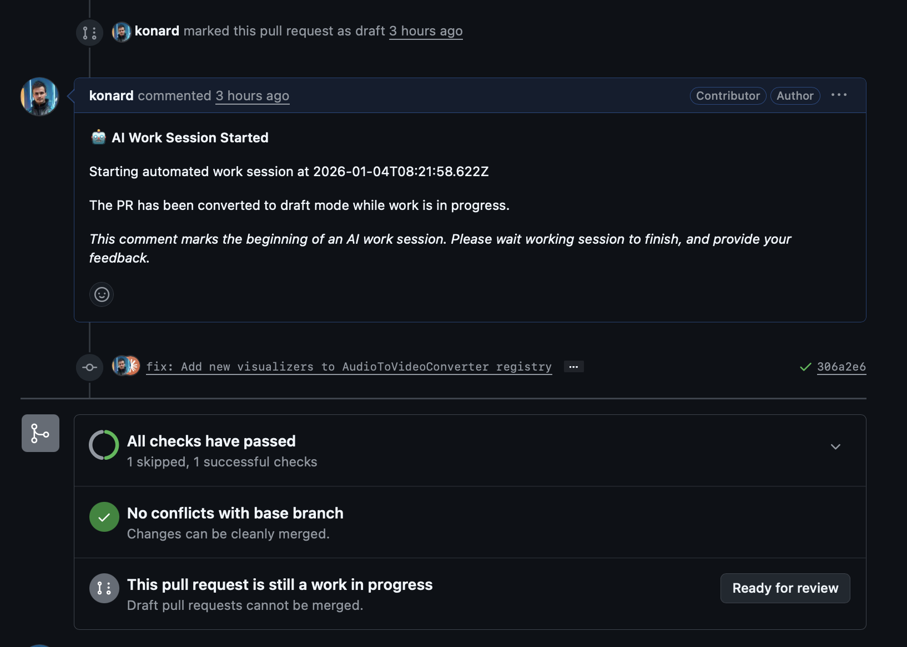

# Case Study: Playwright MCP browser_install Tool Stuck for 3+ Hours (Issue #1060)

## Executive Summary

This case study documents an investigation into a Playwright MCP (Model Context Protocol) `browser_install` tool call that became stuck indefinitely, blocking an AI work session for over 3 hours. The investigation revealed that this is a known issue in the Playwright MCP ecosystem, where the `browser_install` tool can hang without returning any response when browser installation encounters certain conditions.

## Issue Description

**Issue URL:** https://github.com/link-assistant/hive-mind/issues/1060

**Pull Request Reference:** https://github.com/Jhon-Crow/audio-recorder-with-visualization/pull/22

**Reported Behavior:**

The `mcp__playwright__browser_install` tool was called at 08:24:47 UTC and never returned a response. The process remained stuck until it was manually interrupted with CTRL+C at 11:48:06 UTC - a total of **3 hours and 23 minutes**.

**Screenshot Evidence:**



The screenshot shows:
- PR marked as draft at the start of the AI work session
- "AI Work Session Started" comment posted at 2026-01-04T08:21:58.622Z
- PR showing "All checks have passed" but work session never completed
- The work session remained stuck for over 3 hours before the screenshot was taken

## Timeline of Events

Based on the full log file from the gist (https://gist.github.com/konard/6d51538702e3709bcd6f66d2fcece890):

| Timestamp (UTC) | Event |
|-----------------|-------|
| 2026-01-04T08:21:46 | `solve` command started |
| 2026-01-04T08:21:58 | Claude AI execution started, work session began |
| 2026-01-04T08:22:01 | Work session start comment posted to PR |
| 2026-01-04T08:24:33 | HTTP server started for testing (`python3 -m http.server 8080`) |
| 2026-01-04T08:24:39 | Server verified working |
| 2026-01-04T08:24:43 | AI attempted to use Playwright browser navigation |
| 2026-01-04T08:24:43 | **Browser navigation failed**: "browserType.launch: Chromium distribution 'chrome' is not found at /opt/google/chrome/chrome" |
| 2026-01-04T08:24:46 | AI responded: "Let me install the browser:" |
| 2026-01-04T08:24:47 | **`mcp__playwright__browser_install` tool called** |
| (3+ hours silence) | No log entries - tool call never returned |
| 2026-01-04T11:48:06 | Process manually interrupted with CTRL+C |
| 2026-01-04T11:48:06 | Log entry: "Interrupted (CTRL+C)" |

### Critical Gap Analysis

The log shows a **3-hour 23-minute gap** between the `browser_install` tool call and the manual interruption:

```
[2026-01-04T08:24:47.024Z] - browser_install called
[2026-01-04T11:48:06.559Z] - Process cleanup (CTRL+C)
```

During this entire period, no output was generated, no errors were reported, and no timeout was triggered.

## Root Cause Analysis

### Primary Root Cause: MCP Tool Call Timeout Configuration

The Playwright MCP server's `browser_install` tool does not have adequate timeout handling for browser installation operations. When the installation process encounters issues, it can hang indefinitely without returning an error.

### Contributing Factors

#### 1. Browser Not Pre-installed

The error message indicates Chrome was expected at `/opt/google/chrome/chrome` but was not found:

```
Error: browserType.launch: Chromium distribution 'chrome' is not found at /opt/google/chrome/chrome
Run "npx playwright install chrome"
```

This suggests the Playwright MCP server was configured to use a system Chrome installation that didn't exist.

#### 2. browser_install Implementation Issues

Based on research of known issues:

- **[TypeError in browser_install Tool (Claude Code Issue #4955)](https://github.com/anthropics/claude-code/issues/4955)**: The `browser_install` tool can encounter a `TypeError: (intermediate value).resolve is not a function` which prevents completion.

- **[Browser Installation Fails on First Run (Playwright MCP Issue #218)](https://github.com/microsoft/playwright-mcp/issues/218)**: On first run, the browser installation may fail because it tries to use `sudo` for dependency installation, which doesn't work in non-interactive environments.

#### 3. No Timeout Mechanism

The Playwright MCP server has configurable timeouts for:
- Actions (`--timeout-action`, default 5000ms)
- Navigation (`--timeout-navigation`)

However, there is no apparent timeout for the `browser_install` tool specifically. When the underlying `npx playwright install` command hangs, the MCP server waits indefinitely.

#### 4. Claude Code Default Tool Timeout

Claude Code has a 2-minute default timeout for Bash commands, but MCP tool calls may not have the same timeout protection, allowing them to run indefinitely.

## Evidence from Logs

### Successful Operations Before the Hang

```json
[2026-01-04T08:24:39.794Z]
"content": "<!DOCTYPE html>\n<html lang=\"en\">\n<head>...",
"is_error": false
```

The HTTP server was working, and the test page was accessible.

### Browser Launch Failure

```json
[2026-01-04T08:24:43.522Z]
"content": "### Result\nError: browserType.launch: Chromium distribution 'chrome' is not found at /opt/google/chrome/chrome\nRun \"npx playwright install chrome\"",
"is_error": true
```

### The Fatal Tool Call

```json
[2026-01-04T08:24:47.024Z]
{
  "type": "tool_use",
  "id": "toolu_01TrAa3f5yo4iNj9gZR63ejb",
  "name": "mcp__playwright__browser_install",
  "input": {}
}
```

### No Tool Result - Just Interruption

```
[2026-01-04T11:48:06.559Z]
📁 Keeping directory (--no-auto-cleanup): /tmp/gh-issue-solver-1767514913266

✅ Claude command completed
[2026-01-04T11:48:06.564Z] 📊 Total messages: 0, Tool uses: 0
[2026-01-04T11:48:06.567Z] [ERROR] ❌ Interrupted (CTRL+C)
```

Note: "Total messages: 0, Tool uses: 0" indicates the stats weren't properly recorded due to the abnormal termination.

## Known Related Issues

### Playwright MCP Issues

1. **[v0.0.33 Hanging in DevContainers (Issue #881)](https://github.com/microsoft/playwright-mcp/issues/881)**
   - The MCP process hangs forever with certain versions
   - Workaround: Use v0.0.32 instead of @latest

2. **[Browser Installation Fails on First Run (Issue #218)](https://github.com/microsoft/playwright-mcp/issues/218)**
   - Installation fails when dependencies need `sudo`
   - Solution: Pre-install Chrome or use `--browser=chromium`

3. **[MCP Ping Timeout Issues (Issue #982)](https://github.com/microsoft/playwright-mcp/issues/982)**
   - Long-running operations can exceed the 5-second ping timeout
   - The server may terminate connections unexpectedly

### Claude Code Issues

1. **[TypeError in browser_install Tool (Issue #4955)](https://github.com/anthropics/claude-code/issues/4955)**
   - `TypeError: (intermediate value).resolve is not a function`
   - Workaround: Install browsers manually with `npx playwright install`

2. **[Playwright MCP Frequently Fails (Issue #1383)](https://github.com/anthropics/claude-code/issues/1383)**
   - @playwright/mcp@latest was downloading a buggy beta version
   - Solution: Use `@executeautomation/playwright-mcp-server` instead

### General Playwright Issues

1. **[Browser Install Hangs Infinitely (Issue #28189)](https://github.com/microsoft/playwright/issues/28189)**
   - `npx playwright install` hangs with no information
   - Related to network/download issues

2. **[Timeout When Downloading Browsers (Issue #34686)](https://github.com/microsoft/playwright/issues/34686)**
   - Downloads can timeout due to slow network
   - Solution: Set `PLAYWRIGHT_DOWNLOAD_CONNECTION_TIMEOUT` environment variable

## Proposed Solutions

### Immediate Mitigations

#### 1. Pre-install Playwright Browsers Before Starting Work Sessions

Add to the solve.mjs initialization:

```bash
npx playwright install chromium --with-deps
```

Or in the system prompt, instruct the AI to:
- Check if browsers are installed before using Playwright
- Use Bash commands to install if needed
- Set appropriate timeouts

#### 2. Add MCP Tool Timeout Protection

Implement a timeout wrapper around MCP tool calls:

```javascript
// Pseudo-code for timeout wrapper
async function callMcpToolWithTimeout(tool, input, timeoutMs = 120000) {
  const timeoutPromise = new Promise((_, reject) => {
    setTimeout(() => reject(new Error(`MCP tool ${tool} timed out after ${timeoutMs}ms`)), timeoutMs);
  });

  return Promise.race([
    mcpServer.callTool(tool, input),
    timeoutPromise
  ]);
}
```

#### 3. Use Alternative Playwright MCP Server

Based on [Claude Code Issue #1383](https://github.com/anthropics/claude-code/issues/1383), use the more stable `@executeautomation/playwright-mcp-server`:

```json
"mcpServers": {
  "playwright": {
    "command": "npx",
    "args": ["-y", "@executeautomation/playwright-mcp-server"]
  }
}
```

#### 4. Configure Browser Installation Environment Variables

Add to the environment:

```bash
export PLAYWRIGHT_DOWNLOAD_CONNECTION_TIMEOUT=300000  # 5 minutes
export PLAYWRIGHT_DOWNLOAD_HOST="https://cdn.playwright.dev"
```

### Medium-term Solutions

#### 1. Add Browser Check Before Using Playwright

Modify the system prompt to include instructions:

```
Before using any mcp__playwright__* tools, first check if browsers are installed:
1. Run: npx playwright install chromium --with-deps
2. Wait for completion before proceeding
3. If installation fails, fall back to non-browser alternatives
```

#### 2. Pin Playwright MCP Version

Avoid using `@latest` which may include unstable versions:

```json
"args": ["-y", "@playwright/mcp@0.0.32"]
```

#### 3. Add Health Check for MCP Tools

Before using MCP tools, verify the server is responsive:

```javascript
// Attempt a simple operation first
await mcpServer.ping();
```

### Long-term Solutions

#### 1. Implement Proper Timeout Handling in Playwright MCP

Submit a feature request or PR to the [microsoft/playwright-mcp](https://github.com/microsoft/playwright-mcp) repository to add:
- Configurable timeout for `browser_install`
- Progress reporting during installation
- Graceful failure when installation cannot complete

#### 2. Add Circuit Breaker Pattern

If MCP tools fail repeatedly, automatically disable them:

```javascript
class McpCircuitBreaker {
  constructor(maxFailures = 3, resetTimeMs = 300000) {
    this.failures = 0;
    this.isOpen = false;
    this.maxFailures = maxFailures;
    this.resetTimeMs = resetTimeMs;
  }

  async call(fn) {
    if (this.isOpen) {
      throw new Error('Circuit breaker is open - MCP tool disabled');
    }
    try {
      const result = await fn();
      this.failures = 0;
      return result;
    } catch (error) {
      this.failures++;
      if (this.failures >= this.maxFailures) {
        this.isOpen = true;
        setTimeout(() => { this.isOpen = false; this.failures = 0; }, this.resetTimeMs);
      }
      throw error;
    }
  }
}
```

#### 3. Docker Container Pre-configuration

For Docker-based deployments, include browser installation in the Dockerfile:

```dockerfile
# Install Playwright and browsers
RUN npx playwright install-deps
RUN npx playwright install chromium firefox webkit
```

## Recommendations

### For Users

1. **Pre-install browsers** before running solve commands:
   ```bash
   npx playwright install chromium --with-deps
   ```

2. **Monitor long-running sessions** and be prepared to interrupt if stuck

3. **Use specific MCP versions** rather than `@latest`

### For solve.mjs Development

1. **Add timeout handling** for all MCP tool calls

2. **Add progress monitoring** to detect stuck operations

3. **Implement fallback strategies** when browser automation fails

4. **Consider adding a browser pre-check** before enabling Playwright tools

### For Playwright MCP Development

1. **Add configurable timeout** for `browser_install`

2. **Improve error reporting** - return errors instead of hanging

3. **Add progress streaming** for long operations

## Conclusion

The `mcp__playwright__browser_install` tool stuck for 3+ hours due to a combination of:

1. **Missing browser installation** - Chrome was not pre-installed
2. **No timeout protection** - MCP tool calls can hang indefinitely
3. **Known bugs** in Playwright MCP's browser installation implementation
4. **Non-interactive environment** - Browser installation may require `sudo` which fails silently

This is a known class of issues in the Playwright MCP ecosystem, with multiple related bug reports across different repositories. The recommended immediate workaround is to pre-install browsers before using Playwright MCP tools, and to use specific stable versions rather than `@latest`.

## References

### Primary Issue
- [Issue #1060: mcp__playwright__browser_install stuck for more than 3 hours](https://github.com/link-assistant/hive-mind/issues/1060)
- [Full Log Gist](https://gist.github.com/konard/6d51538702e3709bcd6f66d2fcece890)
- [PR Comment Reference](https://github.com/Jhon-Crow/audio-recorder-with-visualization/pull/22#issuecomment-3707858883)

### Related GitHub Issues
- [Playwright MCP Issue #881: v0.0.33 hanging in DevContainers](https://github.com/microsoft/playwright-mcp/issues/881)
- [Playwright MCP Issue #218: Browser installation fails on first run](https://github.com/microsoft/playwright-mcp/issues/218)
- [Playwright MCP Issue #982: MCP ping timeout suggestion](https://github.com/microsoft/playwright-mcp/issues/982)
- [Playwright Issue #28189: Browser install hangs infinitely](https://github.com/microsoft/playwright/issues/28189)
- [Playwright Issue #34686: Timeout when downloading browsers](https://github.com/microsoft/playwright/issues/34686)
- [Claude Code Issue #4955: TypeError in browser_install Tool](https://github.com/anthropics/claude-code/issues/4955)
- [Claude Code Issue #1383: Playwright MCP frequently fails](https://github.com/anthropics/claude-code/issues/1383)

### Documentation
- [Playwright MCP Server Repository](https://github.com/microsoft/playwright-mcp)
- [Playwright Browser Installation Documentation](https://playwright.dev/docs/browsers)

## Appendix: Related Files

- `logs/full-log.txt` - Complete log file from the gist
- `screenshots/screenshot.png` - Screenshot of the stuck PR
- Original gist: https://gist.github.com/konard/6d51538702e3709bcd6f66d2fcece890
