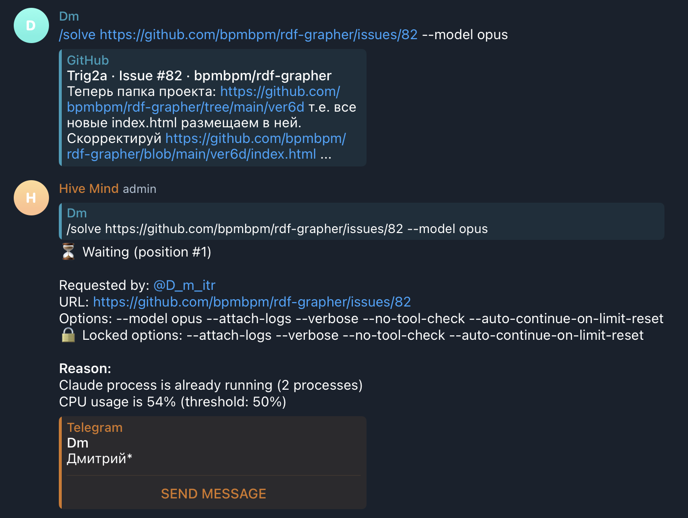
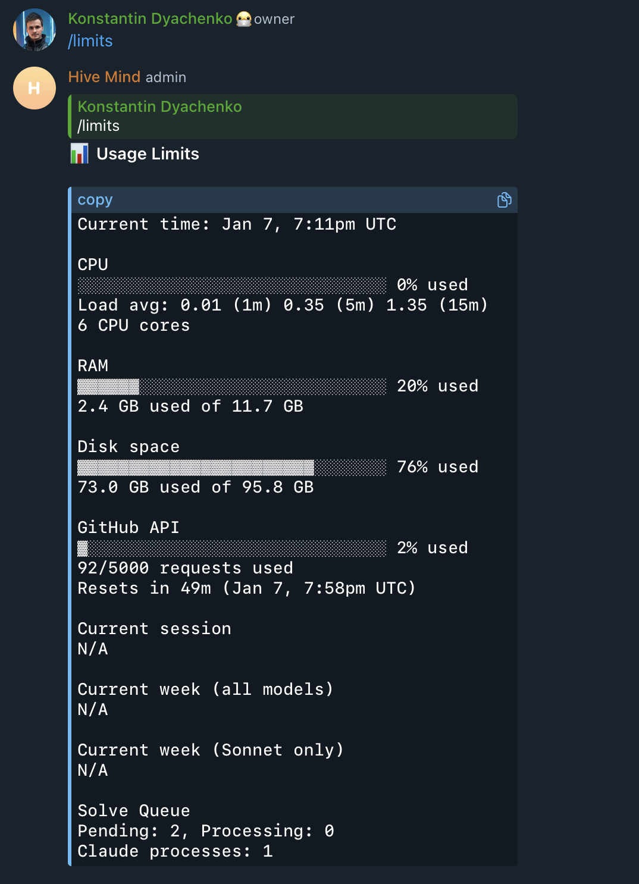
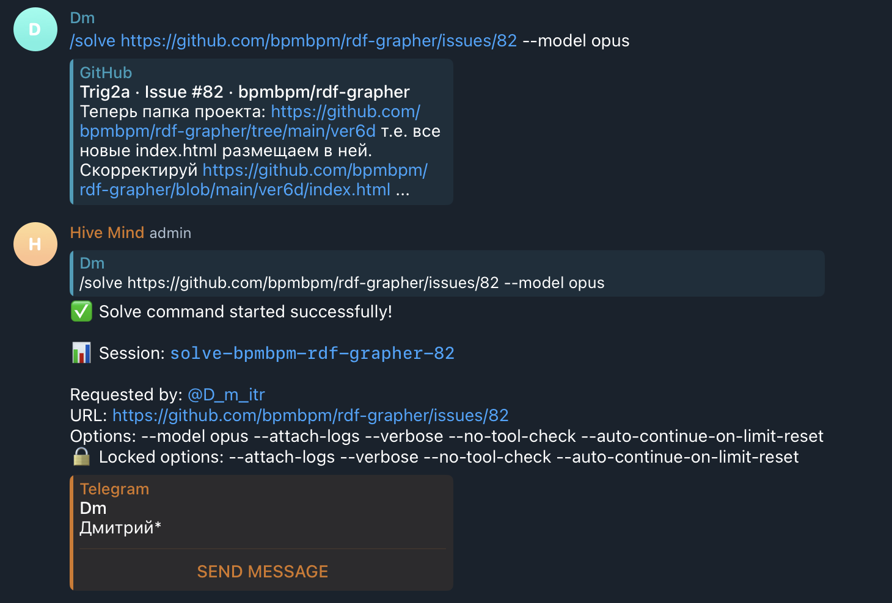

# Case Study: Queue Stuck at CPU Usage Threshold (Issue #1078)

## Overview

This case study documents an incident where the Hive Mind solve queue became stuck, preventing new commands from being processed due to a stale cached CPU usage value exceeding the threshold.

## Timeline of Events

### Background

- **System Configuration:**
  - 6 CPU cores
  - 11.7 GB RAM
  - 95.8 GB Disk space
  - CPU threshold: 50%
  - System metrics cache TTL: 2 minutes

### Incident Timeline (January 7, 2026)

1. **~7:09 PM UTC** - User @D_m_itr requested `/solve` command for issue https://github.com/bpmbpm/rdf-grapher/issues/82

2. **~7:09 PM UTC** - Queue checked system resources:
   - CPU usage was measured at 54% (likely during a brief spike or active Claude process)
   - This value was cached with a 2-minute TTL

3. **~7:09-7:11 PM UTC** - Task remained in "Waiting" status with reasons:

   ```
   Claude process is already running (2 processes)
   CPU usage is 54% (threshold: 50%)
   ```

4. **7:11 PM UTC** - `/limits` command showed:
   - CPU: 0% used (Load avg: 0.01)
   - RAM: 20% used
   - Claude processes: 1

5. **Issue:** Despite actual CPU being at 0%, the queue continued using the cached 54% value, blocking the command.

## Root Cause Analysis

### Primary Root Cause: Stale Cached CPU Value

The queue uses cached system metrics to reduce overhead. The CPU value was cached at 54% during an initial spike, and subsequent queue checks continued using this stale value even though actual CPU usage had dropped to 0%.

**Code location:** `src/telegram-solve-queue.lib.mjs:450-456`

```javascript
const cpuResult = await getCachedCpuInfo(this.verbose);
if (cpuResult.success) {
  const usedRatio = cpuResult.cpuLoad.usagePercentage / 100;
  if (usedRatio > QUEUE_CONFIG.CPU_THRESHOLD) {
    reasons.push(formatWaitingReason('cpu', cpuResult.cpuLoad.usagePercentage, QUEUE_CONFIG.CPU_THRESHOLD));
    this.recordThrottle('cpu_high');
  }
}
```

### Contributing Factor: Reason Message Ordering

The "Claude process is already running" message was displayed first, which is confusing because:

1. It's not a blocking reason by itself (per issue #1061)
2. Users may think the Claude process count is the primary reason for waiting
3. The actual blocking reason (CPU usage) appears second, which is less prominent

**Code location:** `src/telegram-solve-queue.lib.mjs:411-413`

```javascript
if (hasRunningClaude && reasons.length > 0) {
  reasons.unshift(formatWaitingReason('claude_running', claudeProcs.count, 0) + ` (${claudeProcs.count} processes)`);
}
```

### Contributing Factor: No Message Updates

The waiting message shows the reason at the time of initial check but doesn't update as conditions change. Users have no visibility into:

- Whether the cached value has expired
- Current actual resource usage
- When the queue will retry

## Evidence

### Screenshot 1: Queue Waiting Message



Shows:

- Position #1 in queue
- Reason: "Claude process is already running (2 processes)" (first line)
- Reason: "CPU usage is 54% (threshold: 50%)" (second line)

### Screenshot 2: Actual System Resources



Shows:

- CPU: 0% used (Load avg: 0.01)
- RAM: 20% used
- Disk: 76% used
- Claude processes: 1 (not 2!)
- Solve Queue: Pending 2, Processing 0

### Screenshot 3: Success After Wait



Shows the command eventually started after the cached CPU value expired.

## Data Discrepancies

| Metric           | Queue Reason | Actual (/limits)      |
| ---------------- | ------------ | --------------------- |
| CPU Usage        | 54%          | 0%                    |
| Claude Processes | 2            | 1                     |
| Status           | Waiting      | Should be processable |

## Proposed Solutions

### 1. Force-Refresh Cached Values When Above Threshold

When a cached value exceeds a threshold, immediately fetch a fresh value to confirm before blocking.

```javascript
// In checkSystemResources()
const cpuResult = await getCachedCpuInfo(this.verbose);
if (cpuResult.success) {
  let usedRatio = cpuResult.cpuLoad.usagePercentage / 100;

  // If above threshold, refresh to confirm it's not stale
  if (usedRatio > QUEUE_CONFIG.CPU_THRESHOLD) {
    const freshResult = await getCpuLoadInfo(this.verbose);
    if (freshResult.success) {
      usedRatio = freshResult.cpuLoad.usagePercentage / 100;
      // Update cache with fresh value
      getLimitCache().set('cpu', freshResult, CACHE_TTL.SYSTEM);
    }

    // Only block if fresh value still exceeds threshold
    if (usedRatio > QUEUE_CONFIG.CPU_THRESHOLD) {
      reasons.push(...);
    }
  }
}
```

### 2. Reorder Reason Messages

Move "Claude process is already running" to the end of reasons, since it's supplementary information, not a blocking reason:

```javascript
if (hasRunningClaude && reasons.length > 0) {
  // Append at end instead of prepending
  reasons.push(formatWaitingReason('claude_running', claudeProcs.count, 0) + ` (${claudeProcs.count} processes)`);
}
```

### 3. Periodic Message Updates

Update the waiting message periodically (e.g., every minute) to show current status:

```javascript
// Add lastMessageUpdateTime tracking per item
// In consumer loop, update messages periodically
if (Date.now() - item.lastMessageUpdateTime > MESSAGE_UPDATE_INTERVAL_MS) {
  const check = await this.canStartCommand();
  await this.updateItemMessage(item, `⏳ Waiting (position #${position})\n\n${item.infoBlock}\n\n*Reason:*\n${check.reason}`);
  item.lastMessageUpdateTime = Date.now();
}
```

### 4. Comprehensive Queue Unit Tests

Create a queue simulator that tests all possible scenarios:

- Resource threshold transitions
- Cache expiration
- Multiple concurrent commands
- Race conditions
- Message updates

## Impact

- User experience degraded due to confusing wait messages
- Commands unnecessarily delayed by stale cached values
- Reduced trust in queue system reliability

## Lessons Learned

1. **Caching trade-offs:** While caching reduces overhead, stale values can cause incorrect decisions when used for gating
2. **Message clarity:** Status messages should prioritize actionable information
3. **Testing coverage:** Queue logic requires comprehensive simulation testing to catch edge cases
4. **Observability:** Periodic message updates help users understand system state

## References

- Issue #1061: Fixed "Claude process running" being the only blocking reason
- PR #1063: Implemented parallel queue execution
- Issue #1078: This incident report
