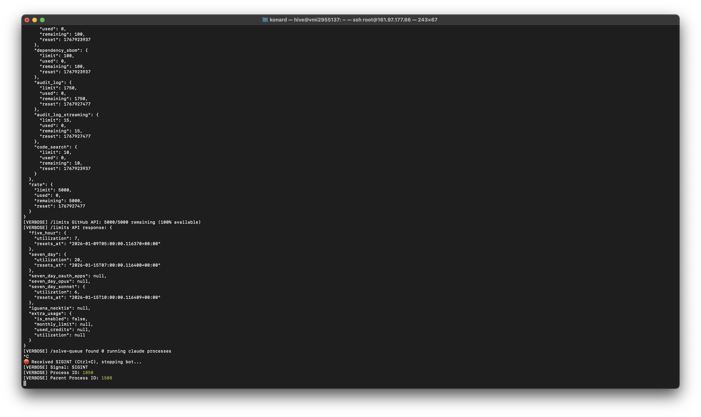

# Case Study: Issue #1083 - Slow SIGINT Shutdown in hive-telegram-bot

## Issue Summary

**Issue:** [#1083](https://github.com/link-assistant/hive-mind/issues/1083)
**Title:** Something taking too long to shutdown on CTRL+C of hive-telegram-bot
**Reporter:** konard
**Type:** Bug

**Symptom:** When pressing Ctrl+C to stop `hive-telegram-bot`, the bot displays "Received SIGINT (Ctrl+C), stopping bot..." but then hangs. Users must press Ctrl+C twice to exit.

## Evidence

### Screenshot Analysis



The screenshot shows:

1. Bot receives `/limits` and `/solve-queue` commands working normally
2. User presses Ctrl+C
3. Bot prints `Received SIGINT (Ctrl+C), stopping bot...`
4. VERBOSE output shows: Signal: SIGINT, Process ID: 1850, Parent Process ID: 1508
5. Process hangs (cursor blinking, no exit)

### Log Evidence from Issue Description

```
[VERBOSE] /solve-queue found 0 running claude processes
^C
Received SIGINT (Ctrl+C), stopping bot...
[VERBOSE] Signal: SIGINT
[VERBOSE] Process ID: 1850
[VERBOSE] Parent Process ID: 1508
```

## Timeline / Sequence of Events

### Expected Flow

1. User presses Ctrl+C
2. Process receives SIGINT
3. Signal handler calls `bot.stop('SIGINT')`
4. Telegraf stops polling loop
5. Event loop empties
6. Process exits

### Actual Flow (Bug)

1. User presses Ctrl+C
2. Process receives SIGINT
3. Signal handler calls `bot.stop('SIGINT')` (synchronous)
4. Telegraf sets `abortController.signal.aborted = true`
5. **BUG: SolveQueue consumer loop continues running (not stopped)**
6. SolveQueue's `sleep()` keeps the event loop alive
7. Process hangs waiting for event loop to empty
8. User presses Ctrl+C again
9. Second SIGINT triggers default handler behavior
10. Process force-exits

## Root Cause Analysis

### Primary Root Cause

**The SolveQueue consumer loop is not stopped during shutdown.**

In `telegram-bot.mjs` lines 1468-1500, the SIGINT/SIGTERM handlers only call `bot.stop()`:

```javascript
process.once('SIGINT', () => {
  isShuttingDown = true;
  console.log('\n Received SIGINT (Ctrl+C), stopping bot...');
  // ... verbose logging ...
  bot.stop('SIGINT'); // Only stops Telegraf, not the queue
});
```

However, the `SolveQueue` class in `telegram-solve-queue.lib.mjs` has its own consumer loop:

```javascript
async runConsumer() {
  this.log('Consumer started');

  while (this.isRunning) {       // <-- This never becomes false
    if (this.queue.length === 0) {
      await this.sleep(QUEUE_CONFIG.CONSUMER_POLL_INTERVAL_MS);  // <-- Keeps event loop alive
      continue;
    }
    // ... process queue items ...
  }

  this.log('Consumer stopped');
  this.consumerTask = null;
}
```

The `sleep()` method creates a `setTimeout` promise that keeps Node.js's event loop active:

```javascript
sleep(ms) {
  return new Promise(resolve => setTimeout(resolve, ms));
}
```

### Why the Second Ctrl+C Works

The first SIGINT handler is registered with `process.once('SIGINT', ...)`, so it only fires once. When the user presses Ctrl+C a second time:

1. There's no custom SIGINT handler anymore
2. Node.js reverts to default SIGINT behavior
3. Default behavior terminates the process immediately

### Contributing Factors

1. **Missing queue shutdown:** The SIGINT handler doesn't call `solveQueue.stop()`
2. **Async consumer loop:** The consumer loop runs indefinitely until `isRunning = false`
3. **Non-ref'd timers:** The `setTimeout` in `sleep()` uses regular timers, not unref'd timers
4. **No cleanup coordination:** No mechanism to coordinate cleanup between Telegraf and the queue

## Proposed Solutions

### Solution 1: Stop the Queue on Shutdown (Recommended)

Add queue shutdown to the signal handlers:

```javascript
process.once('SIGINT', () => {
  isShuttingDown = true;
  console.log('\n Received SIGINT (Ctrl+C), stopping bot...');
  if (VERBOSE) {
    console.log('[VERBOSE] Signal: SIGINT');
    console.log('[VERBOSE] Process ID:', process.pid);
    console.log('[VERBOSE] Parent Process ID:', process.ppid);
  }

  // Stop the solve queue consumer loop
  const solveQueue = getSolveQueue({ verbose: VERBOSE });
  solveQueue.stop();

  bot.stop('SIGINT');
});
```

**Pros:**

- Minimal code change
- Proper cleanup of queue resources
- Coordinated shutdown

**Cons:**

- Need to handle case where queue hasn't been initialized yet

### Solution 2: Use Unref'd Timers in Queue

Modify the `sleep()` method to use unref'd timers:

```javascript
sleep(ms) {
  return new Promise(resolve => {
    const timer = setTimeout(resolve, ms);
    timer.unref();  // Don't keep event loop alive
  });
}
```

**Pros:**

- Event loop can exit naturally
- No explicit stop() call needed

**Cons:**

- Changes behavior of queue (may exit prematurely in edge cases)
- Doesn't properly stop queue processing

### Solution 3: Centralized Exit Handler

Create a centralized shutdown coordinator:

```javascript
const shutdownManager = {
  handlers: [],
  register(handler) {
    this.handlers.push(handler);
  },
  async shutdown(signal) {
    for (const handler of this.handlers) {
      await handler(signal);
    }
    process.exit(0);
  },
};

// Register handlers
shutdownManager.register(async () => solveQueue.stop());
shutdownManager.register(async () => bot.stop('SIGINT'));

process.once('SIGINT', () => shutdownManager.shutdown('SIGINT'));
```

**Pros:**

- Clean architecture
- Extensible for future components
- Proper async handling

**Cons:**

- More code
- Over-engineering for current needs

## Recommended Implementation

**Implement Solution 1** with a safety check:

```javascript
process.once('SIGINT', () => {
  isShuttingDown = true;
  console.log('\n Received SIGINT (Ctrl+C), stopping bot...');
  if (VERBOSE) {
    console.log('[VERBOSE] Signal: SIGINT');
    console.log('[VERBOSE] Process ID:', process.pid);
    console.log('[VERBOSE] Parent Process ID:', process.ppid);
  }

  // Stop the solve queue consumer loop to allow clean exit
  try {
    const solveQueue = getSolveQueue({ verbose: VERBOSE });
    solveQueue.stop();
    if (VERBOSE) {
      console.log('[VERBOSE] Solve queue stopped');
    }
  } catch (err) {
    // Queue may not be initialized, ignore
    if (VERBOSE) {
      console.log('[VERBOSE] Could not stop solve queue:', err.message);
    }
  }

  bot.stop('SIGINT');
});
```

Apply the same change to the SIGTERM handler.

## Additional Recommendations

1. **Add shutdown logging:** After `bot.stop()`, add a log to confirm shutdown started
2. **Consider timeout:** Add a fallback timeout to force exit if graceful shutdown takes too long
3. **Document behavior:** Add comments explaining the shutdown sequence

## References

- [Telegraf Documentation](https://telegraf.js.org/) - Official Telegraf documentation
- [Node.js Process Events](https://nodejs.org/api/process.html) - Node.js signal handling
- [Telegraf GitHub](https://github.com/telegraf/telegraf) - Telegraf source code
- [Node.js SIGINT Handling Issue](https://github.com/nodejs/node/issues/2853) - Related Node.js issue
- [Node.js Event Loop Blocking](https://github.com/nodejs/node/issues/9050) - SIGINT and loops issue

## Test Plan

1. Start `hive-telegram-bot --verbose`
2. Wait for bot to fully initialize
3. Send `/limits` command to ensure queue is active
4. Press Ctrl+C once
5. Verify bot exits cleanly without hanging
6. Check that "Solve queue stopped" message appears in verbose mode
