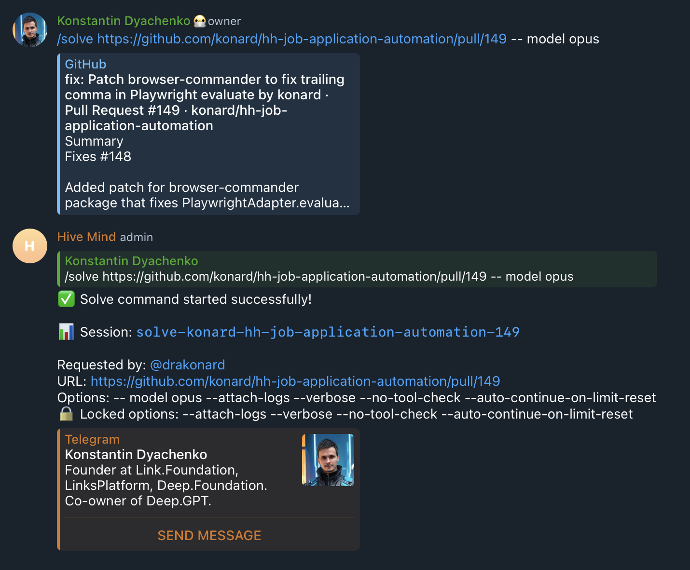

# Case Study: Issue #1092 - `-- model` Does Not Produce Error

## Summary

When a user types `-- model opus` (with a space between `--` and `model`) instead of `--model opus`, the system silently ignores the malformed option and uses the default model (Sonnet 4.5) instead of the user's intended model (Opus 4.5).

## Timeline of Events

1. **User Intent**: User wanted to run `/solve` command with Opus model
2. **User Action**: Typed `/solve https://github.com/konard/hh-job-application-automation/pull/149 -- model opus`
3. **Tokenization**: Telegram bot's `parseCommandArgs()` split the message by spaces, resulting in:
   ```javascript
   ['https://github.com/...', '--', 'model', 'opus'];
   ```
4. **Yargs Parsing**: Yargs interpreted:
   - `--` as the POSIX "end of options" marker (valid)
   - `model` as a positional argument (silently ignored)
   - `opus` as a positional argument (silently ignored)
5. **Model Selection**: Since `--model` was never parsed, the system used the default model (Sonnet 4.5)
6. **Result**: Solve command started with wrong model, no error was shown

## Root Cause Analysis

### Technical Root Cause

The issue occurs due to a gap in argument validation across multiple layers:

1. **Shell/Tokenizer Layer**: When the input `-- model` is tokenized by the space-based parser, it becomes two separate tokens: `['--', 'model']`.

2. **Yargs Layer**: Yargs with `.strict()` mode catches unknown OPTIONS (like `--unknownflag`), but:
   - It does NOT catch the standalone `--` (which is a valid POSIX marker)
   - It does NOT catch `model` after `--` (which becomes a positional argument)

3. **Model Detection Layer**: The model detection code at `solve.config.lib.mjs:402` checks:
   ```javascript
   const modelExplicitlyProvided = rawArgs.includes('--model') || rawArgs.includes('-m');
   ```
   This exact string match fails because `'--model'` is not present - only `'--'` and `'model'` are separate elements.

### Contributing Factors

- **POSIX Convention**: The `--` by itself is a valid POSIX marker meaning "end of options"
- **Silent Degradation**: No error was raised; the system simply fell back to defaults
- **User Expectation**: Users expect typos in command-line options to produce errors

## Evidence

### Screenshot from Issue



The screenshot clearly shows:

- User typed: `/solve https://... -- model opus`
- System showed: `Options: -- model opus ...`
- System used default model (no Opus)

### Log Data

From the session response:

```
Session: solve-konard-hh-job-application-automation-149
Options: -- model opus --attach-logs --verbose --no-tool-check --auto-continue-on-limit-reset
```

Note how `-- model opus` appears in the options but was not parsed as `--model opus`.

## Solution Implemented

### 1. Added Malformed Flag Detection Function

File: `src/option-suggestions.lib.mjs`

Added `detectMalformedFlags(args)` function that detects:

- `"-- option"` as a single argument (space after `--`)
- `['--', 'option']` as split tokens (POSIX-style)
- `"-option"` (single dash for long option)
- `"---option"` (triple dash)
- `"- -option"` (space between dashes)

### 2. Integrated Detection into Telegram Bot

File: `src/telegram-bot.mjs`

Added validation check before yargs parsing:

```javascript
const malformedResult = detectMalformedFlags(args);
if (malformedResult.malformed.length > 0) {
  await ctx.reply(`Malformed option ... Did you mean ...?`);
  return;
}
```

### 3. Integrated Detection into CLI

File: `src/solve.config.lib.mjs`

Added validation check in `parseArguments()`:

```javascript
const malformedResult = detectMalformedFlags(rawArgs);
if (malformedResult.malformed.length > 0) {
  throw new Error(malformedResult.errors.join('\n'));
}
```

## Test Coverage

Created comprehensive unit tests in `tests/test-malformed-flags.mjs`:

- Tests for Issue #1092 specific scenario (23 tests total)
- Tests for various malformed patterns
- Tests for valid cases (no false positives)
- Tests for edge cases

All tests pass:

```
Test Results for malformed flag detection:
  Passed: 23
  Failed: 0
```

## Prevention Measures

### For Users

When typing command options:

- Always type `--model` (no space after `--`)
- Use tab completion if available
- Review the "Options:" line in the response to verify options were parsed correctly

### For System

The new `detectMalformedFlags()` function provides:

- Early detection before yargs parsing
- Helpful error messages with suggestions
- Coverage of common typo patterns

## Files Changed

1. `src/option-suggestions.lib.mjs` - Added `detectMalformedFlags()` function and `KNOWN_OPTION_NAMES` list
2. `src/solve.config.lib.mjs` - Imported and integrated malformed flag detection
3. `src/telegram-bot.mjs` - Imported and integrated malformed flag detection
4. `tests/test-malformed-flags.mjs` - New unit tests for malformed flag detection
5. `experiments/test-malformed-args.mjs` - Experiment script used during development

## References

- Issue: https://github.com/link-assistant/hive-mind/issues/1092
- Related PR: https://github.com/konard/hh-job-application-automation/pull/149
- POSIX `--` convention: https://pubs.opengroup.org/onlinepubs/9699919799/basedefs/V1_chap12.html
