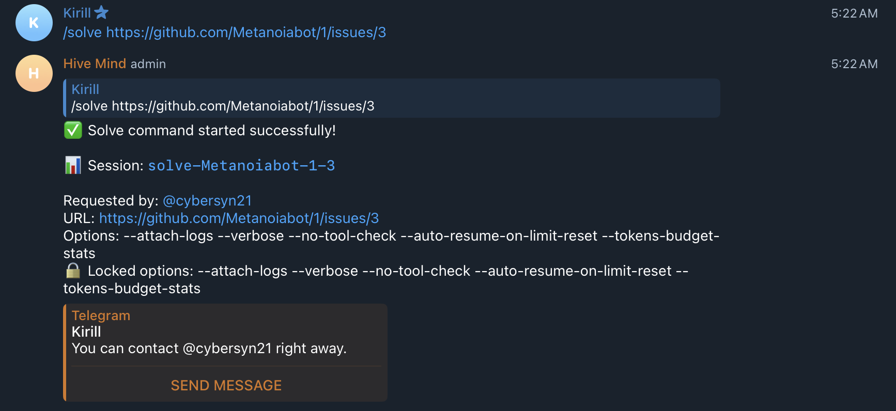
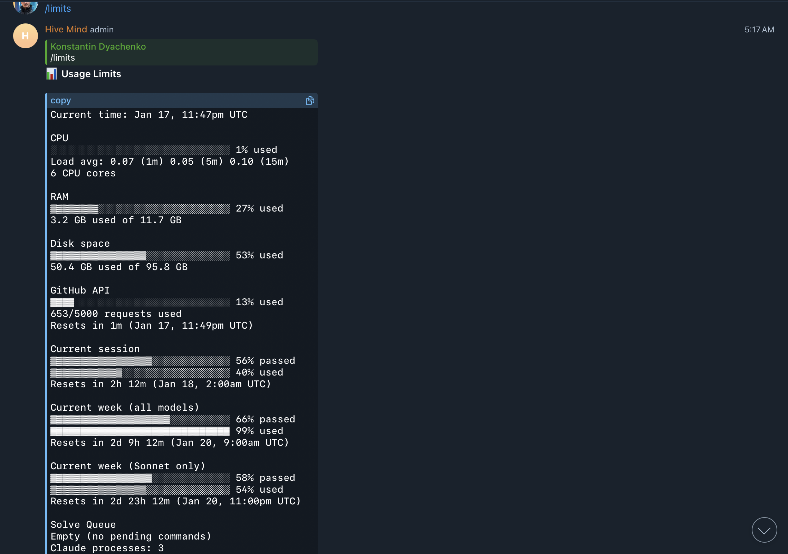

# Case Study: CLAUDE_WEEKLY_THRESHOLD Not Working (Issue #1133)

## Overview

This case study documents an incident where the `CLAUDE_WEEKLY_THRESHOLD` configuration was not enforcing one-at-a-time mode as expected when the weekly API usage reached 99%.

## Timeline of Events

### Background

- **System Configuration:**
  - 6 CPU cores
  - 11.7 GB RAM
  - 95.8 GB Disk space
  - `CLAUDE_WEEKLY_THRESHOLD`: 0.99 (99%)
  - Expected behavior: One-at-a-time mode when weekly limit >= 99%

### Incident Timeline (January 17, 2026)

1. **~11:47 PM UTC** - User checked `/limits` command showing:
   - CPU: 1% used
   - RAM: 27% used
   - Current week (all models): **99% used**
   - Claude processes: **3** running
   - Solve Queue: Empty (no pending commands)

2. **~5:22 AM UTC (Jan 18)** - User requested `/solve` command for issue https://github.com/Metanoiabot/1/issues/3

3. **~5:22 AM UTC** - Solve command **started successfully** despite:
   - Weekly limit being at exactly 99% (matching the threshold)
   - 3 Claude processes already running

### Expected vs Actual Behavior

| Metric           | Value           | Expected Behavior           |
| ---------------- | --------------- | --------------------------- |
| Weekly Usage     | 99%             | One-at-a-time mode active   |
| Claude Processes | 3               | Should block new commands   |
| Queue Processing | 0               | -                           |
| **Result**       | Command started | **Should have been queued** |

## Root Cause Analysis

### Primary Root Cause: External Claude Process Detection Not Used

The `oneAtATime` mode was only checking `this.processing.size > 0` (queue-internal processing count) instead of also considering externally running Claude processes detected via `pgrep`.

**Code location (before fix):** `src/telegram-solve-queue.lib.mjs:667-670`

```javascript
// Check one-at-a-time mode
if (check.oneAtATime && this.processing.size > 0) {
  this.log('One-at-a-time mode: waiting for current command to finish');
  await this.sleep(QUEUE_CONFIG.CONSUMER_POLL_INTERVAL_MS);
  continue;
}
```

**Problem:** The code only blocked if `this.processing.size > 0`, which only tracks commands started through the queue in the current session. It ignored Claude processes that:

- Were started before the bot was restarted
- Were started through other means (direct CLI, other instances)
- Were still running from previous queue sessions

The `canStartCommand()` method correctly detects running Claude processes via `getRunningClaudeProcesses()` and returns `claudeProcesses: count`, but this value was never used in the one-at-a-time blocking logic.

### Secondary Root Cause: Inconsistent Comparison Operators

The configuration comments suggested `>` (exclusive) comparison while the code used `>=` (inclusive) for API thresholds:

**Comment:**

```javascript
CLAUDE_WEEKLY_THRESHOLD: 0.99, // One-at-a-time if weekly limit > 99%
```

**Code:**

```javascript
if (weeklyRatio >= QUEUE_CONFIG.CLAUDE_WEEKLY_THRESHOLD) {
```

Additionally, system resource checks used `>` while API limit checks used `>=`, creating inconsistent behavior.

## Evidence

### Screenshot 1: Solve Command Started Successfully



Shows:

- `/solve` command for https://github.com/Metanoiabot/1/issues/3
- "Solve command started successfully!"
- Session: `solve-Metanoiabot-1-3`

### Screenshot 2: System Limits at Time of Incident



Shows:

- Current time: Jan 17, 11:47pm UTC
- CPU: 1% used
- RAM: 27% used
- **Current week (all models): 99% used**
- **Claude processes: 3**
- Solve Queue: Empty

## Solution

### Fix 1: Include External Claude Processes in One-at-a-Time Check

Modified the one-at-a-time check to consider both queue-internal processing AND externally running Claude processes:

```javascript
// Check one-at-a-time mode
// When oneAtATime is true (e.g., weekly limit >= 99%), block if:
// 1. A command is already being processed by the queue, OR
// 2. There are Claude processes running externally (detected via pgrep)
// This ensures we don't start new commands when near limits, even if external
// Claude processes are consuming the API quota.
// See: https://github.com/link-assistant/hive-mind/issues/1133
if (check.oneAtATime && (this.processing.size > 0 || check.claudeProcesses > 0)) {
  const processInfo = check.claudeProcesses > 0
    ? ` (${check.claudeProcesses} claude process${check.claudeProcesses > 1 ? 'es' : ''} running)`
    : '';
  this.log(`One-at-a-time mode: waiting for current command to finish${processInfo}`);
  await this.sleep(QUEUE_CONFIG.CONSUMER_POLL_INTERVAL_MS);
  continue;
}
```

### Fix 2: Standardize Comparison Operators to >= (Inclusive)

Updated all threshold comparisons to use `>=` consistently, and updated comments to reflect this:

```javascript
export const QUEUE_CONFIG = {
  // Resource thresholds (usage ratios: 0.0 - 1.0)
  // All thresholds use >= comparison (inclusive)
  RAM_THRESHOLD: 0.5, // Stop if RAM usage >= 50%
  CPU_THRESHOLD: 0.5, // Stop if 5-minute load average >= 50% of CPU count
  DISK_THRESHOLD: 0.95, // One-at-a-time if disk usage >= 95%

  // API limit thresholds (usage ratios: 0.0 - 1.0)
  // All thresholds use >= comparison (inclusive)
  CLAUDE_SESSION_THRESHOLD: 0.9, // Stop if 5-hour limit >= 90%
  CLAUDE_WEEKLY_THRESHOLD: 0.99, // One-at-a-time if weekly limit >= 99%
  GITHUB_API_THRESHOLD: 0.8, // Stop if GitHub >= 80% with parallel claude
  // ...
};
```

### Fix 3: Documentation Update for Log Capture

Added recommendation to capture bot logs using `tee` for post-incident analysis:

```bash
hive-telegram-bot 2>&1 | tee -a logs/bot-$(date +%Y%m%d).log
```

## Impact

- **User Impact:** Commands started when they should have been queued, potentially exceeding API limits
- **System Impact:** Risk of hitting hard API limits and service disruption
- **Debugging Impact:** Difficulty in post-incident analysis due to terminal buffer overflow (logs lost)

## Lessons Learned

1. **External Process Detection Matters:** When implementing rate limiting based on process count, must consider ALL processes, not just those tracked internally by the current instance.

2. **Comparison Operator Consistency:** All thresholds should use the same comparison operator (preferably `>=` for inclusive behavior) to avoid confusion and edge case bugs.

3. **Log Capture is Critical:** Long-running services should always capture logs to files, not just terminal output. The `tee` command provides real-time output while also preserving logs.

4. **State Persistence:** Queue state (like `processing` map) is lost on restart. External detection via `pgrep` provides resilience against restarts but was not being used for all checks.

## Files Changed

- `src/telegram-solve-queue.lib.mjs` - Fixed one-at-a-time check and comparison operators
- `README.md` - Added tee command recommendation for log capture

## References

- Issue #1133: This incident report
- Issue #1078: Previous case study on stale cached CPU values
- Issue #1061: "Claude process running" not being a blocking reason by itself
