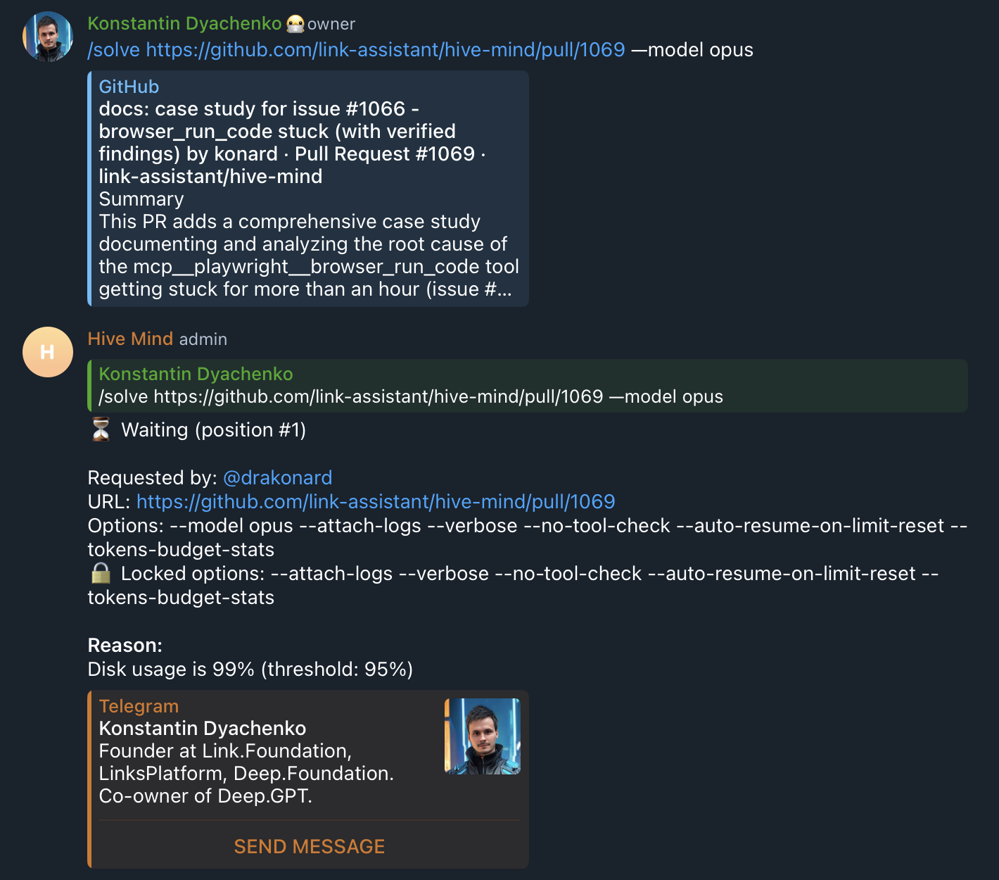

# Case Study: Disk Threshold Not Using One-At-A-Time Mode (Issue #1155)

## Overview

This case study documents an incident where tasks were stuck in the queue waiting indefinitely when disk usage exceeded the threshold (99% > 95%), instead of being processed one-at-a-time as intended.

## Timeline of Events

### Background

- **System Configuration:**
  - `DISK_THRESHOLD`: 0.95 (95%) in documentation, but 0.90 (90%) in code
  - Expected behavior: One-at-a-time mode when disk usage >= threshold
  - Actual behavior: Tasks blocked/waiting indefinitely in queue

### Incident (January 2026)

1. **User attempted `/solve` command** for PR https://github.com/link-assistant/hive-mind/pull/1069

2. **Task was queued** with message:
   - Status: "Waiting (position #1)"
   - Reason: "Disk usage is 99% (threshold: 95%)"

3. **Expected behavior**: Task should have started in one-at-a-time mode (allow exactly one task to run)

4. **Actual behavior**: Task remained waiting indefinitely because disk threshold was implemented as an "ultimate restriction" that blocks ALL commands, not as a one-at-a-time mode

### Expected vs Actual Behavior

| Metric         | Value | Expected Behavior         | Actual Behavior         |
| -------------- | ----- | ------------------------- | ----------------------- |
| Disk Usage     | 99%   | One-at-a-time mode active | Blocked/Waiting         |
| Processing     | 0     | Should start one task     | Task waits indefinitely |
| Queue Position | #1    | Should be processed       | Stuck at position #1    |

## Root Cause Analysis

### Primary Root Cause: Disk Threshold Not Implementing One-At-A-Time Mode

The disk threshold was treated as an "ultimate restriction" (blocking all commands) instead of using one-at-a-time mode like the Claude API thresholds.

**Code location:** `src/telegram-solve-queue.lib.mjs:524-538`

```javascript
// Check disk space (using cached value)
// Note: Disk threshold is an ultimate restriction - it blocks unconditionally when triggered
// Unlike CLAUDE_5_HOUR_SESSION_THRESHOLD and CLAUDE_WEEKLY_THRESHOLD which use totalProcessing
// to allow one command at a time, disk threshold blocks all new commands immediately
// See: https://github.com/link-assistant/hive-mind/issues/1133
const diskResult = await getCachedDiskInfo(this.verbose);
if (diskResult.success) {
  const usedPercent = 100 - diskResult.diskSpace.freePercentage;
  const usedRatio = usedPercent / 100;
  if (usedRatio >= QUEUE_CONFIG.DISK_THRESHOLD) {
    reasons.push(formatWaitingReason('disk', usedPercent, QUEUE_CONFIG.DISK_THRESHOLD));
    this.recordThrottle('disk_high');
  }
}
```

**Problem:** The disk check only adds a blocking reason to `reasons[]`, but never sets `oneAtATime = true`. This means when disk usage exceeds threshold, ALL commands are blocked instead of allowing exactly one command at a time.

### Secondary Root Cause: Inconsistent Code vs Documentation

The comment in `QUEUE_CONFIG` (from commit `196dfdee`) says:

```javascript
DISK_THRESHOLD: 0.9, // One-at-a-time if disk usage >= 90%
```

But the implementation does NOT actually implement one-at-a-time mode for disk.

### Comparison with Working Implementation

The Claude API thresholds correctly implement one-at-a-time mode:

```javascript
// CLAUDE_5_HOUR_SESSION_THRESHOLD - correct implementation
if (sessionRatio >= QUEUE_CONFIG.CLAUDE_5_HOUR_SESSION_THRESHOLD) {
  oneAtATime = true; // <-- Sets one-at-a-time flag
  this.recordThrottle(sessionRatio >= 1.0 ? 'claude_5_hour_session_100' : 'claude_5_hour_session_high');
  if (totalProcessing > 0) {
    reasons.push(formatWaitingReason('claude_5_hour_session', sessionPercent, QUEUE_CONFIG.CLAUDE_5_HOUR_SESSION_THRESHOLD) + ' (waiting for current command)');
  }
}
```

The key differences:

1. Sets `oneAtATime = true` when threshold is exceeded
2. Only adds blocking reason if `totalProcessing > 0`
3. Allows exactly one command when nothing is processing

## Evidence

### Screenshot: Task Waiting in Queue



Shows:

- `/solve` command for https://github.com/link-assistant/hive-mind/pull/1069
- Status: "Waiting (position #1)"
- Reason: "Disk usage is 99% (threshold: 95%)"
- Task stuck instead of being processed

### User's Manual Threshold Notes (Commit 196dfdee)

The user manually documented which thresholds should use which modes:

```javascript
RAM_THRESHOLD: 0.65, // Enqueue if RAM usage >= 65%
CPU_THRESHOLD: 0.65, // Enqueue if 5-minute load average >= 65% of CPU count
DISK_THRESHOLD: 0.9, // One-at-a-time if disk usage >= 90%

CLAUDE_5_HOUR_SESSION_THRESHOLD: 0.85, // One-at-a-time if 5-hour limit >= 85%
CLAUDE_WEEKLY_THRESHOLD: 0.98, // One-at-a-time if weekly limit >= 98%
GITHUB_API_THRESHOLD: 0.8, // Enqueue if GitHub >= 80% with parallel claude
```

This clearly shows the intent:

- RAM, CPU, GitHub: Enqueue mode (block all commands)
- Disk, Claude 5-hour, Claude weekly: One-at-a-time mode (allow exactly one command)

## Solution

### Fix: Move Disk Threshold Check to checkApiLimits with One-At-A-Time Mode

The disk threshold check needs to be restructured to implement one-at-a-time mode similar to Claude API thresholds:

```javascript
// Check disk space with one-at-a-time mode
// Unlike RAM and CPU which block unconditionally, disk threshold allows
// exactly one command when nothing is processing
// See: https://github.com/link-assistant/hive-mind/issues/1155
const diskResult = await getCachedDiskInfo(this.verbose);
if (diskResult.success) {
  const usedPercent = 100 - diskResult.diskSpace.freePercentage;
  const usedRatio = usedPercent / 100;
  if (usedRatio >= QUEUE_CONFIG.DISK_THRESHOLD) {
    oneAtATime = true; // Enable one-at-a-time mode
    this.recordThrottle('disk_high');
    // Only block if something is already processing
    if (totalProcessing > 0) {
      reasons.push(formatWaitingReason('disk', usedPercent, QUEUE_CONFIG.DISK_THRESHOLD) + ' (waiting for current command)');
    }
  }
}
```

### Key Changes:

1. **Set `oneAtATime = true`** when disk threshold is exceeded
2. **Only add blocking reason if `totalProcessing > 0`** (something is already running)
3. **Allow command to start** when disk is high but nothing is processing
4. **Pass `totalProcessing` to checkSystemResources** for uniform checking

### Threshold Mode Summary

After the fix, thresholds will work as intended:

| Threshold                       | Mode              | Behavior                           |
| ------------------------------- | ----------------- | ---------------------------------- |
| RAM_THRESHOLD                   | Enqueue           | Block all commands unconditionally |
| CPU_THRESHOLD                   | Enqueue           | Block all commands unconditionally |
| **DISK_THRESHOLD**              | **One-at-a-time** | **Allow exactly one command**      |
| CLAUDE_5_HOUR_SESSION_THRESHOLD | One-at-a-time     | Allow exactly one command          |
| CLAUDE_WEEKLY_THRESHOLD         | One-at-a-time     | Allow exactly one command          |
| GITHUB_API_THRESHOLD            | Enqueue           | Block all commands unconditionally |

## Impact

- **User Impact:** Tasks stuck waiting indefinitely when disk usage is high
- **System Impact:** Unable to process any tasks during high disk usage periods
- **Risk Mitigation:** One-at-a-time mode allows controlled task execution while preventing multiple tasks from exhausting disk space simultaneously

## Lessons Learned

1. **Comment-Code Consistency:** When comments describe intended behavior, the code must match. The comment said "One-at-a-time" but the implementation was "Enqueue/Block".

2. **Threshold Mode Design:** Resource thresholds fall into two categories:
   - **Enqueue mode:** For recoverable resources (RAM, CPU) that are released when tasks complete
   - **One-at-a-time mode:** For consumable/unpredictable resources (disk, API limits) where we can't predict how much one task will use

3. **Testing Threshold Behavior:** Unit tests should verify not just that thresholds exist, but that they implement the correct mode (blocking vs one-at-a-time).

## Files Changed

- `src/telegram-solve-queue.lib.mjs` - Implement one-at-a-time mode for disk threshold

## Test Plan

- [ ] Verify disk threshold sets `oneAtATime = true`
- [ ] Verify disk threshold only blocks when `totalProcessing > 0`
- [ ] Verify task starts when disk is high but nothing is processing
- [ ] Verify task waits when disk is high and another task is processing
- [ ] Verify existing tests still pass

## References

- Issue #1155: This incident report
- Issue #1133: Previous case study on one-at-a-time mode implementation
- Commit 196dfdee: Manual threshold mode annotations
