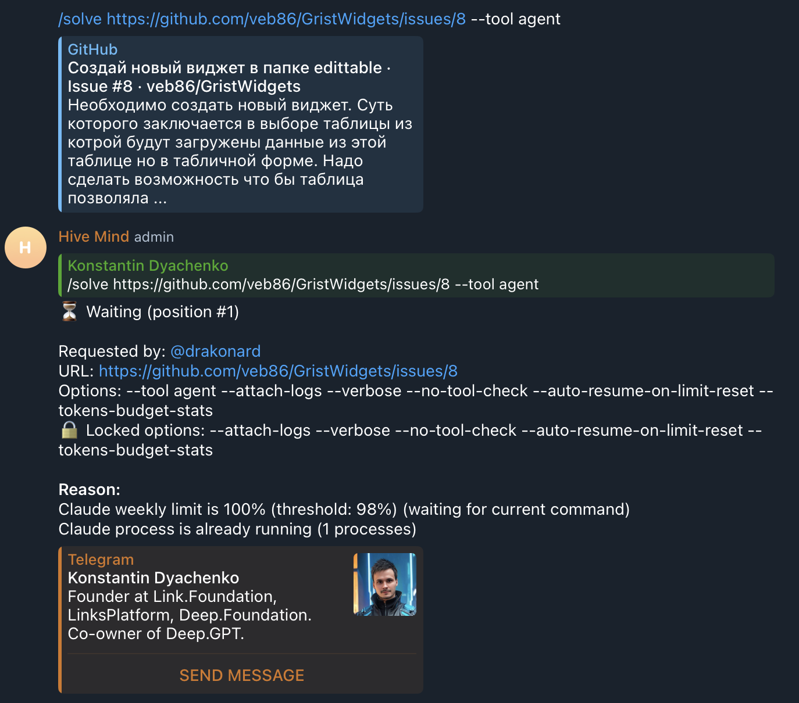

# Case Study: Claude Limits Applied to --tool agent (Issue #1159)

## Overview

This case study documents an incident where tasks using `--tool agent` were incorrectly queued based on Claude API limits. Since the agent tool uses a different backend (like Grok Code or Claude Code SDK via agent), Claude API limits should not apply to these tasks.

## Timeline of Events

### Background

- **System Configuration:**
  - Telegram bot queue with rate limiting
  - Claude weekly limit at 100% (threshold: 98%)
  - Claude process detection via `pgrep -l -x claude`
  - User requesting `/solve` with `--tool agent` option

### Incident Timeline (January 2026)

1. **User Request:** A user requested `/solve` command for issue https://github.com/veb86/GristWidgets/issues/8 with `--tool agent`

2. **Expected Behavior:** The command should start immediately since:
   - `--tool agent` uses a different backend (not Claude API)
   - Agent tools have their own rate limits
   - Claude API limits (5-hour session, weekly) don't apply

3. **Actual Behavior:** The command was queued with reason:
   ```
   Claude weekly limit is 100% (threshold: 98%) (waiting for current command)
   Claude process is already running (1 processes)
   ```

### Expected vs Actual Behavior

| Condition            | Value                     | Expected for --tool agent   | Actual                      |
| -------------------- | ------------------------- | --------------------------- | --------------------------- |
| Claude Weekly Limit  | 100%                      | Ignored (different backend) | **Applied - queued task**   |
| Claude Session Limit | 85%+                      | Ignored (different backend) | **Applied - one-at-a-time** |
| Result               | Command with --tool agent | **Start immediately**       | Queued waiting for limits   |

## Root Cause Analysis

### Primary Root Cause: Claude API Limits Applied Universally

The queue's `checkApiLimits()` function applied Claude-specific limits (5-hour session limit, weekly limit) to all tasks regardless of which tool they used.

**Code location (before fix):** `src/telegram-solve-queue.lib.mjs:570-620`

```javascript
async checkApiLimits(hasRunningClaude = false, totalProcessing = 0) {
  const reasons = [];
  let oneAtATime = false;

  // Claude limits were checked for ALL tools
  const claudeResult = await getCachedClaudeLimits(this.verbose);
  if (claudeResult.success) {
    const sessionPercent = claudeResult.usage.currentSession.percentage;
    const weeklyPercent = claudeResult.usage.allModels.percentage;
    // ... applied limits regardless of tool
  }
}
```

### Secondary Root Cause: Tool Information Not Passed to Limit Checks

The `canStartCommand()` and `checkApiLimits()` functions didn't receive information about which tool the next queued command would use.

**Code location (before fix):** `src/telegram-solve-queue.lib.mjs:692-713`

```javascript
// In runConsumer():
const check = await this.canStartCommand(); // No tool parameter
```

## Evidence

### Screenshot: Task Queued Despite Using --tool agent



Shows:

- `/solve` command for https://github.com/veb86/GristWidgets/issues/8 with `--tool agent`
- Status: "Waiting (position #1)"
- Reason: "Claude weekly limit is 100% (threshold: 98%) (waiting for current command)"
- Claude process is already running (1 processes)

## Why Claude Limits Don't Apply to --tool agent

The agent tool uses a fundamentally different backend than the Claude CLI:

| Aspect         | --tool claude               | --tool agent             |
| -------------- | --------------------------- | ------------------------ |
| Backend        | Claude API (Anthropic)      | Grok Code / OpenCode Zen |
| Rate Limiting  | 5-hour session, weekly caps | Own rate limits          |
| Process Name   | `claude`                    | `agent`                  |
| Usage Tracking | Claude OAuth API            | Separate tracking        |

Sources:

- [Claude Code Limits Explained (2025 Edition)](https://www.truefoundry.com/blog/claude-code-limits-explained)
- [Rate limits - Claude Docs](https://platform.claude.com/docs/en/api/rate-limits)
- [Claude Limit Overview Across All Access Methods](https://claudelog.com/faqs/claude-limit/)

## Solution

### Fix 1: Add Tool Parameter to Limit Checks

Updated `canStartCommand()` to accept tool information:

```javascript
async canStartCommand(options = {}) {
  const tool = options.tool || 'claude';
  // ... pass tool to checkApiLimits
  const limitCheck = await this.checkApiLimits(hasRunningClaude, totalProcessing, tool);
}
```

### Fix 2: Skip Claude Limits for --tool agent

Updated `checkApiLimits()` to skip Claude-specific limits when tool is 'agent':

```javascript
async checkApiLimits(hasRunningClaude = false, totalProcessing = 0, tool = 'claude') {
  const reasons = [];
  let oneAtATime = false;

  // Skip Claude-specific limits for --tool agent since agent uses different rate limits
  // Agent tools (like Grok Code or Claude Code SDK via agent) have their own rate limiting
  // and are not affected by Claude API limits (5-hour session, weekly limits)
  // See: https://github.com/link-assistant/hive-mind/issues/1159
  const skipClaudeLimits = tool === 'agent';

  // Check Claude limits (using cached value)
  // Skipped for --tool agent since it uses different rate limits
  if (!skipClaudeLimits) {
    const claudeResult = await getCachedClaudeLimits(this.verbose);
    // ... check limits
  } else if (this.verbose) {
    this.log(`Skipping Claude limits check for --tool ${tool}`);
  }
  // ...
}
```

### Fix 3: Consumer Loop Passes Tool to Checks

Updated consumer loop to get tool from next queue item:

```javascript
// In runConsumer():
const nextItem = this.queue[0];
const check = await this.canStartCommand({ tool: nextItem?.tool });
```

### Fix 4: Telegram Bot Passes Tool on Initial Check

Updated telegram-bot.mjs to pass tool when checking before queue:

```javascript
const check = await solveQueue.canStartCommand({ tool: solveTool });
```

## Impact

- **User Impact:** Tasks using `--tool agent` were incorrectly delayed when Claude limits were reached
- **System Impact:** Suboptimal resource utilization - agent tasks could run in parallel with Claude tasks
- **User Experience:** Confusing waiting reasons that don't apply to the tool being used

## Lessons Learned

1. **Tool-Specific Rate Limiting:** Different AI tools have different rate limiting systems. Queue implementations should be aware of which tool a task uses and apply only relevant limits.

2. **Backend Awareness:** The queue's limit checking should understand that `--tool claude` and `--tool agent` use different backends with different rate limiting.

3. **Information Propagation:** Tool information needs to flow through the entire queue lifecycle - from enqueueing to limit checking to execution.

4. **Test Coverage:** Added 7 new tests specifically for tool-aware limit checking to ensure this behavior is maintained.

## Files Changed

- `src/telegram-solve-queue.lib.mjs` - Added tool parameter to `canStartCommand()` and `checkApiLimits()`, skip Claude limits for agent
- `src/telegram-bot.mjs` - Pass tool to `canStartCommand()` initial check
- `tests/solve-queue.test.mjs` - Added 7 new tests for tool-specific limit handling

## References

- Issue #1159: This incident report
- Issue #1133: Previous case study on totalProcessing calculation
- Issue #1078: Previous case study on Claude process detection
- [Claude Code Limits Explained](https://www.truefoundry.com/blog/claude-code-limits-explained)
- [Rate limits - Claude Docs](https://platform.claude.com/docs/en/api/rate-limits)
