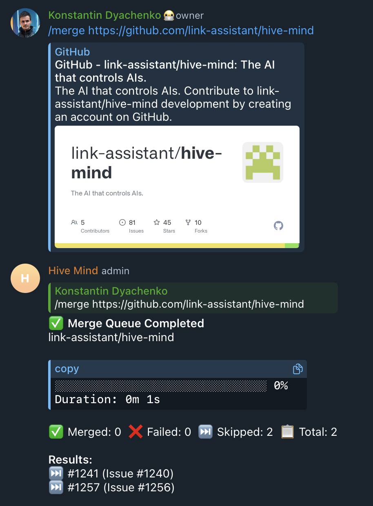

# Case Study: Issue #1294 - Merge Queue Skips Merging Without Reason

## Summary

The merge queue bot displays "Skipped" status for PRs in Telegram messages but does not include the reason why each PR was skipped, leaving users unable to understand what action is required.

## Issue Details

- **Issue**: [#1294](https://github.com/link-assistant/hive-mind/issues/1294)
- **Type**: Bug
- **Reporter**: @konard
- **Date**: 2026-02-14

## Problem Statement

When using the `/merge` command in Telegram, the bot processes PRs with the 'ready' label. When PRs are skipped (e.g., due to merge conflicts), the final message shows:

```
Results:
⏭️ #1241 (Issue #1240)
⏭️ #1257 (Issue #1256)
```

However, the **reason** for skipping is not displayed, even though it's available in the logs:

- `PR #1241: PR has merge conflicts`
- `PR #1257: PR has merge conflicts`

## Evidence

### Screenshot from Telegram



The screenshot shows:

- Merge Queue Completed with 0% progress
- Skipped: 2, Total: 2
- Results list shows only PR numbers without any explanation

### Bot Logs

See [evidence/bot-logs.txt](evidence/bot-logs.txt) for complete verbose output.

Key log entries:

```
[VERBOSE] /merge: PR #1241 mergeable: false, state: DIRTY
[VERBOSE] /merge-queue: Skipped PR #1241: PR has merge conflicts
[VERBOSE] /merge: PR #1257 mergeable: false, state: DIRTY
[VERBOSE] /merge-queue: Skipped PR #1257: PR has merge conflicts
```

## Timeline / Sequence of Events

1. User sends `/merge https://github.com/link-assistant/hive-mind` in Telegram
2. Bot checks repository permissions (admin: true)
3. Bot finds 2 PRs with 'ready' label (#1241, #1257)
4. Bot initializes merge queue with 2 PRs
5. Bot processes PR #1241:
   - Checks mergeability: `mergeable: false, state: DIRTY`
   - Skips PR with reason: "PR has merge conflicts"
   - **Attempts to update Telegram message but fails** with: `400: Bad Request: can't parse entities: Character '#' is reserved and must be escaped`
6. Bot processes PR #1257:
   - Same result: skipped due to merge conflicts
   - Same Telegram message update error
7. Bot sends final completion message without skip reasons

## Root Cause Analysis

### Primary Issue: Missing Skip Reason in Final Message

**Location**: `src/telegram-merge-queue.lib.mjs`, function `formatFinalMessage()` (lines 537-543)

```javascript
// Current code (problematic)
message += `*Results:*\n`;
for (const item of report.items) {
  const issueRef = item.issueNumber ? ` \\(Issue \\#${item.issueNumber}\\)` : '';
  message += `${item.emoji} \\#${item.prNumber}${issueRef}\n`;
  // ⚠️ Missing: item.error is not displayed!
}
```

The `getFinalReport()` function (line 423-431) correctly includes `error: item.error` in the report items, but `formatFinalMessage()` does not display it.

### Secondary Issue: Progress Message Also Missing Skip Reasons

**Location**: `src/telegram-merge-queue.lib.mjs`, function `formatProgressMessage()` (lines 465-476)

The progress message shows errors only for `FAILED` items, not for `SKIPPED` items:

```javascript
// Only shows errors for FAILED status, not SKIPPED
const failedItems = update.items.filter(item => item.status === MergeItemStatus.FAILED && item.error);
```

### Tertiary Issue: Telegram Message Update Errors

The logs show errors when trying to update the progress message:

```
Error updating message: 400: Bad Request: can't parse entities: Character '#' is reserved and must be escaped with the preceding '\'
```

This suggests that when showing the skip reason in progress updates, the '#' character in the error message needs to be escaped for MarkdownV2.

## UX Best Practices Research

According to UX research from sources like [Nielsen Norman Group](https://www.nngroup.com/articles/error-message-guidelines/) and [Smashing Magazine](https://www.smashingmagazine.com/2022/08/error-messages-ux-design/):

1. **Show the Reason**: Concisely describe the issue; generic messages lack context
2. **Be Action-Oriented**: Help users understand what they can do to fix the problem
3. **Use Clear Language**: Avoid technical jargon, use human-readable text
4. **Provide Visibility**: Ensure status information is clearly visible and not hidden

## Proposed Solutions

### Solution 1: Add Skip/Error Reason to Final Message (Recommended)

Modify `formatFinalMessage()` to include the error reason for skipped/failed PRs:

```javascript
message += `*Results:*\n`;
for (const item of report.items) {
  const issueRef = item.issueNumber ? ` \\(Issue \\#${item.issueNumber}\\)` : '';
  let reasonText = '';
  if (item.error && (item.status === MergeItemStatus.SKIPPED || item.status === MergeItemStatus.FAILED)) {
    reasonText = `: ${this.escapeMarkdown(item.error)}`;
  }
  message += `${item.emoji} \\#${item.prNumber}${issueRef}${reasonText}\n`;
}
```

### Solution 2: Add Skip Reason to Progress Message

Modify `formatProgressMessage()` to also show skipped items with their reasons:

```javascript
// Show errors for both FAILED and SKIPPED items
const problemItems = update.items.filter(item => (item.status === MergeItemStatus.FAILED || item.status === MergeItemStatus.SKIPPED) && item.error);
```

### Solution 3: Group Results by Status with Reasons

For better readability, group results by status:

```
Results:
✅ Merged (0):
  (none)

❌ Failed (0):
  (none)

⏭️ Skipped (2):
  #1241 (Issue #1240): PR has merge conflicts
  #1257 (Issue #1256): PR has merge conflicts
```

## Implementation Plan

1. Modify `formatFinalMessage()` to include error reasons for skipped/failed items
2. Modify `formatProgressMessage()` to include skipped items with reasons
3. Ensure all special characters in error messages are properly escaped for MarkdownV2
4. Add tests to verify skip reasons are displayed correctly
5. Test with various skip reasons (conflicts, CI failures, draft PRs, etc.)

## Related Files

- `src/telegram-merge-queue.lib.mjs` - Main merge queue logic
- `src/telegram-merge-command.lib.mjs` - Telegram command handler
- `src/github-merge.lib.mjs` - GitHub API interactions

## References

- [GitHub Docs: Managing a merge queue](https://docs.github.com/en/repositories/configuring-branches-and-merges-in-your-repository/configuring-pull-request-merges/managing-a-merge-queue)
- [NN/g Error Message Guidelines](https://www.nngroup.com/articles/error-message-guidelines/)
- [Smashing Magazine: Error Messages UX Design](https://www.smashingmagazine.com/2022/08/error-messages-ux-design/)

## External Issues

No external issues need to be created as this is an internal implementation issue in the hive-mind codebase.
