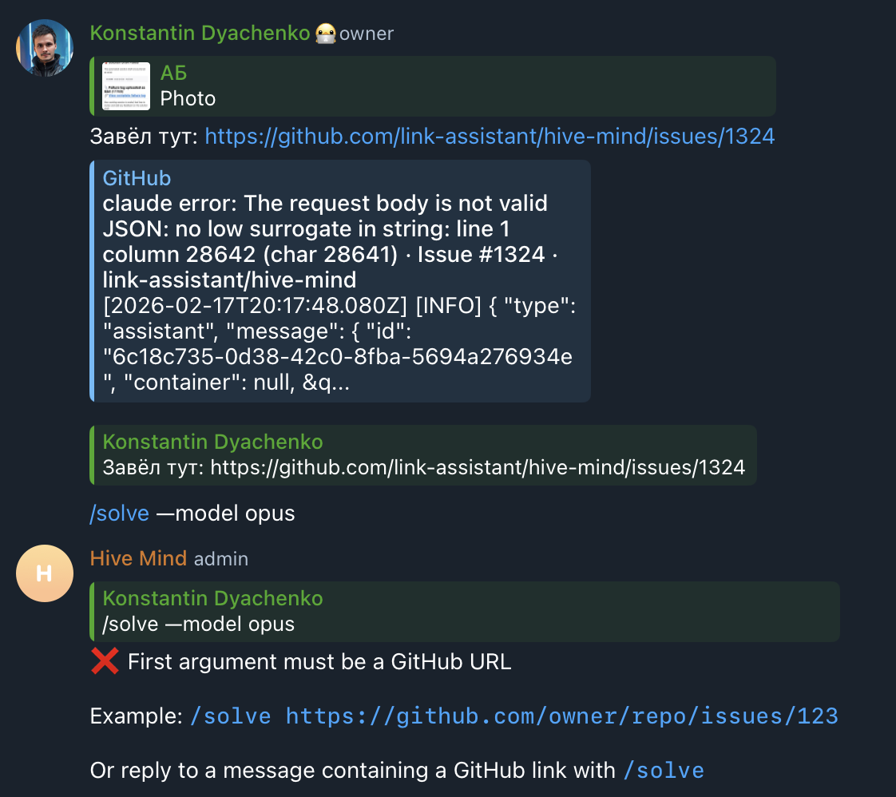

# Case Study: Issue #1325 - Support all options via /solve command as reply

## Issue Summary

**Issue URL**: https://github.com/link-assistant/hive-mind/issues/1325
**Created**: 2026-02-17
**Author**: konard
**Labels**: bug, documentation, enhancement
**Status**: Open

## Problem Description

When users reply to a message containing a GitHub issue link with the `/solve` command AND additional options (like `--model opus`), the bot returns an error:

```
❌ First argument must be a GitHub URL

Example: /solve https://github.com/owner/repo/issues/123

Or reply to a message containing a GitHub link with /solve
```

### Reproduction Steps

1. User sends a message with an issue link: `Завёл тут: https://github.com/link-assistant/hive-mind/issues/1324`
2. User replies to that message with: `/solve —model opus`
3. Bot returns error instead of extracting the URL from the replied message and using the provided options

### Expected Behavior

The bot should:

1. Extract the GitHub URL from the replied-to message
2. Use the options provided with the `/solve` command (e.g., `--model opus`)
3. Execute the solve command with both the extracted URL and the user-provided options

## Root Cause Analysis

### Code Location

- **File**: `src/telegram-bot.mjs`
- **Function**: `handleSolveCommand()` (lines 859-1069)
- **Specific Bug**: Line 933

### Technical Details

The bug is in the conditional logic for URL extraction from replied messages:

```javascript
// Line 927
let userArgs = parseCommandArgs(ctx.message.text);

// Line 931-933 - THE BUG
const isReply = message.reply_to_message && message.reply_to_message.message_id && !message.reply_to_message.forum_topic_created;

if (isReply && userArgs.length === 0) {
  // URL extraction from reply happens here
  // But this condition is ONLY true when userArgs is empty!
}
```

### Bug Explanation

1. When user types `/solve —model opus`:
   - `parseCommandArgs('/solve —model opus')` returns `['--model', 'opus']`
   - `userArgs.length === 2` (not 0!)

2. The condition `isReply && userArgs.length === 0` is **FALSE**:
   - `isReply` is TRUE (user is replying)
   - `userArgs.length === 0` is FALSE (length is 2, not 0)

3. The URL extraction is **skipped** because the condition fails

4. `validateGitHubUrl(['--model', 'opus'])` is called:
   - First argument `'--model'` doesn't contain `'github.com'`
   - Error: "First argument must be a GitHub URL"

### The Fix

Instead of checking `userArgs.length === 0`, we should check if the **first argument is NOT a GitHub URL**:

```javascript
// Check if first argument looks like a URL (starts with http or contains github.com)
const hasUrlInArgs = userArgs.length > 0 && (userArgs[0].startsWith('http') || userArgs[0].includes('github.com'));

if (isReply && !hasUrlInArgs) {
  // Extract URL from replied message
  // The user's options (--model, etc.) will be used along with extracted URL
}
```

## Timeline of Events

| Time                    | Event                                                                                  |
| ----------------------- | -------------------------------------------------------------------------------------- |
| Before Issue            | `/solve` reply feature was implemented to allow replying to messages with GitHub links |
| Original Implementation | Feature only worked when user typed just `/solve` with no arguments                    |
| User Discovery          | User tried `/solve —model opus` as a reply, expecting it to work                       |
| Bug Report              | Issue #1325 filed documenting the limitation                                           |

## Solution

### Implementation Approach

1. **Modify the condition** in `handleSolveCommand()` to check if first argument is a URL, not if args are empty
2. **Extract URL from reply** when user provides options but no URL
3. **Prepend extracted URL** to user's args before validation

### Code Changes

The fix involves changing the condition at line 933 from:

```javascript
if (isReply && userArgs.length === 0) {
```

To:

```javascript
// Check if first argument looks like a GitHub URL
const firstArgIsUrl = userArgs.length > 0 &&
  (userArgs[0].includes('github.com') || userArgs[0].match(/^https?:\/\//));

if (isReply && !firstArgIsUrl) {
```

## References

### Related Files

- `src/telegram-bot.mjs` - Main Telegram bot implementation
- `src/telegram-message-filters.lib.mjs` - Message filtering utilities
- `tests/test-telegram-url-extraction.mjs` - URL extraction tests

### External Resources

- [Telegraf.js Documentation](https://telegraf.js.org/) - Telegram bot framework used
- [Telegram Bot API](https://core.telegram.org/bots/api) - Official Telegram Bot API
- [grammY - Sending and Receiving Messages](https://grammy.dev/guide/basics) - Alternative bot framework with similar patterns

### Similar Issues/PRs

- Original reply feature implementation (search codebase for related PRs)

## Screenshot



_Screenshot showing the error when using `/solve —model opus` as a reply_

## Test Cases

New test cases needed:

1. Reply with `/solve --model opus` should extract URL from replied message
2. Reply with `/solve --verbose --attach-logs` should extract URL
3. Reply with `/solve https://github.com/...` should NOT extract from reply (URL provided directly)
4. Reply with just `/solve` should work as before (existing behavior)
