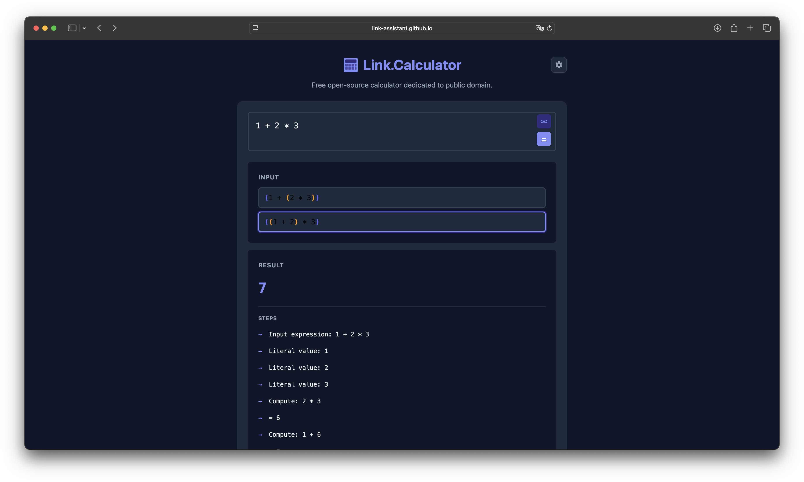
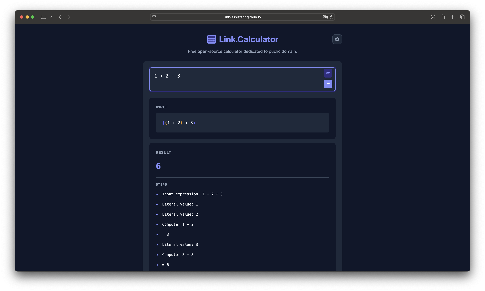

# Case Study: Issue #1365 — Possible Input Interpretations Switching Does Not Work

## Overview

**Repository**: [link-assistant/calculator](https://github.com/link-assistant/calculator)
**Issue**: [#1365 — Possible input interpretations switching does not work](https://github.com/link-assistant/hive-mind/issues/1365)
**Date**: 2026-02-27
**Severity**: High — Core feature (interpretation switching) is non-functional

---

## 1. Problem Description

The Link.Calculator web app shows multiple possible interpretations of an ambiguous mathematical expression (e.g. `1 + 2 * 3` can be interpreted as `(1 + (2 * 3)) = 7` or `((1 + 2) * 3) = 9`).

Two bugs were reported:

1. **Switching interpretations doesn't recalculate**: Clicking on an alternative interpretation in the UI updates the visual selection (highlighting) but does NOT trigger a new calculation using that interpretation.
2. **Inconsistent styling**: The multiple-interpretation display has different spacing, font color (in dark mode), and visual design compared to the single-interpretation display.

### Screenshots

**Bug 1 + Bug 2 — Multiple interpretations with broken switching and inconsistent style:**


*Expression: `1 + 2 * 3`. Two interpretations are shown: `(1 + (2 * 3))` and `((1 + 2) * 3)`. The second is highlighted (visually selected) but the RESULT still shows 7, meaning the selected interpretation `((1 + 2) * 3) = 9` was never recalculated.*

**Reference style — Single interpretation (desired style):**


*Expression: `1 + 2 + 3`. Single interpretation: `((1 + 2) + 3) = 6`. Notice bigger spacing, cleaner layout with proper text color in dark mode.*

---

## 2. Timeline / Sequence of Events

1. The calculator receives an expression like `1 + 2 * 3`.
2. The WASM backend (Rust) computes the result and returns a `CalculationResult` with:
   - `result: "7"` (default interpretation)
   - `lino_interpretation: "(1 + (2 * 3))"` (default interpretation in Lino notation)
   - `alternative_lino: ["(1 + (2 * 3))", "((1 + 2) * 3)"]` (all possible interpretations)
3. React component `App.tsx` renders the alternatives as clickable buttons (`lino-alt-button`).
4. **Bug**: When the user clicks interpretation #2 (`((1 + 2) * 3)`), only `setSelectedLinoIndex(1)` is called — this visually highlights the second button, but **no new calculation is triggered**.
5. The result section continues to show `7` (the result of interpretation #1), not `9` (the result of the selected interpretation #2).

---

## 3. Root Cause Analysis

### Bug 1: Switching doesn't recalculate

**File**: `web/src/App.tsx`, lines 453–462

```tsx
// BROKEN CODE (before fix):
{result.alternative_lino.map((alt, idx) => (
  <button
    key={idx}
    className={`lino-alt-button${idx === selectedLinoIndex ? ' selected' : ''}`}
    onClick={() => setSelectedLinoIndex(idx)}  // ← only updates UI state, no recalculation!
    title={...}
  >
    <ColorCodedLino lino={alt} />
  </button>
))}
```

**Root cause**: The `onClick` handler only calls `setSelectedLinoIndex(idx)` which updates the visual selection state. It does **not** call `calculate(alt)` to re-run the calculation with the selected interpretation.

The `calculate()` function sends the expression to the WASM worker which returns a new `CalculationResult`. For interpretation switching to work, when the user selects interpretation `alt`, we need to call `calculate(alt)` to get the result for that specific interpretation.

### Bug 2: Styling inconsistency

**File**: `web/src/index.css`

The `.lino-alt-button` element has:
- `background: var(--surface)` — matching the card background
- Inner `.lino-colored` has `background: transparent`
- `padding: 0` — the padding is inside `.lino-colored` at `0.75rem`

The `.lino-value` (single interpretation) has:
- `padding: 0.75rem`
- `color: var(--text)` (white in dark mode via `--text: #f1f5f9`)
- `background: var(--surface)`

The visual differences arise because:
1. The `.lino-alt-button` wraps content in a `<button>` element which has browser-default styles overriding some properties
2. The gap between alternative interpretation buttons is `0.5rem` (too small)
3. The borders of `.lino-alt-button` create a visually cluttered look vs. the clean single `.lino-value` box

---

## 4. Related Research

### Operator Precedence Ambiguity in Calculators

This is a well-known problem in mathematics education and calculator design:

- **Historical case**: TI-82 vs TI-83 — These calculators from the same company (Texas Instruments) gave different results for `1/2x` due to different operator precedence rules. TI-82 treats implicit multiplication with higher precedence; TI-83 uses strict left-to-right.
- **Famous viral example**: `6÷2(1+2)` — this expression yields either 1 or 9 depending on whether implicit multiplication has higher precedence than explicit division. This has generated massive online debate.
- **Academic reference**: Oliver Knill (Harvard) has documented "Ambiguous PEMDAS" cases where standard notation is genuinely ambiguous and cannot be resolved without additional context or parentheses. See: https://people.math.harvard.edu/~knill/pedagogy/ambiguity/index.html
- **Industry standard**: The standard recommendation (from The Math Doctors and others) is to resolve ambiguity by using explicit parentheses. This is exactly what Link.Calculator does — it shows the user all possible interpretations with explicit parentheses, allowing them to select the intended one.

### Casio Approach

Some Casio calculators (e.g., fx-9750GIII) allow users to switch between precedence interpretations via a configurable UI setting in the calculator's setup menu. Link.Calculator's approach of showing both options simultaneously and allowing selection is more user-friendly.

### React Best Practices for Derived Calculations

Per [React official docs](https://react.dev/learn/you-might-not-need-an-effect):
- Derived state should be computed during render, not via `useEffect`
- When a selection changes and requires a side effect (like an API/WASM call), the side effect should be triggered directly from the event handler, not via a state change + useEffect chain

---

## 5. Proposed Solution

### Fix 1: Trigger recalculation on interpretation switch

When the user clicks an alternative interpretation button, call `calculate(alt)` to send the selected lino expression to the WASM calculator:

```tsx
// FIXED CODE:
onClick={() => {
  setSelectedLinoIndex(idx);
  calculate(alt);  // ← trigger recalculation with selected interpretation
}}
```

This passes the lino notation string (e.g., `((1 + 2) * 3)`) to the calculator which will evaluate it and return the correct result.

### Fix 2: Unify styling for single and multiple interpretations

Make `.lino-alt-button` visually consistent with `.lino-value`:
- Add proper padding to the button itself
- Ensure text color is `var(--text)` (white in dark mode) inside buttons
- Use consistent `gap` between alternatives
- Style the selected state with a clear visual indicator while maintaining the same font/color as the non-selected state

---

## 6. Existing Libraries / Components That Could Help

- **mathjs** (https://mathjs.org/): Has built-in expression parser that can enumerate different interpretations. Could serve as an alternative or reference implementation for ambiguity detection.
- **algebrite** (http://algebrite.org/): Symbolic computation library with strict precedence rules.
- **React Aria** (https://react-spectrum.adobe.com/react-aria/): Provides accessible radio group / selection components that could replace the custom `lino-alt-button` implementation.

---

## 7. Impact

- **User experience**: Users see the switching UI but get no visual feedback that the calculation has changed. The feature is completely non-functional.
- **Trust**: Users may trust the wrong result (e.g., they think they selected interpretation 9 but the display shows 7).
- **Accessibility**: The button semantics (`<button>` with `onClick`) are correct, just the handler needs the actual calculation call.

---

## 8. Files to Modify

All changes are in the `link-assistant/calculator` repository:

| File | Change |
|------|--------|
| `web/src/App.tsx` | Add `calculate(alt)` call in the alternative lino button's `onClick` handler |
| `web/src/index.css` | Unify styling of `.lino-alt-button` with `.lino-value` |
