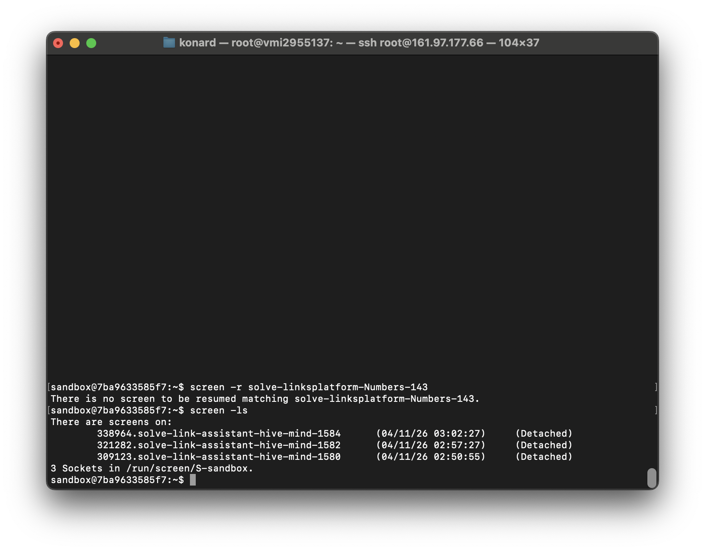
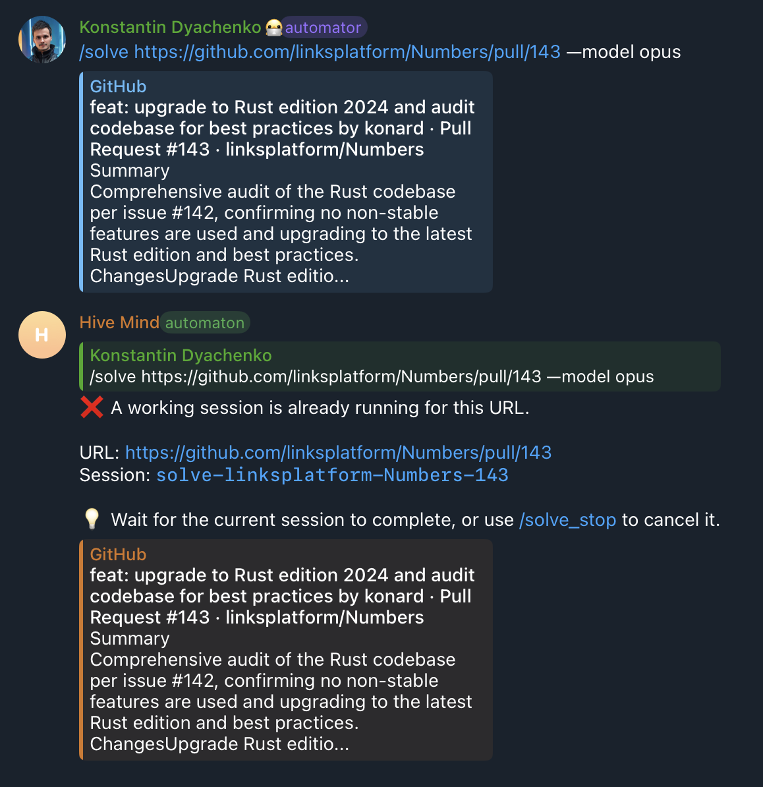

# Case Study: Issue #1586 — False positive for currently active session

## Overview

The Telegram bot incorrectly reports "A working session is already running for this URL" when no active session actually exists. This blocks users from starting new solve commands on URLs that are not being processed.

## Timeline / Sequence of Events

1. User sends `/solve https://github.com/linksplatform/Numbers/pull/143 --model opus` to the Telegram bot
2. Bot starts a `start-screen` session (no `--isolation` flag enabled)
3. `start-screen` creates a GNU screen session `solve-linksplatform-Numbers-143` with `bash -c 'solve ...; exec bash'`
4. The solve command completes inside the screen session
5. The screen session remains alive (by design — `exec bash` keeps it open for debugging)
6. The `monitorSessions()` polling loop checks `screen -ls` and finds the session still exists → does NOT clean up from in-memory Map
7. User later sends another `/solve` command for the same URL
8. `hasActiveSessionForUrl()` finds the URL in the in-memory Map → returns false positive "active session"
9. Bot rejects the command with "A working session is already running for this URL"

**Screenshot evidence**: `screen -ls` shows sessions for `hive-mind` issues (1580, 1582, 1584) but no `solve-linksplatform-Numbers-143` session. Yet the bot claims a session is running.

## Root Causes

### Root Cause 1: Screen sessions without `--auto-terminate` never signal completion

`start-screen.mjs` by default wraps commands in `bash -c '<command>; exec bash'` (line 200). This keeps the screen session alive after the command finishes, allowing users to reattach for debugging. However, this means `checkScreenSessionExists()` will always return `true` for these sessions, and `monitorSessions()` will never call `completeSession()` to remove them from the in-memory tracking Map.

**File**: `src/start-screen.mjs:200`

### Root Cause 2: In-memory session tracking is unreliable without isolation

The `activeSessions` Map in `session-monitor.lib.mjs` is purely in-memory. Sessions tracked via `trackSession()` for non-isolation (plain `start-screen`) commands have no reliable completion signal because:

1. The screen session stays alive by design (Root Cause 1)
2. If the bot restarts, the in-memory Map is lost — but previously tracked sessions might still have stale entries if they were persisted before restart
3. The `checkScreenSessionExists()` fallback uses `stdout.includes(sessionName)` which is a substring match — potentially matching wrong sessions

**File**: `src/session-monitor.lib.mjs:38,45-53,192-195`

### Root Cause 3: `hasActiveSessionForUrl()` does not verify session liveness

The `hasActiveSessionForUrl()` function (line 257) only checks the in-memory Map — it does not verify whether the session is actually still running. For isolation-backed sessions this is acceptable because `monitorSessions()` can reliably detect completion. For plain screen sessions, it leads to false positives.

**File**: `src/session-monitor.lib.mjs:257-277`

## Requirements from Issue

1. **Prevent false positives for non-isolation sessions**: The `start-screen` command without isolation does not provide reliable session completion detection, so plain screen sessions should not permanently block future commands.
2. **Keep the check enabled for `--isolation screen|tmux|docker` modes**: These modes have reliable session tracking via `$ --status` and/or `screen -ls` with `--auto-terminate` behavior.
3. **Timeout-based expiry for non-isolation sessions**: Track non-isolation sessions with a 5-10 minute timeout to prevent accidental duplicate commands in quick succession, while auto-expiring to avoid permanent false positives. Once `--isolation` is fully tested, it can become the primary/only tracking method.

## Solution

### Approach: Timeout-based expiry for non-isolation sessions

Non-isolation sessions are tracked in memory with a 10-minute timeout (`NON_ISOLATION_SESSION_TIMEOUT_MS`). Within the timeout window, `hasActiveSessionForUrl()` treats them as active (blocking duplicate commands). After the timeout, they are auto-expired and removed from tracking.

Isolation-backed sessions have no timeout — their completion is reliably detected by `monitorSessions()` via `$ --status` or `screen -ls`.

This approach:

- Prevents accidental duplicate `/solve` commands within 10 minutes
- Avoids permanent false positives that block users indefinitely
- Bridges the gap until `--isolation` becomes the default tracking method

### Files Changed

| File                                         | Change                                                                            |
| -------------------------------------------- | --------------------------------------------------------------------------------- |
| `src/session-monitor.lib.mjs`                | Add `NON_ISOLATION_SESSION_TIMEOUT_MS` constant (10 minutes)                      |
| `src/session-monitor.lib.mjs`                | `hasActiveSessionForUrl()` auto-expires non-isolation sessions after timeout      |
| `src/session-monitor.lib.mjs`                | `monitorSessions()` auto-expires non-isolation sessions after timeout             |
| `src/telegram-bot.mjs`                       | Re-enable `trackSession()` for non-isolation sessions (with timeout-based expiry) |
| `tests/test-session-false-positive-1586.mjs` | Regression tests covering timeout behavior (12 test cases)                        |

## References

- Issue: https://github.com/link-assistant/hive-mind/issues/1586
- Related: Issue #1567 (concurrent sessions on same PR/issue)
- Related: Issue #1545 (screen-based isolation session tracking)
