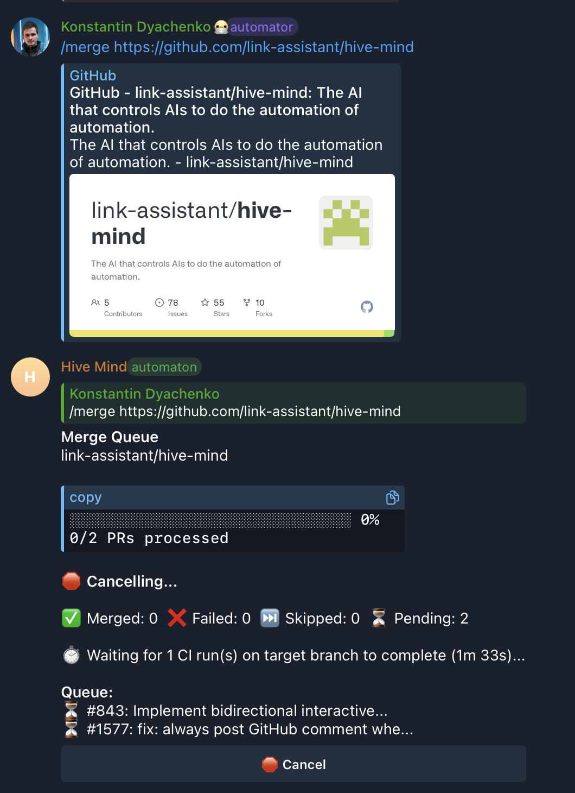

# Issue #1588: Cancel button reappears in merge queue - impossible to stop immediately

## Problem

When a user clicks the "Cancel" button on a Telegram merge queue operation, the button is briefly removed but then reappears on the next progress update. This makes it impossible to stop the merge queue immediately, especially when waiting for CI/CD to complete.

### Screenshot

The screenshot shows:

1. User issued `/merge https://github.com/link-assistant/hive-mind`
2. The queue shows "Cancelling..." status (cancellation was requested)
3. But the Cancel button is still visible at the bottom
4. The queue continues waiting for CI runs to complete instead of stopping

## Timeline / Sequence of Events

1. User sends `/merge <repo-url>` command in Telegram
2. Bot creates a merge queue processor and starts processing PRs
3. Queue enters a CI wait phase (either `waitForBranchCI`, `waitForCI`, or `waitForCommitCI`)
4. During the CI wait, `onProgress` callbacks fire periodically, each adding the Cancel button via `reply_markup`
5. User clicks Cancel button
6. Cancel handler calls `processor.cancel()` (sets `isCancelled = true`) and removes the button from the message
7. **BUG**: The next `onProgress` callback fires from inside the CI wait loop and re-adds the Cancel button
8. **BUG**: The CI wait loops (`waitForBranchCI`, `waitForCommitCI`) don't check `isCancelled`, so they keep polling
9. The cancel button keeps reappearing, and the queue doesn't stop until the CI wait finishes or times out

## Root Causes

### Root Cause 1: `onProgress` always re-adds the Cancel button

**File**: `src/telegram-merge-command.lib.mjs`, line ~241
**Problem**: The `onProgress` callback unconditionally includes `reply_markup` with the Cancel button, even after `processor.cancel()` has been called. This overwrites the cancel handler's button removal.

### Root Cause 2: `waitForBranchCI` has no cancellation support

**File**: `src/github-merge.lib.mjs`, function `waitForBranchCI`
**Problem**: Unlike `waitForCI` (which already had `isCancelled` support from Issue #1407), `waitForBranchCI` had no `isCancelled` parameter and no cancellation check in its polling loop. When the queue is waiting for target branch CI before starting merges, pressing Cancel has no effect on this wait.

### Root Cause 3: `waitForCommitCI` has no cancellation support

**File**: `src/github-merge-ci.lib.mjs`, function `waitForCommitCI`
**Problem**: Same as Root Cause 2, but for post-merge CI waiting. After a PR is merged, the queue waits for CI to complete before merging the next PR. During this wait, cancellation is ignored.

## Solution

### Fix 1: Conditional Cancel button in `onProgress` (telegram-merge-command.lib.mjs)

Check `processor.isCancelled` before adding the Cancel button to the message. When cancelled, omit `reply_markup` entirely so the button stays removed.

### Fix 2: Add `isCancelled` to `waitForBranchCI` (github-merge.lib.mjs)

Added `isCancelled` parameter to `waitForBranchCI` options, with a check before each poll iteration. Returns early with `{ success: false, error: 'Operation was cancelled' }`.

### Fix 3: Add `isCancelled` to `waitForCommitCI` (github-merge-ci.lib.mjs)

Added `isCancelled` parameter to `waitForCommitCI` options, with a check before each poll iteration. Returns early with `{ success: false, status: 'cancelled', error: 'Operation was cancelled' }`.

### Fix 4: Pass `isCancelled` from queue processor (telegram-merge-queue.lib.mjs)

Updated `waitForTargetBranchCI()` and `waitForPostMergeCI()` methods to pass `isCancelled: () => this.isCancelled` to the respective wait functions.

## Files Changed

| File                                 | Change                                                                              |
| ------------------------------------ | ----------------------------------------------------------------------------------- |
| `src/telegram-merge-command.lib.mjs` | `onProgress` conditionally omits cancel button when `processor.isCancelled` is true |
| `src/github-merge.lib.mjs`           | `waitForBranchCI` accepts and checks `isCancelled` option                           |
| `src/github-merge-ci.lib.mjs`        | `waitForCommitCI` accepts and checks `isCancelled` option                           |
| `src/telegram-merge-queue.lib.mjs`   | Passes `isCancelled` to `waitForBranchCI` and `waitForCommitCI`                     |
| `tests/test-merge-queue.mjs`         | Added 6 tests for issue #1588                                                       |

## Related Issues

- Issue #1407: Original cancel button fix (added `isCancelled` to `waitForCI` only)
- Issue #1307: Added `waitForBranchCI` for target branch CI waiting
- Issue #1341: Added `waitForCommitCI` for post-merge CI waiting
