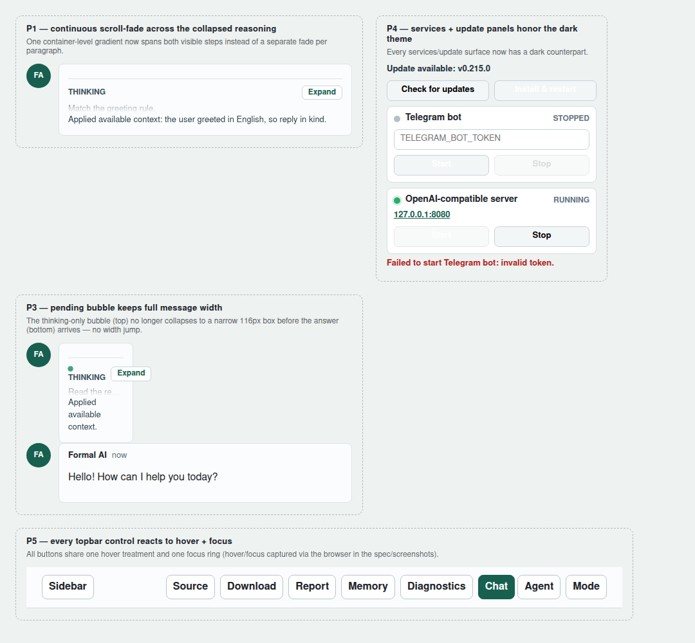
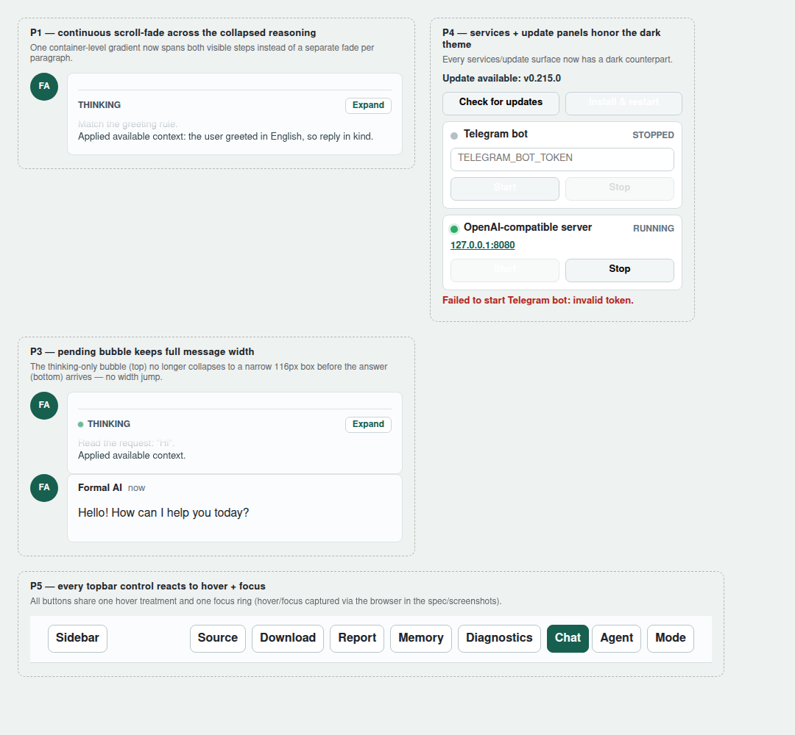
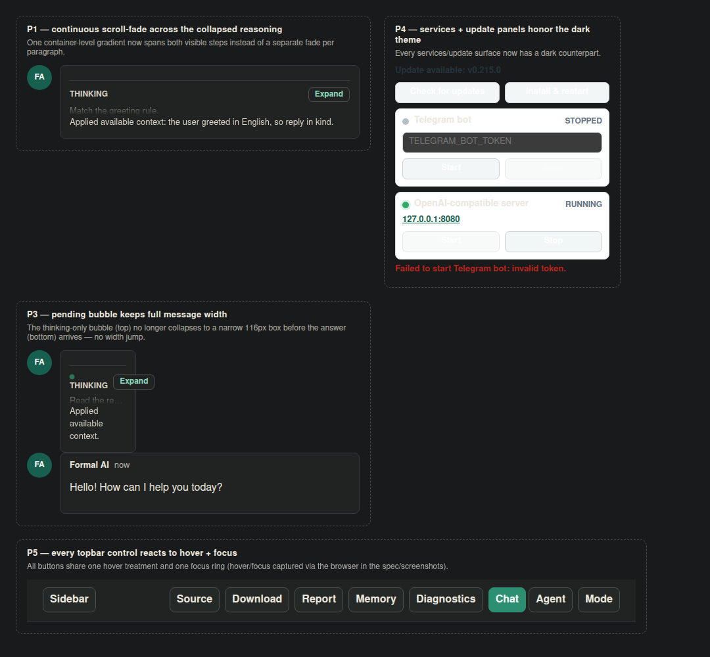
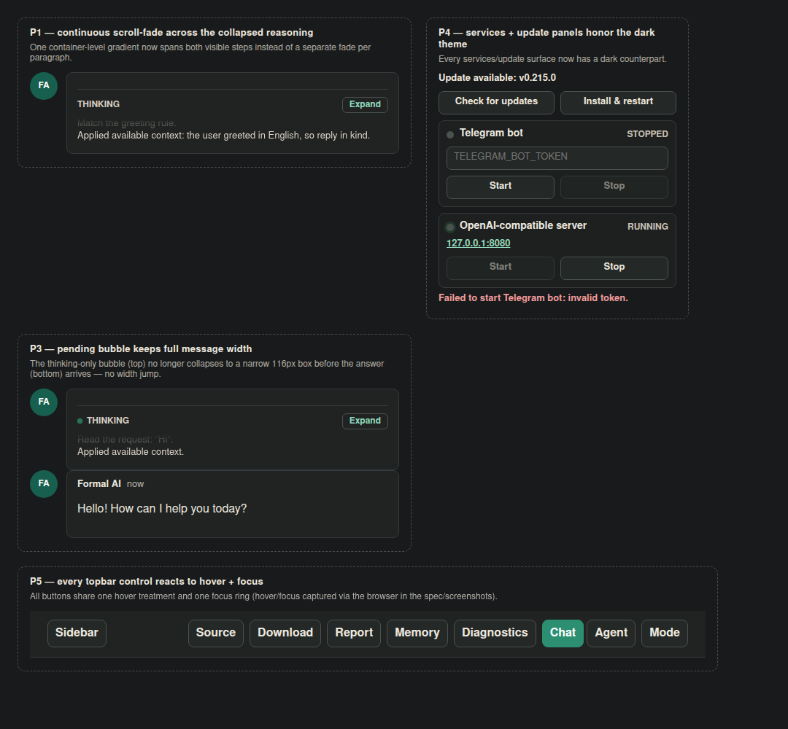
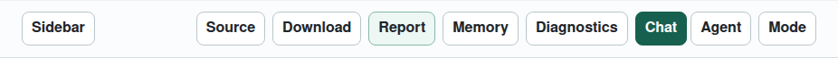

# Case Study — Issue #1963 "Unexpected UI/UX behavior"

> Deep analysis of [link-assistant/hive-mind#1963][issue], a UI/UX polish report
> against the **formal-ai** desktop app (v0.214.0). The same report is mirrored in
> the product repository as [link-assistant/formal-ai#550][fa-issue]; the fix
> lands in [link-assistant/formal-ai#551][fa-pr].

| | |
|---|---|
| **Tracking issue (this repo)** | [link-assistant/hive-mind#1963][issue] |
| **Product issue (formal-ai)** | [link-assistant/formal-ai#550][fa-issue] |
| **Fix PR (formal-ai)** | [link-assistant/formal-ai#551][fa-pr] |
| **Reporter** | `konard` |
| **Reported** | 2026-06-21 11:56 UTC |
| **Affected build** | formal-ai desktop `v0.214.0` (web UI in `src/web/`) |
| **Severity** | Cosmetic / UX polish (5 distinct defects) |

---

## 1. What was reported

The reporter attached a single annotated screenshot (`data/screenshot.png`) of the
desktop app and listed five problems, plus meta-requirements about codebase-wide
consistency and a long-term Chakra UI migration. Verbatim:

> - Animation gradient does not span 2 paragraphs/steps of thinking. No it looks
>   broken, because each paragraph/line/step has its own gradient. The gradient is
>   to create a feeling that there is more content, so it should be applied to full
>   scrolled container of all thinking steps.
> - Thinking steps are not fully written, some parts are omitted.
> - When where is no yet message body and only thinking steps we the width of
>   message broken, that causes bad feeling, as UI have sudden jump in width when
>   message starts displaying.
> - We still have theming issues in all `services` box
> - Not all buttons on top menu are reacting to hover as other buttons, so it is
>   partial.

The full requirement text (including the meta-requirements) is enumerated in
[`requirements.md`](./requirements.md).

---

## 2. Timeline / sequence of events

| Date (UTC) | Event |
|---|---|
| 2026-06-15 | [formal-ai#488 "Deep thinking"][fa-488] introduces the thinking-preview UI: "show last thinking paragraph … show half of second-to-last paragraph and do gradient so it disappears … illusion of rotated scrolling", naturalized human-readable steps, and "some too small steps can be omitted by default." **Seeds P1 (per-line gradient) and P2 (detail truncation).** |
| 2026-06-20 | [formal-ai#541 "Missing UI/UX improvements"][fa-541]: "Not all UI elements has correctly applied theme, maybe we should migrate to chakra-ui.com" + a reasoning-reveal animation pass. **Seeds P4 (theming gaps) and the Chakra migration ask; the reveal/pending states surface P3; piecemeal topbar buttons surface P5.** |
| 2026-06-20 | formal-ai#549 merges the desktop **auto-update flow** (`feat(desktop): add auto update flow`), adding the update panel inside the services box — light-only styling. **Compounds P4.** |
| 2026-06-21 11:56 | [hive-mind#1963][issue] filed by `konard` with the annotated screenshot (this case study's tracking issue). |
| 2026-06-21 13:07 | [formal-ai#550][fa-issue] opened (product-repo mirror of the same report). |
| 2026-06-21 13:08 | [formal-ai#551][fa-pr] auto-created as a `[WIP]` solution-draft placeholder. |
| 2026-06-21 (this work) | Root-caused all five defects, fixed them across both theme layers and both language surfaces, added Rust + Playwright regression tests, and compiled this case study. |

**Reading of the timeline:** none of the five defects is a fresh bug. Each is a
*residual rough edge* from a feature that was shipped quickly across #488/#541/#549.
The thinking UI (#488) attached its scroll-fade to the wrong element and capped
detail too aggressively; the theme/desktop work (#541/#549) added new surfaces and
controls without back-filling their dark-mode and hover rules. The systemic cause
that ties P4 and P5 together is the absence of shared design primitives — every
color and every interactive treatment is written by hand per element, so new
elements silently miss rules that older elements have.

---

## 3. Per-problem root cause & fix

Each problem is verified with a failing-before / passing-after regression test
(`formal-ai/tests/e2e/tests/issue-1963.spec.js` and
`formal-ai/tests/unit/issue_1963.rs`). Before/after renders are in
[`assets/`](./assets) (the harness that produced them is
`formal-ai/experiments/issue-1963-harness.html`, which links the *shipped*
stylesheet so the pixels are production-faithful).

### P1 — the scroll-fade is per-line, not per-container

* **Symptom.** With two visible steps, each line carries its own gradient, so the
  preview shows two separate fades instead of one continuous "there is more below"
  fade.
* **Root cause.** #488 implemented the fade as a `mask-image` on the single
  `.thinking-preview-previous` *line* rather than on the scrolling *container*. When
  the collapsed preview stacks `previous` + `current`, the mask repeats per line.
  The mask was on the wrong element.
* **Fix.** Move the gradient to the container,
  `.thinking-preview-collapsed:has(.thinking-preview-previous)`, as one
  `linear-gradient(to bottom, transparent 0, #000 1.4em)`, and drop the per-line
  mask. The `:has()` guard means a lone first step (no previous) is never masked —
  it stays fully legible.
* **Where.** `src/web/styles.css` (`.thinking-preview-collapsed:has(...)`).

### P2 — thinking detail is clipped mid-sentence

* **Symptom.** Realistic single-step detail (a pasted prompt, a composed answer)
  is truncated, so the reasoning reads as "some parts are omitted."
* **Root cause.** Detail was capped at **120 characters** in *two parallel
  constants*: `truncate_thinking_detail` (Rust core, `src/thinking.rs`) and
  `thinkingDetailText` (browser worker, `src/web/app.js`). #488's "small steps can
  be omitted" was about dropping *trivial* steps; the 120-char cap instead clipped
  the *content of normal steps*.
* **Fix.** Raise the cap to **600** in both surfaces, kept in sync (the panel still
  scrolls and the P1 fade still applies, so the upper bound stays meaningful).
* **Where.** `src/thinking.rs` + `src/web/app.js`. Pinned by
  `tests/unit/issue_1963.rs`.

### P3 — pending message jumps in width

* **Symptom.** A message that shows only thinking (no body yet) renders a narrow
  ~116px body, then snaps to full width when the answer text streams in.
* **Root cause.** A leftover typing-indicator rule, `.pending .message-body {
  width: 116px }` (plus a dead `.typing::after`), pinned the pending body to a fixed
  narrow width. The natural full width only takes over once body text exists →
  sudden jump.
* **Fix.** Remove the fixed-width clamp (and the dead rule) so the pending body uses
  the same width as a settled body — no reflow when the answer appears.
* **Where.** `src/web/styles.css` (`.pending .message-body`).

### P4 — the `services` box ignores the dark theme

* **Symptom.** In dark mode the desktop **services** and **update** panels render
  light-derived surfaces: washed buttons, a light token input, dim status text.
* **Root cause (systemic).** `styles.css` uses **zero CSS custom properties** —
  light and dark are *manually duplicated hex* across three layers: the light base,
  `:root[data-theme="dark"]`, and `@media (prefers-color-scheme: dark)`. When the
  services panel (and later the #549 auto-update panel) were added, only the light
  base rules were written; nobody hand-duplicated the dark counterparts, so every
  services/update surface fell through to light styling in dark mode.
* **Fix.** Add complete dark rules for *every* services/update surface — card, dot,
  state, token input, url, action + update-action buttons (incl. hover), start /
  install buttons, update-state, and the services-error text — in **both** the
  `data-theme="dark"` block **and** the `prefers-color-scheme` media query (per the
  "fix it in all places" requirement).
* **Where.** `src/web/styles.css` (dark block + media-query mirror).

### P5 — only some topbar buttons react to hover

* **Symptom.** Hovering the header, some controls highlight and others stay inert —
  partial, inconsistent feedback.
* **Root cause.** Topbar controls were styled piecemeal as they were added across
  issues. Older controls (`mode-toggle`, `diagnostics-toggle`, mode options) had
  `:hover` rules; newer ones (`report-button`, `source-code-button`,
  `download-button`, `memory-button`, `sidebar-toggle`, `mobile-menu-toggle`) had
  none. There was no shared hover/focus treatment.
* **Fix.** Give every topbar control one shared hover treatment + an active-state
  hover + a consistent keyboard focus ring (`:focus-visible`, 2px), in light **and**
  dark.
* **Where.** `src/web/styles.css` (topbar control block, light + dark).

---

## 4. Before / after

Rendered from the production stylesheet via
`formal-ai/experiments/issue-1963-harness.html`.

### Light theme (P1 fade, P3 pending width, P5 controls)

| Before | After |
|---|---|
|  |  |

In **before**, the P3 pending bubble (top-left of the P3 card) is clamped to a
narrow box while the settled bubble below is full width. In **after**, the pending
bubble matches the settled width — no jump.

### Dark theme (P4 services/update theming)

| Before | After |
|---|---|
|  |  |

In **before**, the services cards, action buttons and "Update available" status
render with light-derived surfaces against the dark page. In **after**, every
services/update surface is properly dark and readable.

### Detail crops

| P1 — one continuous fade | P5 — shared hover |
|---|---|
|  |  |

---

## 5. Codebase-wide application ("fix it in all places")

The issue requires that a fix in one place be applied everywhere the same pattern
appears. Concretely:

* **P2** is fixed in **both** language surfaces (Rust `truncate_thinking_detail` and
  JS `thinkingDetailText`), kept in sync with a cross-referencing comment.
* **P4 and P5** are fixed in **both** dark layers — the explicit
  `:root[data-theme="dark"]` override **and** the `@media (prefers-color-scheme:
  dark)` fallback — so the behavior holds whether the user picks dark explicitly or
  inherits it from the OS.
* The audit for "other UI issues even out of scope" surfaced the shared root cause
  (manual hex duplication + per-element interactive styling); the long-term remedy
  is captured in [`solution-plans.md`](./solution-plans.md) and
  [`best-practices.md`](./best-practices.md).

---

## 6. Library / component research

See [`solution-plans.md`](./solution-plans.md) for the full evaluation. Summary:

* **Chakra UI v3** (the issue's stated target) — component system with semantic
  tokens and first-class color-mode support. Adopting it would replace the manual
  hex duplication that causes P4 and the piecemeal control styling that causes P5.
  It is the right *strategic* direction but a multi-PR migration; this PR keeps the
  existing raw-`createElement` app and fixes the defects in a token-ready way.
* **CSS custom properties / design tokens** — the minimal in-house fix for the P4
  root cause; a single `--surface`, `--surface-dark`, `--border` … set defined once
  per theme removes the duplication that lets new surfaces miss dark rules.
* **`mask-image` + `linear-gradient`** — the standard scroll-fade technique (P1);
  the fix simply moves it from the line to the container. `:has()` (now baseline)
  lets us scope it to "has a previous step."
* **Playwright** — already in the repo; used here for behavioral regression of all
  five defects (hover/focus, computed widths, dark-mode computed colors).

---

## 7. Outcome / verification

All formal-ai CI gates pass on the fix branch:

* `cargo test --test unit` — **1021 passed, 0 failed** (incl. the new
  `issue_1963` tests and the `semantic_grounding` grounding scan).
* `cargo fmt --check`, `cargo clippy --all-targets --all-features` — clean.
* `check:i18n`, `check:web-tdz`, `check:web-hardcoded-ui` — pass.
* `playwright … issue-1963` — **10 passed** (and 9/10 fail when the CSS fix is
  stashed, proving the tests bind to the fix).
* `src/web/{vendor,ocr}.bundle.js` — unchanged (entry files untouched).

No third-party/upstream issues were warranted — every defect is in formal-ai's own
code. The reasoning is documented in [`proposed-issues.md`](./proposed-issues.md).

---

## 8. Files in this case study

```
docs/case-studies/issue-1963/
├── README.md            ← this document
├── requirements.md      ← every requirement, enumerated & traced to a fix
├── solution-plans.md    ← per-requirement solution plans + library evaluation
├── proposed-issues.md   ← upstream-issue analysis (conclusion: none needed)
├── best-practices.md    ← lessons learned & recommendations
├── assets/              ← before/after renders referenced above
├── data/                ← the reporter's screenshot + cropped annotations
└── raw-data/            ← issue JSON, predecessor issues (#488/#541), code snapshots
```

[issue]: https://github.com/link-assistant/hive-mind/issues/1963
[fa-issue]: https://github.com/link-assistant/formal-ai/issues/550
[fa-pr]: https://github.com/link-assistant/formal-ai/pull/551
[fa-488]: https://github.com/link-assistant/formal-ai/issues/488
[fa-541]: https://github.com/link-assistant/formal-ai/issues/541
