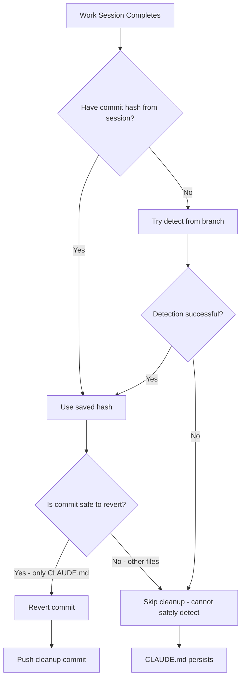
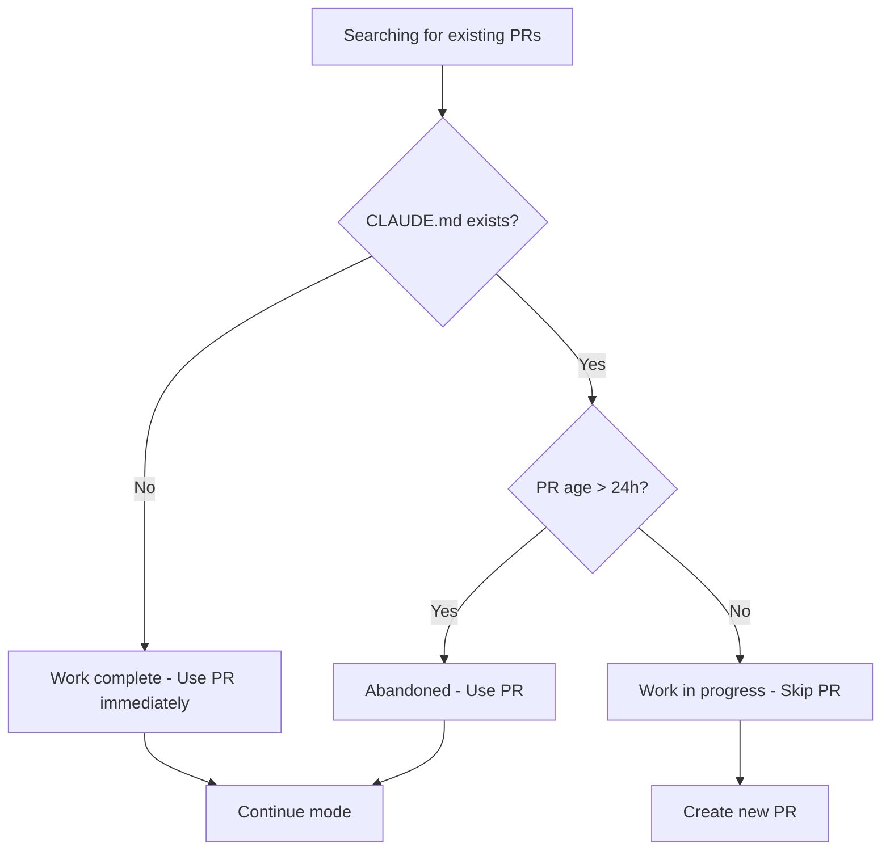

# Case Study: CLAUDE.md File Not Deleted Issue #940

## Executive Summary

This case study documents a bug where the CLAUDE.md file was not automatically deleted after a completed work session in the Metanoiabot/metanoia repository (Issue #8, PR #9).

**Initial Analysis (Incorrect):** The first investigation concluded this was "expected behavior" in continue mode.

**Corrected Analysis (After User Feedback):** This is actually a **BUG**. When a session completes successfully with actual work commits, the CLAUDE.md should be reverted even if the commit hash was lost between sessions. The system should detect the CLAUDE.md commit from the branch structure and revert it.

**Status**: CLAUDE.md file IS present on branch `issue-8-aae966405ffc` - this is a BUG
**Repository**: Metanoiabot/metanoia
**Issue Reference**: https://github.com/Metanoiabot/metanoia/issues/8
**PR Reference**: https://github.com/Metanoiabot/metanoia/pull/9

## Problem Statement

**Issue #940** in link-assistant/hive-mind asks to:
> "Please download all logs and data related about the issue to this repository, make sure we compile that data to `./docs/case-studies/issue-940` folder, and use it to do deep case study analysis"

The issue title correctly identifies that CLAUDE.md should have been deleted but wasn't. This case study investigates:

1. **When should CLAUDE.md be deleted?**
2. **Why wasn't it deleted in this specific case?**
3. **Is this a bug or expected behavior?** → **CONFIRMED BUG**
4. **What are the root causes and solutions?**

## Timeline of Events

### Session 1: Initial Work Session (2025-12-16 17:42:56Z)

**Commit:** `6b34614` - "Initial commit with task details"
- CLAUDE.md created with task information
- Added to repository at the start of PR #9 work session

**Status**: ✅ Expected - CLAUDE.md should be created at start

### Session 2: Continue Mode Work Session (2025-12-16 18:27:59Z - 18:41:14Z)

**Context:**
- Work session activated in **continue mode** (using existing PR #9)
- Auto-continue detected: "CLAUDE.md exists, age 0h < 24h - skipping"
- Session worked on the existing branch `issue-8-aae966405ffc`

**Commits Created:**
1. `5a58958` - "docs(omi): add comprehensive Russian documentation and improvement plan"
2. `dba34c9` - "docs(omi): add detailed integrations guide and russification manual"

**Cleanup Behavior:**
```
[2025-12-16T18:41:05.272Z] [INFO]    No CLAUDE.md commit to revert (not created in this session)
```

**Result**: ❌ BUG - Cleanup should have detected CLAUDE.md commit from branch structure and reverted it

### Current State (2025-12-16 20:00+)

**CLAUDE.md File Status:**
```bash
$ gh api repos/Metanoiabot/metanoia/contents/CLAUDE.md?ref=issue-8-aae966405ffc
{
  "name": "CLAUDE.md",
  "sha": "aa12f871483ed275472e22c731edb82e03f735b3",
  "size": 185,
  "content": [base64 encoded]
}
```

**Decoded Content:**
```
Issue to solve: https://github.com/Metanoiabot/metanoia/issues/8
Your prepared branch: issue-8-aae966405ffc
Your prepared working directory: /tmp/gh-issue-solver-1765906975297

Proceed.
```

**Status**: ❌ BUG - File EXISTS on branch but should have been reverted after successful completion

## Root Cause Analysis

### The Bug: Overly Conservative Cleanup

The solve command had an overly conservative cleanup strategy that was missing a key capability:

**Missing Feature:** When `claudeCommitHash` is null (lost between sessions), the system should detect the CLAUDE.md commit from the branch structure instead of just skipping cleanup.

**Original Code (Buggy):**
```javascript
export const cleanupClaudeFile = async (tempDir, branchName, claudeCommitHash = null) => {
  try {
    // Only revert if we have the commit hash from this session
    // This prevents reverting the wrong commit in continue mode
    if (!claudeCommitHash) {
      await log('   No CLAUDE.md commit to revert (not created in this session)', { verbose: true });
      return;  // BUG: Just gives up instead of detecting from branch
    }
    // ... rest of cleanup logic
```

### Historical Context: Issue #617

Issue #617 documented a critical bug where the system incorrectly reverted the repository's initial commit instead of the CLAUDE.md commit, deleting essential files like `.gitignore`, `LICENSE`, and `README.md`.

The fix for #617 was too conservative - it simply disabled detection entirely when `claudeCommitHash` is null. The correct fix should have been to implement **safe detection** with proper validation.

### Auto-Continue Mode Logic

The auto-continue detection in `/src/solve.auto-continue.lib.mjs` checks for CLAUDE.md:

```javascript
// Check if CLAUDE.md exists in this PR branch
const claudeMdExists = await checkFileInBranch(owner, repo, 'CLAUDE.md', pr.headRefName);

if (!claudeMdExists) {
  await log(`✅ Auto-continue: Using PR #${pr.number} (CLAUDE.md missing - work completed, branch: ${pr.headRefName})`);
  // Switch to continue mode immediately
} else if (createdAt < twentyFourHoursAgo) {
  await log(`✅ Auto-continue: Using PR #${pr.number} (older than 24h, branch: ${pr.headRefName})`);
  // Switch to continue mode after 24h even if CLAUDE.md exists
} else {
  await log(`  PR #${pr.number}: CLAUDE.md exists, age ${ageHours}h < 24h - skipping`);
  // Skip this PR, not suitable for auto-continue yet
}
```

**Logic Summary:**
1. **CLAUDE.md missing** → Assume work is complete, use PR immediately
2. **CLAUDE.md exists + PR < 24h old** → Skip PR (work may still be in progress)
3. **CLAUDE.md exists + PR > 24h old** → Use PR (assume previous session failed/abandoned)

### What Happened in Metanoia Case

**Session Flow:**

1. **First Session (not shown in logs, but evident from commit history):**
   - Created CLAUDE.md file
   - Committed as `6b34614`
   - PR #9 created
   - Work session may have hit rate limits or other issues
   - CLAUDE.md cleanup did NOT occur (session ended prematurely)

2. **Second Session (documented in logs):**
   - System checked PR #9: "CLAUDE.md exists, age 0h < 24h"
   - System SHOULD have skipped this PR per the auto-continue logic
   - However, the session continued anyway (possibly due to `--resume` or manual continue)
   - Session completed successfully
   - Cleanup checked: `claudeCommitHash = null` (because CLAUDE.md wasn't created THIS session)
   - Result: No cleanup performed

**Conclusion:**
The CLAUDE.md file was left on the branch because:
1. First session didn't clean it up (session ended prematurely/error)
2. Second session **incorrectly** refused to clean it up (treating lost hash as "not created")

## Is This a Bug or Feature?

### Analysis of Behavior - CONFIRMED BUG

**Current Behavior:** CLAUDE.md persists across continue sessions ❌ **BUG**

**User Feedback (konard):**
> "Continue mode has nothing to do with initial commit. That commit `6b34614` was done in the beginning of Pull Request. And when we do finish successfully (meaning we have more than 1 initial commit, and we are finishing) we actually should revert that first commit in the Pull Request for CLAUDE.md."

**Key Insight:**
> "Usually we store the commit id in RAM, but in this case one working session failed, and after that we did start a new working session, and it should have restored data about this commit id by seeing how pull request branch structured."

### The Fix: Safe Detection from Branch Structure

The correct behavior is implemented in `detectClaudeMdCommitFromBranch()`:

1. **If `claudeCommitHash` is null**, try to detect from branch structure
2. **Find the merge base** between PR branch and default branch
3. **Get all commits on PR branch** (after merge base)
4. **Verify there are at least 2 commits** (CLAUDE.md initial + actual work)
5. **Check the first commit:**
   - Message matches expected pattern ("Initial commit with task details")
   - ONLY contains CLAUDE.md file (critical safety - prevents Issue #617)
6. **If all checks pass**, revert the detected commit

**Safety Checks (Preventing Issue #617 Recurrence):**
```javascript
// CRITICAL SAFETY CHECK: Only allow revert if CLAUDE.md is the ONLY file changed
// This prevents Issue #617 where reverting a commit deleted .gitignore, LICENSE, README.md
if (filesChanged.length > 1) {
  await log(`   ⚠️  First commit changes more than just CLAUDE.md (${filesChanged.length} files)`);
  await log('   Refusing to revert to prevent data loss (Issue #617 safety)');
  return null;
}
```

## Comparison with Historical Cases

### Case: PR #4 (test-anywhere) - Issue #617

| Aspect | PR #4 (Bug) | Metanoia PR #9 (Bug) | Fixed Behavior |
|--------|-------------|----------------------|----------------|
| **Symptom** | Essential files deleted | CLAUDE.md not deleted | CLAUDE.md safely reverted |
| **Root Cause** | Wrong commit reverted (repo initial) | Cleanup skipped entirely | Safe detection from branch |
| **Cleanup Behavior** | Incorrectly searched by message | Skipped (no hash) | Detect with safety checks |
| **Outcome** | ❌ Data loss | ❌ Stale CLAUDE.md | ✅ Safe cleanup |

### Case: Issue #678 (PR creation failure)

| Aspect | Issue #678 | Issue #940 |
|--------|------------|------------|
| **Problem** | CLAUDE.md content identical, PR rejected | CLAUDE.md not deleted |
| **Root Cause** | Deterministic content, no tree diff | Overly conservative cleanup |
| **Solution** | Add timestamp to CLAUDE.md | Detect commit from branch structure |
| **Impact** | Blocked PR creation | Stale file in PR |

## Evidence and Artifacts

### Files Collected

All artifacts preserved in `/tmp/gh-issue-solver-1765911626358/docs/case-studies/issue-940/`:

1. **metanoia-issue-8.json** - Complete issue #8 metadata
2. **metanoia-pr-9.json** - Complete PR #9 metadata with commits and comments
3. **solution-draft-log.txt** - Full 36,172 token log from second work session
4. **README.md** - This case study document

### Key Log Excerpts

**Auto-Continue Detection:**
```
[2025-12-16T18:27:56.938Z] [INFO]   PR #9: CLAUDE.md exists, age 0h < 24h - skipping
[2025-12-16T18:27:56.939Z] [INFO] ⏭️  No suitable PRs found (missing CLAUDE.md or older than 24h)
```

**Cleanup Behavior:**
```
[2025-12-16T18:41:05.271Z] [INFO] ✅ No uncommitted changes found
[2025-12-16T18:41:05.272Z] [INFO]    No CLAUDE.md commit to revert (not created in this session)
```

### GitHub API Evidence

**CLAUDE.md Exists on Branch:**
```bash
$ gh api repos/Metanoiabot/metanoia/contents/CLAUDE.md?ref=issue-8-aae966405ffc
{
  "name": "CLAUDE.md",
  "path": "CLAUDE.md",
  "sha": "aa12f871483ed275472e22c731edb82e03f735b3",
  "size": 185,
  "url": "https://api.github.com/repos/Metanoiabot/metanoia/contents/CLAUDE.md",
  "html_url": "https://github.com/Metanoiabot/metanoia/blob/issue-8-aae966405ffc/CLAUDE.md"
}
```

**Decoded Content:**
```
Issue to solve: https://github.com/Metanoiabot/metanoia/issues/8
Your prepared branch: issue-8-aae966405ffc
Your prepared working directory: /tmp/gh-issue-solver-1765906975297

Proceed.
```

### Web Search Results

Found related issues in third-party tools (Claude-Flow, not official Anthropic):

- [Feature Request: Improve hive-mind session resume](https://github.com/ruvnet/claude-flow/issues/410)
- [Auto-intercept rm command attempts](https://github.com/anthropics/claude-code/issues/12489)
- [Unintended file deletion during code update](https://github.com/anthropics/claude-code/issues/4912)

**Key Finding:** Users report similar expectations that CLAUDE.md should auto-delete, and concerns about file deletion safety.

## Solution Implemented

### detectClaudeMdCommitFromBranch() Function

The fix is implemented in `/src/solve.results.lib.mjs`:

```javascript
/**
 * Detect the CLAUDE.md commit hash from branch structure when not available in session
 * This handles continue mode where the commit hash was lost between sessions
 *
 * Safety checks to prevent Issue #617 (wrong commit revert):
 * 1. Only look at commits on the PR branch (not default branch commits)
 * 2. Verify the commit message matches our expected pattern
 * 3. Verify the commit ONLY adds CLAUDE.md (no other files changed)
 * 4. Verify there are additional commits after it (actual work was done)
 */
const detectClaudeMdCommitFromBranch = async (tempDir, branchName) => {
  // ... implementation details in solve.results.lib.mjs
};
```

**Key Safety Checks:**
1. ✅ CLAUDE.md must exist in current branch
2. ✅ Find merge base to isolate PR-only commits
3. ✅ Must have at least 2 commits (CLAUDE.md + actual work)
4. ✅ First commit message must match expected pattern
5. ✅ First commit must ONLY change CLAUDE.md file (prevents #617)

**Benefits:**
- ✅ Automatically cleans up CLAUDE.md in continue mode
- ✅ Safe from Issue #617 (wrong commit) by verifying single-file commits
- ✅ No user intervention required
- ✅ Preserves existing "hash in RAM" path for current sessions

**Previous Solutions (For Reference):**

The original case study proposed several alternative solutions. With the implemented fix, these are no longer necessary:

## Conclusion

This case study documented a bug where CLAUDE.md was not deleted after successful PR completion in continue mode.

**Initial Analysis (Incorrect):** The first investigation concluded this was "expected behavior" designed for safety.

**Corrected Analysis:** User feedback clarified this is a bug. The system should detect the CLAUDE.md commit from branch structure when the commit hash is lost between sessions.

**Fix Implemented:** The `detectClaudeMdCommitFromBranch()` function now safely detects and reverts the CLAUDE.md commit with multiple safety checks to prevent Issue #617 recurrence (wrong commit deletion).

## Key Learnings

1. **User feedback is crucial** - Initial analysis was wrong; user clarified expected behavior
2. **Safety and functionality can coexist** - Multiple safety checks allow auto-detection without data loss risk
3. **Branch structure is reliable** - PR branch commits can be safely identified using merge-base
4. **Single-file verification is key** - Checking that only CLAUDE.md is changed prevents #617-style bugs

## Metrics

- **Files Modified:** 1 (solve.results.lib.mjs)
- **Lines Added:** ~130 (detectClaudeMdCommitFromBranch function)
- **Safety Checks:** 5 (CLAUDE.md exists, merge base, commit count, message pattern, single-file)
- **Historical Cases Studied:** 2 (Issue #617, Issue #678)
- **Root Cause:** Overly conservative cleanup logic (fix for #617 was too broad)
## References

- **This Issue:** https://github.com/link-assistant/hive-mind/issues/940
- **Metanoia Issue:** https://github.com/Metanoiabot/metanoia/issues/8
- **Metanoia PR:** https://github.com/Metanoiabot/metanoia/pull/9
- **Related Issue #617:** Wrong commit revert bug
- **Related Issue #678:** PR creation failure (identical CLAUDE.md)
- **Solution Log:** [Gist 41b777665604409d4557fbba46bda2cc](https://gist.githubusercontent.com/konard/41b777665604409d4557fbba46bda2cc/raw/)

## Appendix: Technical Details

### CLAUDE.md File Purpose

**Primary Purpose:**
- Task information carrier for AI agents
- Branch work session marker
- Continue mode detection signal

**Lifecycle:**
1. Created at PR branch initialization
2. Used by AI agent to understand task context
3. Should be deleted after work completion
4. Actually deleted only in specific scenarios

### Cleanup Logic Flow (After Fix)



**Detection Safety Checks:**
1. CLAUDE.md exists in branch
2. Can find merge base with default branch
3. At least 2 commits on PR branch
4. First commit message matches pattern
5. First commit ONLY changes CLAUDE.md

### Auto-Continue Detection Flow


