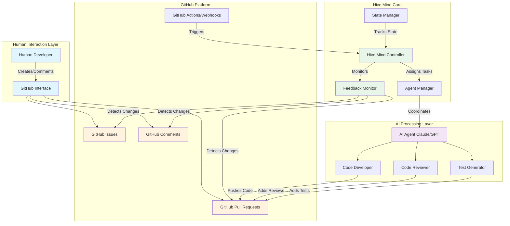
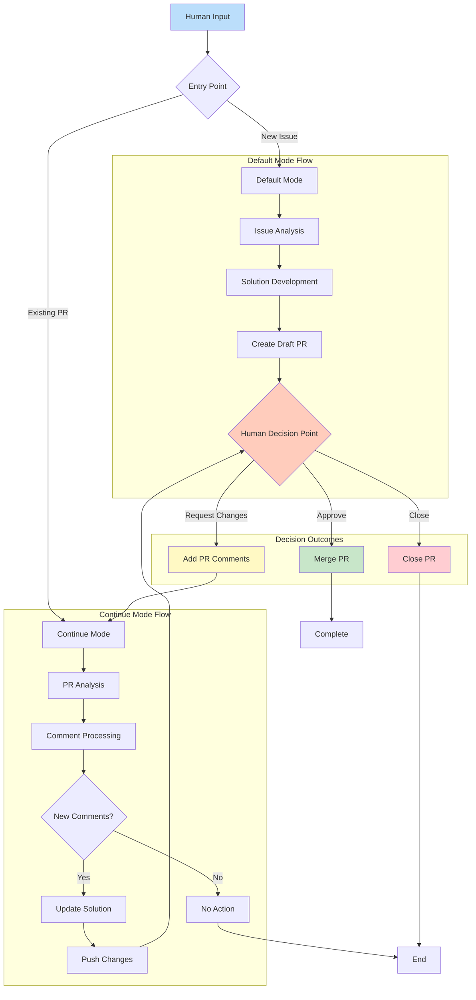
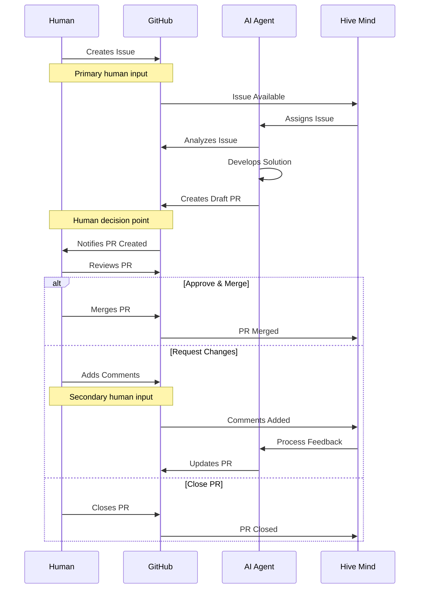
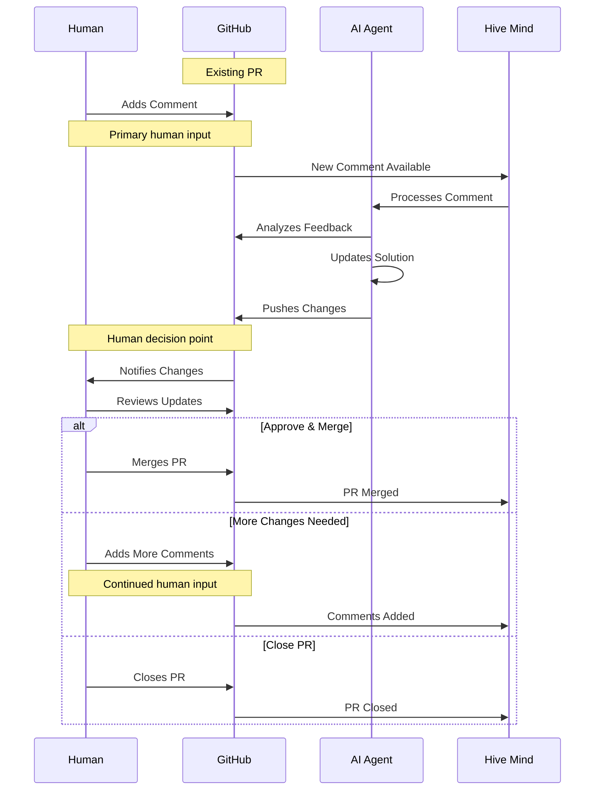
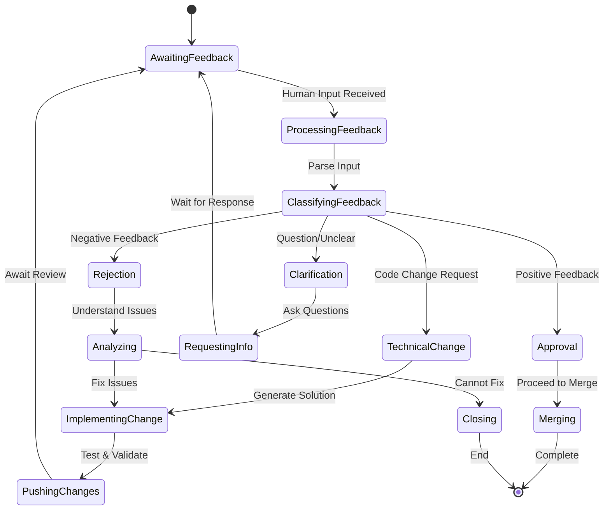
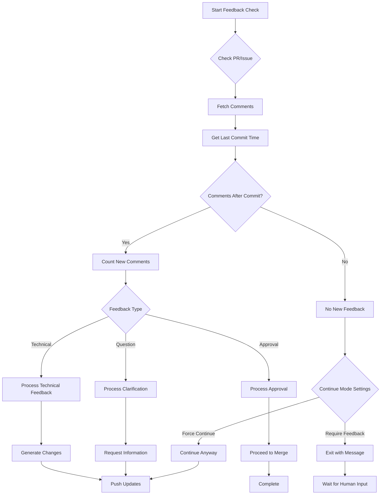

# Hive Mind Data Flow दस्तावेज़ीकरण (languages: [en](flow.md) • [zh](flow.zh.md) • hi • [ru](flow.ru.md))

यह व्यापक दस्तावेज़ Hive Mind में data flow का वर्णन करता है, विशेष रूप से उन सभी बिंदुओं को उजागर करता है जहां human feedback को system workflow में एकीकृत किया जाता है।

## विषय-सूची

1. [अवलोकन](#अवलोकन)
2. [Operating Modes](#operating-modes)
3. [Data Flow Architecture](#data-flow-architecture)
4. [Mode 1: Default Mode](#mode-1-default-mode-issue--pull-request)
5. [Mode 2: Continue Mode](#mode-2-continue-mode-pull-request--comments)
6. [Human Feedback Integration Points](#human-feedback-integration-points)
7. [Configuration Options](#configuration-options)
8. [Error Handling & Fallbacks](#error-handling--fallbacks)
9. [Implementation Details](#implementation-details)
10. [सारांश](#सारांश)

## अवलोकन

Hive Mind एक AI-powered सहयोगी विकास प्रणाली है जो GitHub के माध्यम से संचालित होती है, महत्वपूर्ण निर्णय बिंदुओं पर human oversight बनाए रखते हुए solution विकास को स्वचालित करती है। यह प्रणाली सुनिश्चित करती है कि human feedback कई integration points के माध्यम से विकास प्रक्रिया के केंद्र में बना रहे।

## Operating Modes

Hive Mind entry point और human interaction patterns के आधार पर दो प्राथमिक modes में संचालित होता है:

| Mode              | Entry Point  | प्राथमिक Human Input              | द्वितीयक Input             | निर्णय बिंदु             |
| ----------------- | ------------ | -------------------------------- | --------------------------- | --------------------------- |
| **Default Mode**  | GitHub Issue | Issue description और requirements | PR comments परिशोधन के लिए | Merge/Request Changes/Close |
| **Continue Mode** | Existing PR  | PR comments और feedback        | अतिरिक्त PR comments      | Merge/Request Changes/Close |

## Data Flow Architecture

### High-Level System Architecture



### विस्तृत Data Flow



## Mode 1: Default Mode (Issue → Pull Request)

### Human Feedback बिंदु

- **प्राथमिक Input**: GitHub Issue description और requirements
- **निर्णय बिंदु**: PR को Merge करना, changes request करना, या बंद करना
- **द्वितीयक Input**: परिशोधन के लिए PR पर Comments

### Sequence Diagram



### Data Flow चरण

1. **Human GitHub issue बनाता है** (प्राथमिक human input)
2. Hive Mind issue पहचानता है और AI agent को assign करता है
3. AI agent issue requirements का विश्लेषण करता है
4. AI agent solution विकसित करता है और draft PR बनाता है
5. **Human PR की समीक्षा करता है** (Human निर्णय बिंदु)
6. **Human निर्णय करता है**: Merge, changes request, या close (Human feedback)
7. यदि changes request किए गए हैं, तो cycle PR comments को input के रूप में जारी रहती है

## Mode 2: Continue Mode (Pull Request → Comments)

### Human Feedback बिंदु

- **प्राथमिक Input**: मौजूदा PR पर Comments
- **निर्णय बिंदु**: Mode 1 के समान (merge, changes request, या close)
- **Trigger**: नए comments या feedback का पता लगाना

### Sequence Diagram



### Data Flow चरण

1. **Human मौजूदा PR में comment जोड़ता है** (प्राथमिक human input)
2. Hive Mind नया comment पहचानता है
3. AI agent comment और feedback को process करता है
4. AI agent feedback के आधार पर solution अपडेट करता है
5. AI agent PR में changes push करता है
6. **Human अपडेट की समीक्षा करता है** (Human निर्णय बिंदु)
7. **Human निर्णय करता है**: Merge, और comments जोड़ें, या close (Human feedback)
8. Resolution तक cycle जारी रहती है

## Human Feedback Integration Points

### व्यापक Feedback Points Matrix

| Feedback Point         | Mode    | Timing      | Input प्रकार                | System Response               | Impact Level                |
| ---------------------- | ------- | ----------- | ------------------------- | ----------------------------- | --------------------------- |
| **Issue निर्माण**     | Default | Initial     | Requirements, Description | Solution development trigger करता है | High - पूरा scope परिभाषित |
| **Issue Comments**     | Default | Ongoing     | स्पष्टीकरण, Updates   | Requirements अपडेट करता है          | Medium - Scope परिशोधित      |
| **PR Creation Review** | Both    | Draft के बाद | Initial assessment        | Continuation निर्धारित करता है       | High - Go/No-go decision    |
| **PR Comments**        | Both    | Iterative   | Technical feedback        | Code updates trigger करता है         | High - Changes निर्देशित      |
| **Code Review**        | Both    | Per commit  | Line-by-line feedback     | Precise modifications         | Medium - Specific fixes     |
| **PR Approval**        | Both    | Final       | Acceptance decision       | Merge enable करता है                 | Critical - Final gate       |
| **PR Rejection**       | Both    | Any time    | Stop signal               | Process रोकता है                 | Critical - Full stop        |
| **Label Changes**      | Both    | Any time    | Priority/status updates   | Approach adjust करता है              | Low - Process hints         |

### 1. Issue निर्माण (Mode 1 Entry)

- **प्रकार**: Requirements specification
- **Format**: GitHub issue description, labels, initial comments
- **Impact**: AI solution के लिए scope और requirements परिभाषित करता है
- **उपलब्ध Human Actions**:
  - विस्तृत requirements लिखें
  - उदाहरण या specifications संलग्न करें
  - Priority labels सेट करें
  - विशेष agents को assign करें
  - संबंधित issues link करें

### 2. PR Review & Decision (दोनों Modes)

- **प्रकार**: Approval/rejection decision
- **Format**: PR merge, close, या comment actions
- **Impact**: निर्धारित करता है कि solution स्वीकार्य है या परिशोधन की आवश्यकता है
- **उपलब्ध Human Actions**:
  - Approve और merge करें
  - विशेष feedback के साथ changes request करें
  - Merge के बिना close करें
  - Draft में बदलें
  - अतिरिक्त reviewers assign करें

### 3. PR Comments (Mode 2 Primary, Mode 1 Secondary)

- **प्रकार**: विशेष feedback और change requests
- **Format**: Technical details के साथ GitHub PR comments
- **Impact**: AI agent परिशोधन और iterations का मार्गदर्शन करता है
- **उपलब्ध Human Actions**:
  - Line-specific code comments
  - सामान्य PR conversation
  - विशेष changes suggest करें
  - Tests या documentation request करें
  - स्पष्टीकरण मांगें

### 4. निरंतर Monitoring (दोनों Modes)

- **प्रकार**: चल रही oversight
- **Format**: PR status changes, additional comments
- **Impact**: Iterative improvement cycles enable करता है
- **उपलब्ध Human Actions**:
  - CI/CD results monitor करें
  - Automated test outcomes की समीक्षा करें
  - Code quality metrics जाँचें
  - Requirements के विरुद्ध validate करें
  - चल रहा guidance प्रदान करें

### 5. Emergency Intervention Points

- **प्रकार**: Critical feedback
- **Format**: Comments में direct commands
- **Impact**: तत्काल system response
- **Triggers**:
  - Comments में `STOP` command
  - PR closure
  - Branch protection activation
  - Manual revert

### Human Feedback Processing Flow



## Configuration Options

### Auto-Continue Behavior

- `--auto-continue`: Issues के लिए मौजूदा PRs के साथ स्वचालित रूप से continue करें (default से enabled, disable करने के लिए `--no-auto-continue` उपयोग करें)
- `--auto-continue-only-on-new-comments`: केवल तभी continue करें जब नए comments पहचाने जाएं
- `--continue-only-on-feedback`: केवल तभी continue करें जब feedback मौजूद हो

### Human Interaction Controls

- `--auto-pull-request-creation`: Human review से पहले draft PR बनाएं
- `--attach-logs`: Human review के लिए विस्तृत logs शामिल करें
- Manual merge requirement human oversight सुनिश्चित करती है

## Error Handling & Fallbacks

### जब Human Feedback अनुपस्थित हो

- System आगे बढ़ने के बजाय input की प्रतीक्षा करता है
- Draft PRs human action तक draft state में रहते हैं
- Auto-continue features feedback requirements का सम्मान करती हैं

### जब Human Feedback अस्पष्ट हो

- AI PR comments के माध्यम से स्पष्टीकरण मांगता है
- Human selection के लिए कई solution proposals
- अनिश्चितता होने पर conservative approach

## Implementation Details

### Command-Line Interface

System human feedback interaction नियंत्रित करने के लिए विभिन्न command-line options प्रदान करता है:

```bash
# Default Mode - Issue to PR
./solve.mjs "https://github.com/owner/repo/issues/123"

# Continue Mode - PR with comments
./solve.mjs "https://github.com/owner/repo/pull/456"

# Continue only when new comments are detected (--auto-continue is enabled by default)
./solve.mjs "https://github.com/owner/repo/issues/123" \
  --auto-continue-only-on-new-comments

# Continue only when feedback is present
./solve.mjs "https://github.com/owner/repo/pull/456" \
  --continue-only-on-feedback
```

### Feedback Detection Algorithm



### State Management

System निरंतरता सुनिश्चित करने के लिए sessions में state बनाए रखता है:

| State Element   | Storage     | उद्देश्य                    | Persistence      |
| --------------- | ----------- | -------------------------- | ---------------- |
| Session ID      | File System | Conversation context track करें | Completion तक |
| PR Number       | Memory/Args | Issue को PR से link करें           | Runtime          |
| Comment History | GitHub API  | नए बनाम पुराने feedback track करें  | Permanent        |
| Commit History  | Git         | Feedback timing निर्धारित करें  | Permanent        |
| Configuration   | CLI Args    | Behavior नियंत्रित करें           | Per execution    |

## सारांश

### मुख्य Design Principles

1. **Human-Centric**: प्रत्येक स्वचालित action human review और approval के अधीन है
2. **Feedback-Driven**: System कई बिंदुओं पर human input पर गतिशील रूप से प्रतिक्रिया करता है
3. **Transparent**: सभी AI actions GitHub के standard interfaces के माध्यम से दृश्यमान हैं
4. **Iterative**: Human feedback के आधार पर परिशोधन के कई दौरों का समर्थन करता है
5. **Configurable**: Behavior को team workflows से मेल खाने के लिए adjust किया जा सकता है

### Data Flow सारांश

Hive Mind data flow architecture व्यापक human oversight सुनिश्चित करता है:

- **Multiple Entry Points**: Issues (Default Mode) या PRs (Continue Mode)
- **Continuous Feedback Integration**: Comments real-time में process होते हैं
- **Clear Decision Gates**: Merge के लिए स्पष्ट human approval आवश्यक है
- **Emergency Controls**: Commands के माध्यम से तत्काल halt capabilities
- **Flexible Configuration**: Adjustable automation levels

### Human Feedback Integration

| Mode              | प्राथमिक Feedback   | द्वितीयक Feedback  | निर्णय Authority   |
| ----------------- | ------------------ | ------------------- | -------------------- |
| **Default Mode**  | Issue requirements | PR comments         | Human merge decision |
| **Continue Mode** | PR comments        | Additional comments | Human merge decision |

दोनों modes implementation के लिए AI का उपयोग करते हुए महत्वपूर्ण निर्णयों पर human authority बनाए रखते हैं, यह सुनिश्चित करते हुए कि human feedback विकास प्रक्रिया का आधारशिला बना रहे।
