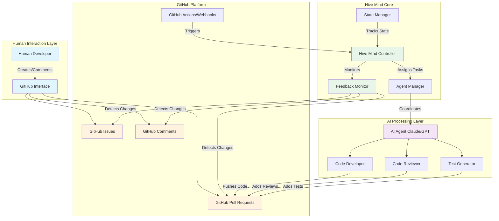
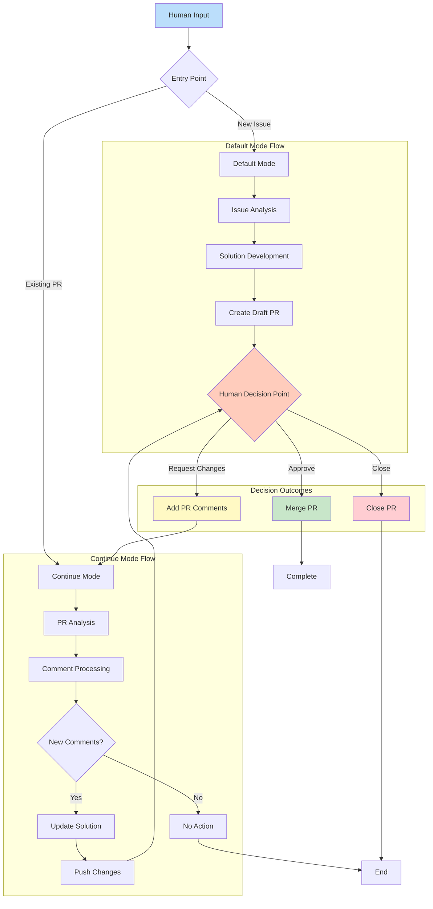
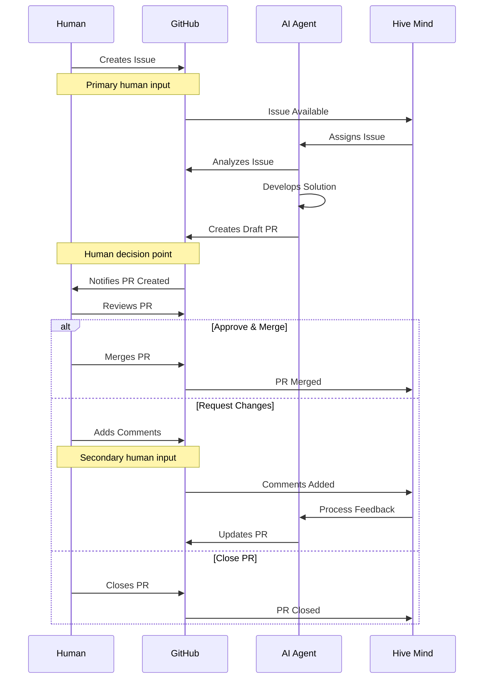
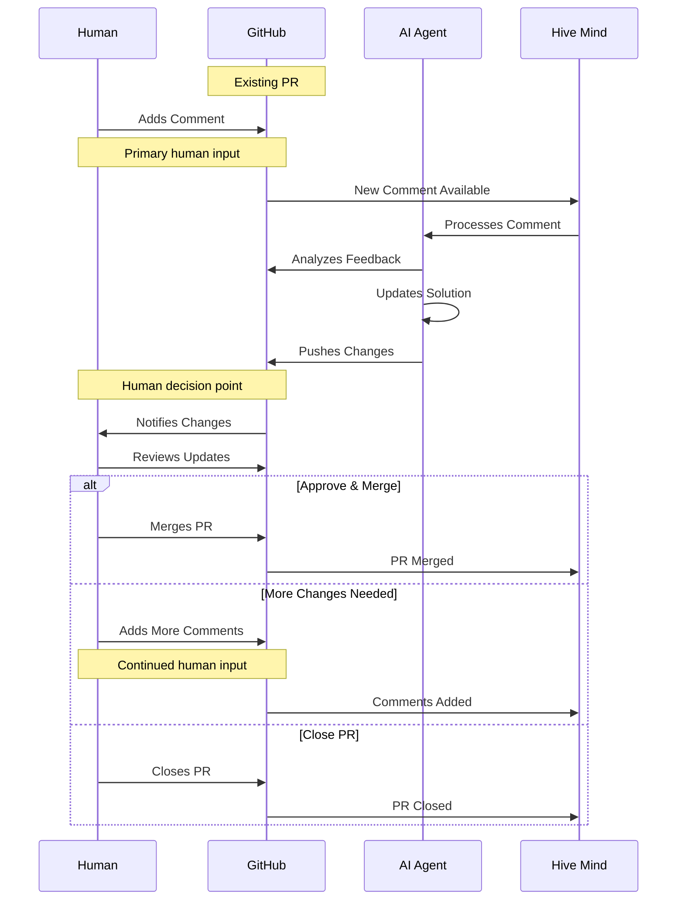
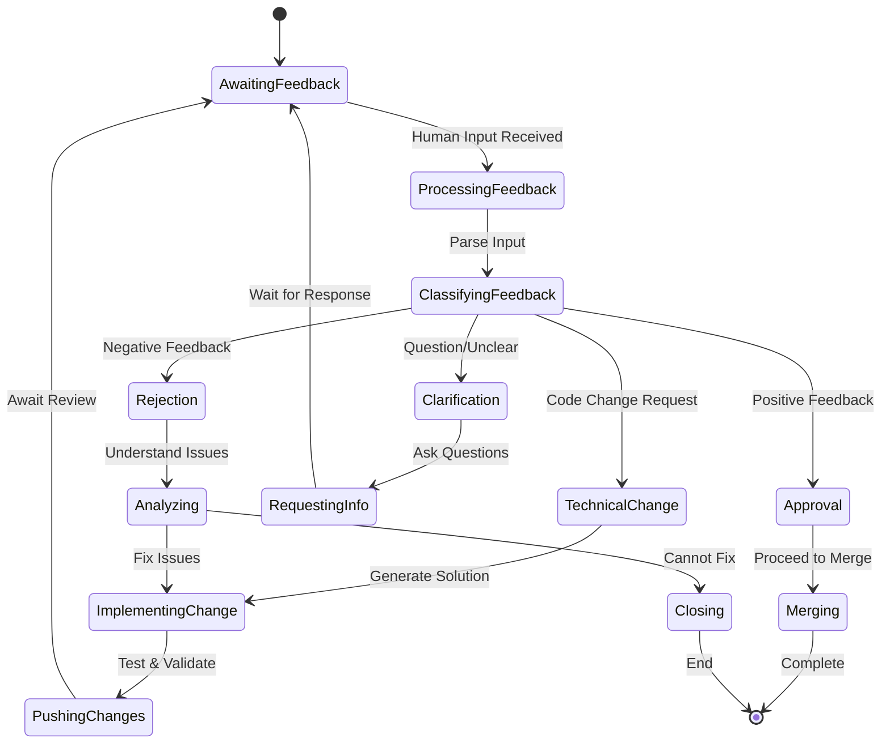
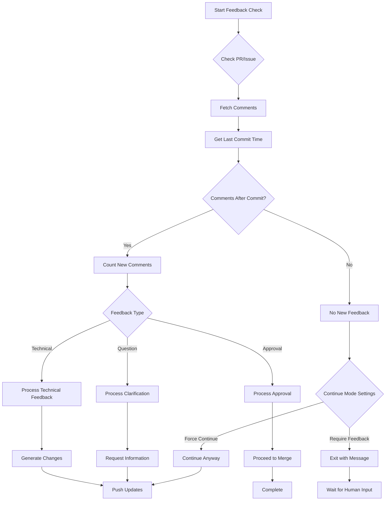

# Документация потока данных Hive Mind (languages: [en](flow.md) • [zh](flow.zh.md) • [hi](flow.hi.md) • ru)

Этот всесторонний документ описывает поток данных в Hive Mind, явно указывая все точки, где обратная связь от человека интегрируется в рабочий процесс системы.

## Содержание

1. [Обзор](#обзор)
2. [Режимы работы](#режимы-работы)
3. [Архитектура потока данных](#архитектура-потока-данных)
4. [Режим 1: Режим по умолчанию](#режим-1-режим-по-умолчанию-issue--pull-request)
5. [Режим 2: Режим продолжения](#режим-2-режим-продолжения-pull-request--комментарии)
6. [Точки интеграции обратной связи от человека](#точки-интеграции-обратной-связи-от-человека)
7. [Параметры конфигурации](#параметры-конфигурации)
8. [Обработка ошибок и резервные варианты](#обработка-ошибок-и-резервные-варианты)
9. [Детали реализации](#детали-реализации)
10. [Итог](#итог)

## Обзор

Hive Mind — это система совместной разработки на основе ИИ, работающая через GitHub, которая обеспечивает контроль человека в критических точках принятия решений, автоматизируя при этом разработку решений. Система гарантирует, что обратная связь от человека остаётся центральной в процессе разработки через несколько точек интеграции.

## Режимы работы

Hive Mind работает в двух основных режимах в зависимости от точки входа и паттернов взаимодействия с человеком:

| Режим                     | Точка входа    | Основной ввод от человека        | Дополнительный ввод         | Точки принятия решений     |
| ------------------------- | -------------- | -------------------------------- | --------------------------- | -------------------------- |
| **Режим по умолчанию**    | GitHub Issue   | Описание задачи и требования     | Комментарии к PR для уточнений | Слияние/запрос изменений/закрытие |
| **Режим продолжения**     | Существующий PR | Комментарии к PR с обратной связью | Дополнительные комментарии к PR | Слияние/запрос изменений/закрытие |

## Архитектура потока данных

### Высокоуровневая архитектура системы



### Детальный поток данных



## Режим 1: Режим по умолчанию (Issue → Pull Request)

### Точки обратной связи от человека

- **Основной ввод**: Описание задачи GitHub и требования
- **Точка принятия решения**: Слияние, запрос изменений или закрытие PR
- **Дополнительный ввод**: Комментарии к PR для уточнений

### Диаграмма последовательности



### Шаги потока данных

1. **Человек создаёт задачу GitHub** (основной ввод от человека)
2. Hive Mind обнаруживает задачу и назначает её агенту ИИ
3. Агент ИИ анализирует требования задачи
4. Агент ИИ разрабатывает решение и создаёт черновик PR
5. **Человек проверяет PR** (точка принятия решения человеком)
6. **Человек принимает решение**: слияние, запрос изменений или закрытие (обратная связь от человека)
7. При запросе изменений цикл продолжается с комментариями к PR в качестве ввода

## Режим 2: Режим продолжения (Pull Request → Комментарии)

### Точки обратной связи от человека

- **Основной ввод**: Комментарии к существующему PR
- **Точка принятия решения**: Та же, что и в режиме 1 (слияние, запрос изменений или закрытие)
- **Триггер**: Обнаружение новых комментариев или обратной связи

### Диаграмма последовательности



### Шаги потока данных

1. **Человек добавляет комментарий к существующему PR** (основной ввод от человека)
2. Hive Mind обнаруживает новый комментарий
3. Агент ИИ обрабатывает комментарий и обратную связь
4. Агент ИИ обновляет решение на основе обратной связи
5. Агент ИИ отправляет изменения в PR
6. **Человек проверяет обновления** (точка принятия решения человеком)
7. **Человек принимает решение**: слияние, добавление комментариев или закрытие (обратная связь от человека)
8. Цикл продолжается до разрешения

## Точки интеграции обратной связи от человека

### Комплексная матрица точек обратной связи

| Точка обратной связи     | Режим      | Момент      | Тип ввода               | Реакция системы             | Уровень воздействия         |
| ------------------------ | ---------- | ----------- | ----------------------- | --------------------------- | --------------------------- |
| **Создание задачи**      | По умолчанию | Начальный | Требования, описание    | Запускает разработку решения | Высокий — определяет весь объём |
| **Комментарии к задаче** | По умолчанию | Непрерывный | Уточнения, обновления  | Обновляет требования        | Средний — уточняет объём    |
| **Проверка создания PR** | Оба        | После черновика | Начальная оценка      | Определяет продолжение      | Высокий — решение о продолжении |
| **Комментарии к PR**     | Оба        | Итеративный | Техническая обратная связь | Запускает обновления кода | Высокий — направляет изменения |
| **Code Review**          | Оба        | За коммит   | Постострочная обратная связь | Точные изменения          | Средний — конкретные исправления |
| **Одобрение PR**         | Оба        | Финальный   | Решение о принятии      | Разрешает слияние           | Критический — финальный шлюз |
| **Отклонение PR**        | Оба        | В любое время | Сигнал остановки      | Останавливает процесс       | Критический — полная остановка |
| **Изменения меток**      | Оба        | В любое время | Обновления приоритета/статуса | Корректирует подход      | Низкий — подсказки процессу |

### 1. Создание задачи (вход в режим 1)

- **Тип**: Спецификация требований
- **Формат**: Описание задачи GitHub, метки, начальные комментарии
- **Воздействие**: Определяет объём и требования для решения ИИ
- **Доступные действия человека**:
  - Написать подробные требования
  - Прикрепить примеры или спецификации
  - Установить метки приоритета
  - Назначить конкретным агентам
  - Связать с похожими задачами

### 2. Проверка PR и принятие решения (оба режима)

- **Тип**: Решение об одобрении/отклонении
- **Формат**: Слияние PR, закрытие или комментарии
- **Воздействие**: Определяет, приемлемо ли решение или требует уточнений
- **Доступные действия человека**:
  - Одобрить и слить
  - Запросить изменения с конкретной обратной связью
  - Закрыть без слияния
  - Перевести в черновик
  - Назначить дополнительных рецензентов

### 3. Комментарии к PR (основные в режиме 2, дополнительные в режиме 1)

- **Тип**: Конкретная обратная связь и запросы изменений
- **Формат**: Комментарии к PR на GitHub с техническими деталями
- **Воздействие**: Направляет уточнения и итерации агента ИИ
- **Доступные действия человека**:
  - Постострочные комментарии к коду
  - Общее обсуждение PR
  - Предложение конкретных изменений
  - Запрос тестов или документации
  - Запрос уточнений

### 4. Непрерывный мониторинг (оба режима)

- **Тип**: Непрерывный контроль
- **Формат**: Изменения статуса PR, дополнительные комментарии
- **Воздействие**: Обеспечивает итерационные циклы улучшения
- **Доступные действия человека**:
  - Мониторинг результатов CI/CD
  - Просмотр результатов автоматических тестов
  - Проверка метрик качества кода
  - Валидация по требованиям
  - Предоставление текущих указаний

### 5. Точки экстренного вмешательства

- **Тип**: Критическая обратная связь
- **Формат**: Прямые команды в комментариях
- **Воздействие**: Немедленная реакция системы
- **Триггеры**:
  - Команда `STOP` в комментарии
  - Закрытие PR
  - Активация защиты ветки
  - Ручной откат

### Поток обработки обратной связи от человека



## Параметры конфигурации

### Поведение автопродолжения

- `--auto-continue`: Автоматически продолжать с существующими PR для задач (включено по умолчанию, используйте `--no-auto-continue` для отключения)
- `--auto-continue-only-on-new-comments`: Продолжать только при обнаружении новых комментариев
- `--continue-only-on-feedback`: Продолжать только при наличии обратной связи

### Элементы управления взаимодействием с человеком

- `--auto-pull-request-creation`: Создать черновик PR до проверки человеком
- `--attach-logs`: Включить подробные журналы для проверки человеком
- Требование ручного слияния обеспечивает контроль человека

## Обработка ошибок и резервные варианты

### Когда обратная связь от человека отсутствует

- Система ожидает ввода, а не продолжает работу
- Черновики PR остаются в состоянии черновика до действий человека
- Функции автопродолжения соблюдают требования к обратной связи

### Когда обратная связь от человека неоднозначна

- ИИ запрашивает уточнения через комментарии к PR
- Несколько предложений решений для выбора человеком
- Консервативный подход при наличии неопределённости

## Детали реализации

### Интерфейс командной строки

Система предоставляет различные параметры командной строки для управления взаимодействием с человеком:

```bash
# Default Mode - Issue to PR
./solve.mjs "https://github.com/owner/repo/issues/123"

# Continue Mode - PR with comments
./solve.mjs "https://github.com/owner/repo/pull/456"

# Continue only when new comments are detected (--auto-continue is enabled by default)
./solve.mjs "https://github.com/owner/repo/issues/123" \
  --auto-continue-only-on-new-comments

# Continue only when feedback is present
./solve.mjs "https://github.com/owner/repo/pull/456" \
  --continue-only-on-feedback
```

### Алгоритм обнаружения обратной связи



### Управление состоянием

Система поддерживает состояние между сессиями для обеспечения непрерывности:

| Элемент состояния | Хранилище       | Назначение                          | Сохранность     |
| ----------------- | --------------- | ----------------------------------- | --------------- |
| Session ID        | Файловая система | Отслеживание контекста разговора   | До завершения   |
| PR Number         | Память/Args     | Связь задачи с PR                   | Во время работы |
| Comment History   | GitHub API      | Отслеживание новой и старой обратной связи | Постоянно |
| Commit History    | Git             | Определение времени обратной связи | Постоянно       |
| Configuration     | CLI Args        | Управление поведением               | За выполнение   |

## Итог

### Ключевые принципы проектирования

1. **Ориентированность на человека**: Каждое автоматизированное действие подлежит проверке и одобрению человеком
2. **Управляемость обратной связью**: Система динамически реагирует на ввод человека в нескольких точках
3. **Прозрачность**: Все действия ИИ видны через стандартные интерфейсы GitHub
4. **Итеративность**: Поддерживает несколько раундов уточнений на основе обратной связи от человека
5. **Конфигурируемость**: Поведение может быть настроено под рабочие процессы команды

### Сводка потока данных

Архитектура потока данных Hive Mind обеспечивает всесторонний контроль человека через:

- **Множество точек входа**: Задачи (режим по умолчанию) или PR (режим продолжения)
- **Непрерывная интеграция обратной связи**: Комментарии обрабатываются в режиме реального времени
- **Чёткие шлюзы принятия решений**: Для слияния требуется явное одобрение человека
- **Элементы экстренного управления**: Возможность немедленной остановки через команды
- **Гибкая конфигурация**: Настраиваемые уровни автоматизации

### Интеграция обратной связи от человека

| Режим                  | Основная обратная связь | Дополнительная обратная связь | Орган принятия решений |
| ---------------------- | ----------------------- | ----------------------------- | ---------------------- |
| **Режим по умолчанию** | Требования задачи       | Комментарии к PR              | Решение человека о слиянии |
| **Режим продолжения**  | Комментарии к PR        | Дополнительные комментарии    | Решение человека о слиянии |

Оба режима сохраняют за человеком право принимать критические решения, используя ИИ для реализации, гарантируя, что обратная связь от человека остаётся краеугольным камнем процесса разработки.
