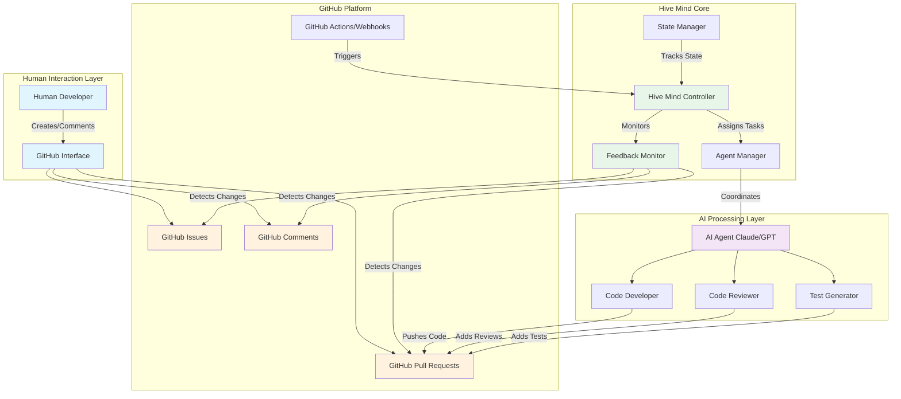
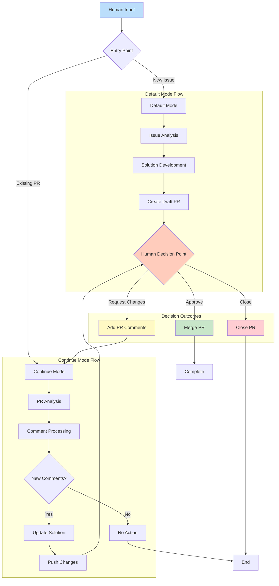
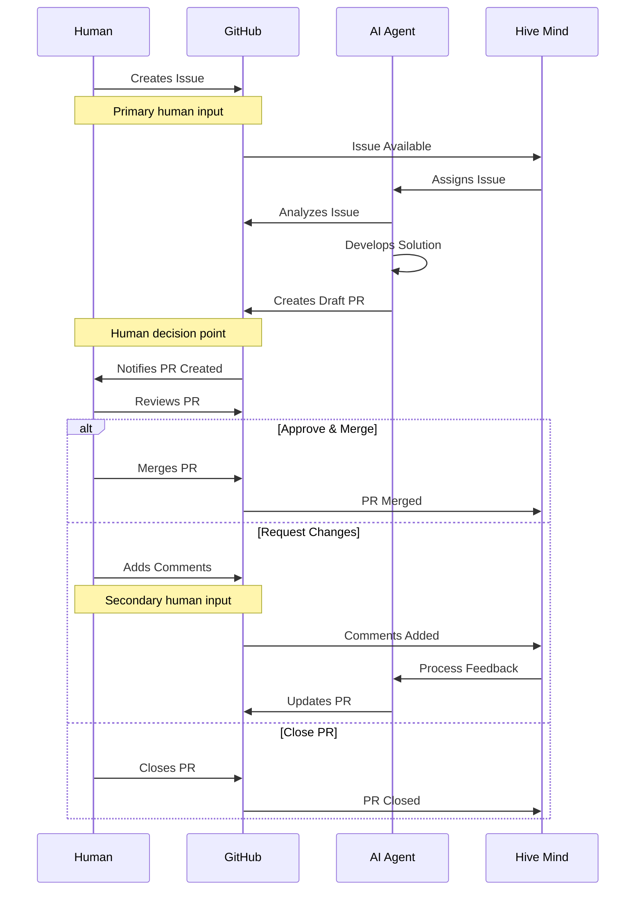
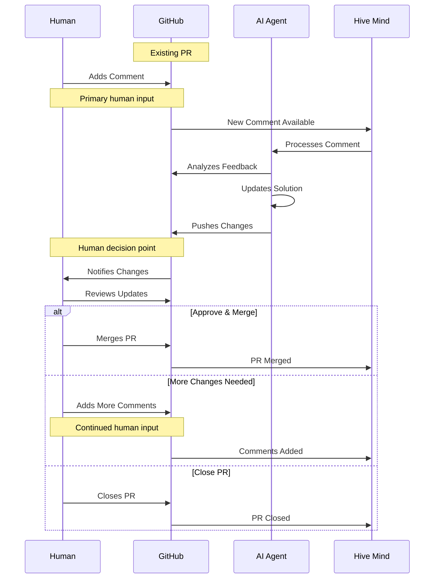
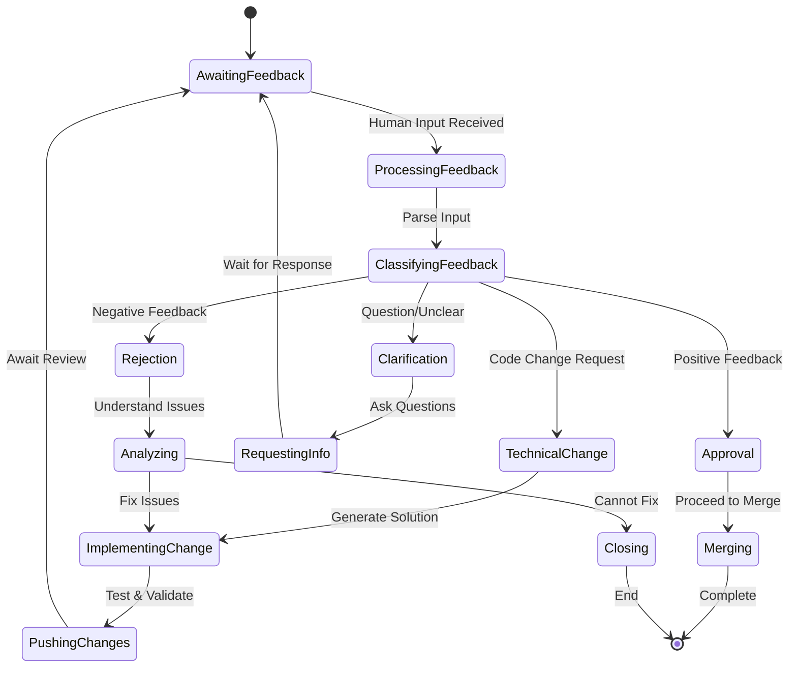
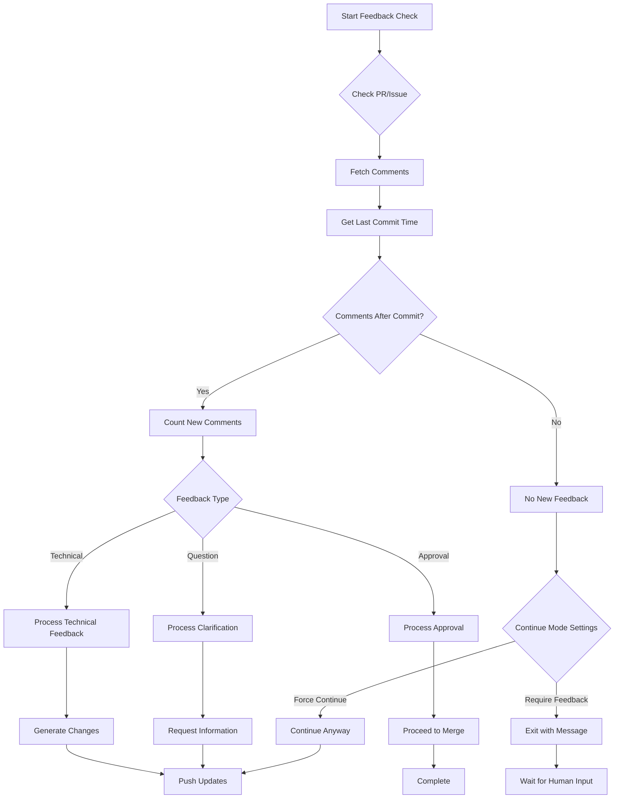

# Hive Mind 数据流文档 (languages: [en](flow.md) • zh • [hi](flow.hi.md) • [ru](flow.ru.md))

本文档全面描述了 Hive Mind 中的数据流，明确指出了将人工反馈整合到系统工作流中的所有节点。

## 目录

1. [概述](#概述)
2. [运行模式](#运行模式)
3. [数据流架构](#数据流架构)
4. [模式一：默认模式](#模式一默认模式issue--pull-request)
5. [模式二：继续模式](#模式二继续模式pull-request--comments)
6. [人工反馈集成点](#人工反馈集成点)
7. [配置选项](#配置选项)
8. [错误处理与回退](#错误处理与回退)
9. [实现细节](#实现细节)
10. [总结](#总结)

## 概述

Hive Mind 是一个由 AI 驱动的协作开发系统，通过 GitHub 运作，在关键决策点保持人工监督，同时自动化解决方案开发。该系统通过多个集成点确保人工反馈始终是开发过程的核心。

## 运行模式

Hive Mind 根据入口点和人工交互模式以两种主要模式运行：

| 模式           | 入口点        | 主要人工输入                | 次要输入                    | 决策点                       |
| -------------- | ------------- | --------------------------- | --------------------------- | ---------------------------- |
| **默认模式**   | GitHub Issue  | Issue 描述和需求            | PR 评论用于细化             | 合并/请求更改/关闭           |
| **继续模式**   | 现有 PR       | 带反馈的 PR 评论            | 额外的 PR 评论              | 合并/请求更改/关闭           |

## 数据流架构

### 高层系统架构



### 详细数据流



## 模式一：默认模式（Issue → Pull Request）

### 人工反馈点

- **主要输入**：GitHub Issue 描述和需求
- **决策点**：合并、请求更改或关闭 PR
- **次要输入**：PR 上的评论用于细化

### 时序图



### 数据流步骤

1. **人工创建 GitHub issue**（主要人工输入）
2. Hive Mind 检测并将 issue 分配给 AI agent
3. AI agent 分析 issue 需求
4. AI agent 开发解决方案并创建草稿 PR
5. **人工审查 PR**（人工决策点）
6. **人工决定**：合并、请求更改或关闭（人工反馈）
7. 如果请求更改，循环以 PR 评论作为输入继续

## 模式二：继续模式（Pull Request → Comments）

### 人工反馈点

- **主要输入**：对现有 PR 的评论
- **决策点**：与模式一相同（合并、请求更改或关闭）
- **触发**：新评论或反馈检测

### 时序图



### 数据流步骤

1. **人工在现有 PR 上添加评论**（主要人工输入）
2. Hive Mind 检测到新评论
3. AI agent 处理评论和反馈
4. AI agent 根据反馈更新解决方案
5. AI agent 将变更推送到 PR
6. **人工审查更新**（人工决策点）
7. **人工决定**：合并、添加更多评论或关闭（人工反馈）
8. 循环持续直到问题解决

## 人工反馈集成点

### 综合反馈点矩阵

| 反馈点               | 模式     | 时机         | 输入类型                | 系统响应                      | 影响级别                    |
| -------------------- | -------- | ------------ | ----------------------- | ----------------------------- | --------------------------- |
| **Issue 创建**       | 默认     | 初始         | 需求、描述              | 触发解决方案开发              | 高——定义整体范围            |
| **Issue 评论**       | 默认     | 持续         | 澄清、更新              | 更新需求                      | 中——细化范围                |
| **PR 创建审查**      | 两种     | 草稿后       | 初步评估                | 决定是否继续                  | 高——去/不去决定             |
| **PR 评论**          | 两种     | 迭代         | 技术反馈                | 触发代码更新                  | 高——指导变更                |
| **代码审查**         | 两种     | 每次提交     | 逐行反馈                | 精确修改                      | 中——具体修复                |
| **PR 批准**          | 两种     | 最终         | 接受决定                | 允许合并                      | 关键——最终关卡              |
| **PR 拒绝**          | 两种     | 任何时候     | 停止信号                | 停止进程                      | 关键——完全停止              |
| **标签变更**         | 两种     | 任何时候     | 优先级/状态更新         | 调整方法                      | 低——流程提示                |

### 1. Issue 创建（模式一入口）

- **类型**：需求规范
- **格式**：GitHub issue 描述、标签、初始评论
- **影响**：定义 AI 解决方案的范围和需求
- **可用的人工操作**：
  - 编写详细需求
  - 附上示例或规范
  - 设置优先级标签
  - 分配给特定 agent
  - 链接相关 issues

### 2. PR 审查与决定（两种模式）

- **类型**：批准/拒绝决定
- **格式**：PR 合并、关闭或评论操作
- **影响**：决定解决方案是否可接受或需要细化
- **可用的人工操作**：
  - 批准并合并
  - 请求带具体反馈的变更
  - 不合并直接关闭
  - 转换为草稿
  - 分配额外审阅者

### 3. PR 评论（模式二主要，模式一次要）

- **类型**：具体反馈和变更请求
- **格式**：带技术细节的 GitHub PR 评论
- **影响**：指导 AI agent 的细化和迭代
- **可用的人工操作**：
  - 针对特定行的代码评论
  - 通用 PR 对话
  - 建议具体变更
  - 请求测试或文档
  - 要求澄清

### 4. 持续监控（两种模式）

- **类型**：持续监督
- **格式**：PR 状态变化、额外评论
- **影响**：支持迭代改进循环
- **可用的人工操作**：
  - 监控 CI/CD 结果
  - 审查自动化测试结果
  - 检查代码质量指标
  - 对照需求验证
  - 提供持续指导

### 5. 紧急干预点

- **类型**：关键反馈
- **格式**：评论中的直接命令
- **影响**：系统立即响应
- **触发**：
  - 评论中的 `STOP` 命令
  - PR 关闭
  - 分支保护激活
  - 手动回退

### 人工反馈处理流程



## 配置选项

### 自动继续行为

- `--auto-continue`：自动继续处理 issues 的现有 PR（默认启用，使用 `--no-auto-continue` 禁用）
- `--auto-continue-only-on-new-comments`：仅在检测到新评论时继续
- `--continue-only-on-feedback`：仅在有反馈时继续

### 人工交互控制

- `--auto-pull-request-creation`：在人工审查之前创建草稿 PR
- `--attach-logs`：包含详细日志供人工审查
- 手动合并要求确保人工监督

## 错误处理与回退

### 人工反馈缺失时

- 系统等待输入而不是继续进行
- 草稿 PR 保持草稿状态，直到人工操作
- 自动继续功能尊重反馈需求

### 人工反馈模糊时

- AI 通过 PR 评论请求澄清
- 提供多个解决方案供人工选择
- 不确定时采用保守方法

## 实现细节

### 命令行界面

系统提供各种命令行选项来控制人工反馈交互：

```bash
# Default Mode - Issue to PR
./solve.mjs "https://github.com/owner/repo/issues/123"

# Continue Mode - PR with comments
./solve.mjs "https://github.com/owner/repo/pull/456"

# Continue only when new comments are detected (--auto-continue is enabled by default)
./solve.mjs "https://github.com/owner/repo/issues/123" \
  --auto-continue-only-on-new-comments

# Continue only when feedback is present
./solve.mjs "https://github.com/owner/repo/pull/456" \
  --continue-only-on-feedback
```

### 反馈检测算法



### 状态管理

系统跨会话维护状态以确保连续性：

| 状态元素        | 存储       | 目的                       | 持久性           |
| --------------- | ---------- | -------------------------- | ---------------- |
| Session ID      | 文件系统   | 跟踪对话上下文             | 直到完成         |
| PR Number       | 内存/参数  | 将 issue 链接到 PR         | 运行时           |
| Comment History | GitHub API | 跟踪新旧反馈               | 永久             |
| Commit History  | Git        | 确定反馈时机               | 永久             |
| Configuration   | CLI 参数   | 控制行为                   | 每次执行         |

## 总结

### 关键设计原则

1. **以人为本**：每个自动化操作都须经过人工审查和批准
2. **反馈驱动**：系统在多个点动态响应人工输入
3. **透明**：所有 AI 操作通过 GitHub 的标准界面可见
4. **迭代**：支持基于人工反馈的多轮细化
5. **可配置**：可以调整行为以匹配团队工作流

### 数据流总结

Hive Mind 数据流架构通过以下方式确保全面的人工监督：

- **多个入口点**：Issues（默认模式）或 PR（继续模式）
- **持续反馈集成**：实时处理评论
- **清晰的决策关卡**：合并需要明确的人工批准
- **紧急控制**：通过命令立即停止
- **灵活配置**：可调整的自动化级别

### 人工反馈集成

| 模式           | 主要反馈         | 次要反馈         | 决策权限             |
| -------------- | ---------------- | ---------------- | -------------------- |
| **默认模式**   | Issue 需求       | PR 评论          | 人工合并决定         |
| **继续模式**   | PR 评论          | 额外评论         | 人工合并决定         |

两种模式都在将 AI 用于实现的同时保持人工对关键决策的权威，确保人工反馈仍然是开发过程的基石。
