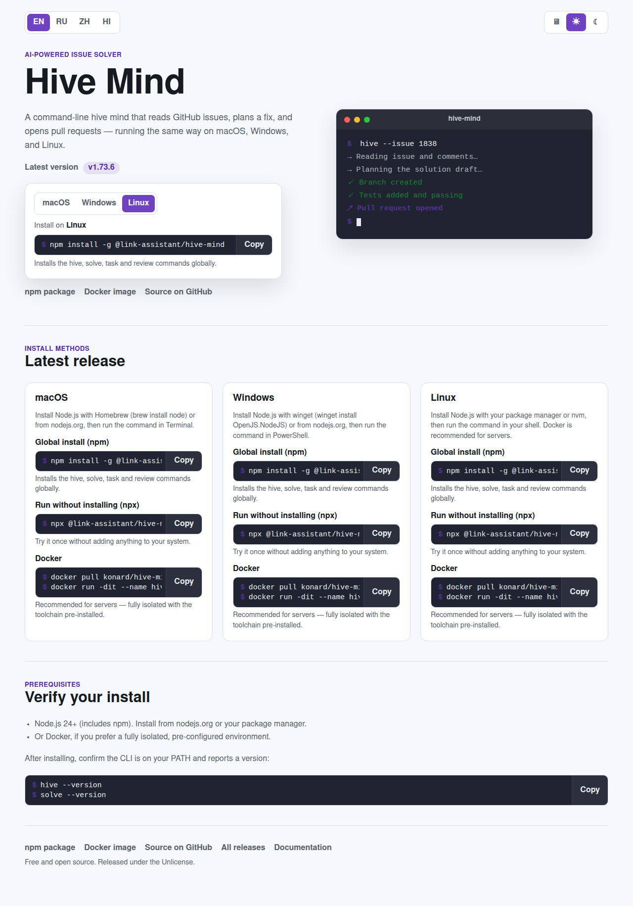
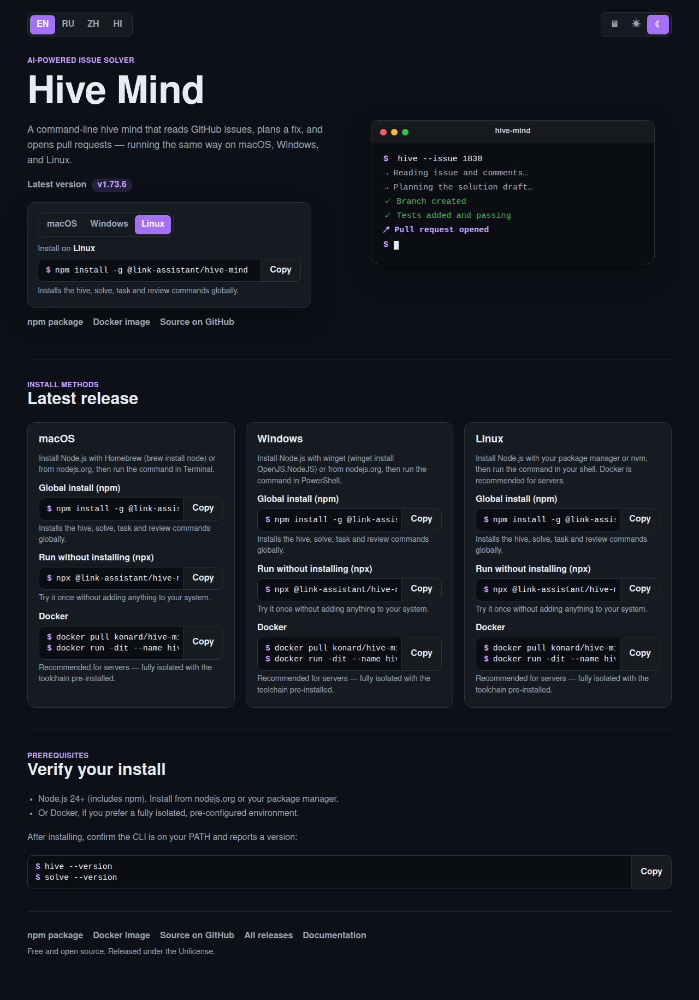

# Hive Mind download page

The static download / install landing page served at
**https://link-assistant.github.io/hive-mind/**. It is modelled on the
[vk-bot-desktop](https://github.com/konard/vk-bot-desktop) site and offers
copy-paste install commands for macOS, Windows, and Linux (npm, npx, and
Docker), light/dark theme switching, and four languages (en/ru/zh/hi).

## Structure

| File            | Purpose                                                                |
| --------------- | ---------------------------------------------------------------------- |
| `index.html`    | HTML entry with a strict CSP; loads `assets/site.js` and `styles.css`. |
| `bootstrap.jsx` | React mount point.                                                     |
| `App.jsx`       | Page UI: hero, OS tabs, install cards, theme + locale switches.        |
| `downloads.js`  | Install methods/commands per OS and release-version helpers.           |
| `i18n.js`       | UI copy in English, Russian, Chinese, and Hindi.                       |
| `theme.js`      | System / Light / Dark theme handling backed by `localStorage`.         |
| `styles.css`    | Theme-aware styling (light + dark variables).                          |

The bundle is fully self-contained (no remote CDN) so it works under the page's
strict Content-Security-Policy.

## Commands

```bash
# Build the static bundle into site/dist
npm run build:site

# Run the headless-browser e2e smoke test against the built bundle
npm run build:site && npm run test:pages:e2e -- --site-dir site/dist

# Regenerate the locale/theme preview screenshots in docs/screenshots/download/
npm run preview:update
```

`npm run test:pages:e2e` and `npm run preview:update` need Playwright with a
Chromium browser. It is intentionally **not** a declared dependency (it is heavy
and only used for tooling); install it on demand:

```bash
npm install --no-save playwright
npx playwright install --with-deps chromium
```

## Deployment

`.github/workflows/pages.yml` builds the bundle, runs the e2e test, regenerates
the preview screenshots, and deploys `site/dist` to GitHub Pages on pushes to
`main`. On pull requests it builds and verifies without deploying.

## Previews

Light and dark, English locale:

| Light                                                        | Dark                                                       |
| ------------------------------------------------------------ | ---------------------------------------------------------- |
|  |  |
